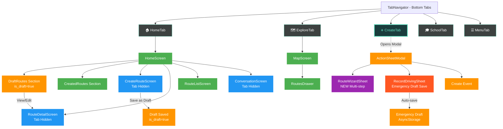
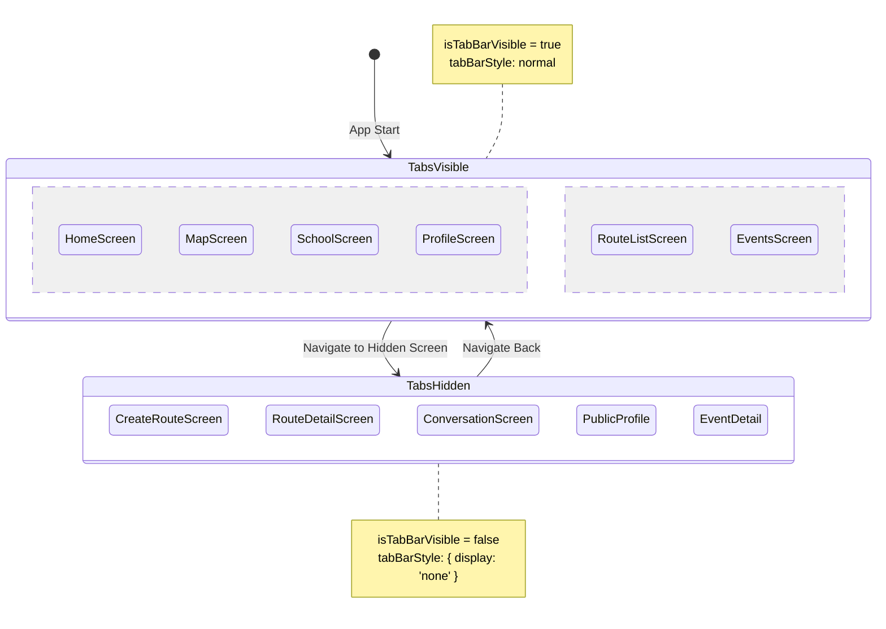
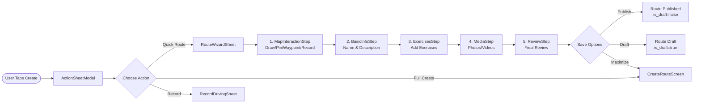
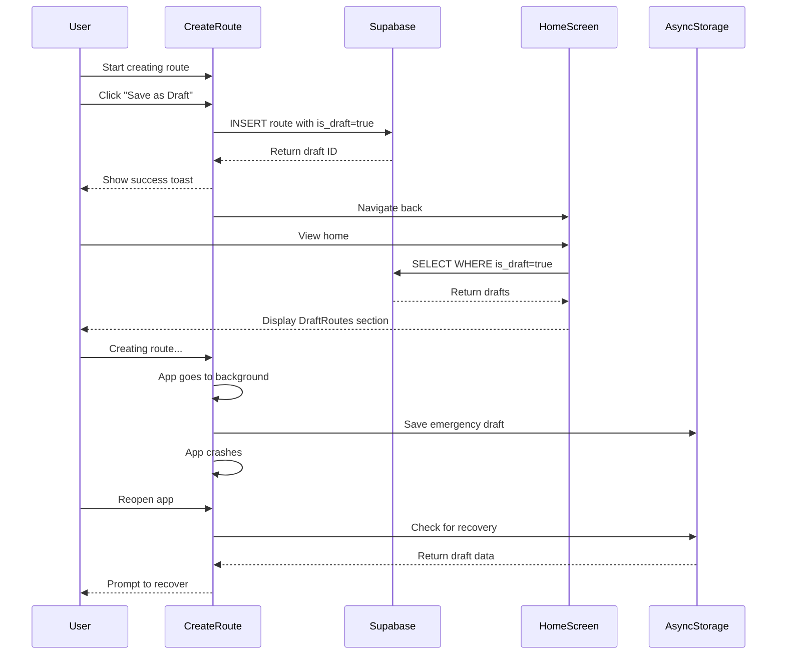
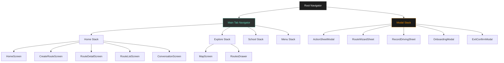
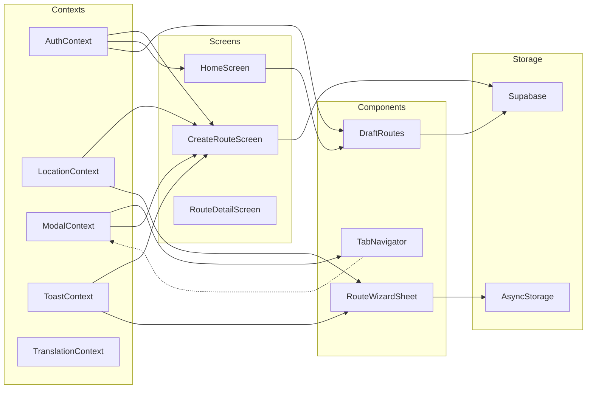

# VROMM App Navigation Architecture

## 1. Main Navigation Flow (Mermaid)



## 2. Tab Visibility State Machine



## 3. RouteWizardSheet Flow



## 4. Draft Mode Lifecycle



## 5. Navigation Stack Hierarchy



## 6. Component Communication Flow



## 7. DrawIO Text Format (Copy-Paste Ready)

```
App Structure:
├── TabNavigator (Bottom Navigation)
│   ├── HomeTab (🏠)
│   │   ├── HomeScreen
│   │   │   ├── DraftRoutes (is_draft=true) [NEW]
│   │   │   └── CreatedRoutes
│   │   ├── CreateRouteScreen (Tab Hidden)
│   │   ├── RouteDetailScreen (Tab Hidden)
│   │   └── RouteListScreen
│   ├── ExploreTab (🗺️)
│   │   ├── MapScreen
│   │   └── RoutesDrawer
│   ├── CreateTab (➕) [Central Button]
│   │   └── Opens ActionSheetModal
│   │       ├── RouteWizardSheet [NEW]
│   │       │   ├── MapInteractionStep
│   │       │   ├── BasicInfoStep
│   │       │   ├── ExercisesStep
│   │       │   ├── MediaStep
│   │       │   └── ReviewStep
│   │       ├── RecordDrivingSheet
│   │       └── Create Event
│   ├── SchoolTab (🎓)
│   └── MenuTab (☰)
│       ├── Profile
│       ├── Messages
│       └── Settings

Modal System:
├── ActionSheetModal (Create Options)
├── RouteWizardSheet (Multi-step) [NEW]
├── RecordDrivingSheet (With Emergency Save)
├── OnboardingModalInteractive [NEW]
└── Exit Confirmation (With Draft Option)

Tab Visibility Rules:
├── Hidden: CreateRoute, RouteDetail, Conversation, PublicProfile
└── Visible: Home, Map, School, Profile, RouteList

Draft Features:
├── Database: is_draft column
├── UI: DraftRoutes section on HomeScreen
├── Actions: Save as Draft button
└── Recovery: Emergency draft save on crash
```

## Usage Instructions

1. **For DrawIO XML**: Copy the entire XML file content and:
   - Go to https://app.diagrams.net/
   - File > Open from > Device > Select the XML file
   - Or paste directly into a new diagram

2. **For Mermaid Diagrams**: 
   - Use in GitHub README.md files
   - Paste into mermaid.live editor
   - Use in Notion, Obsidian, or other Markdown tools

3. **For Quick Reference**: Use the text hierarchy in any documentation

The diagrams show:
- Navigation flow and stack hierarchy
- Tab visibility state management
- Draft mode implementation
- Modal system architecture
- Component communication patterns