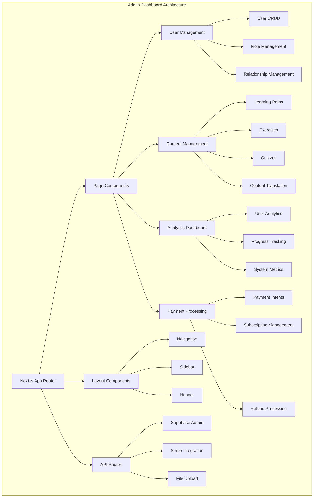

# VROMM Admin Dashboard Documentation

## Table of Contents
1. [Project Overview](#project-overview)
2. [Technology Stack](#technology-stack)
3. [Architecture](#architecture)
4. [Core Features](#core-features)
5. [Database Integration](#database-integration)
6. [API Endpoints](#api-endpoints)
7. [Component Structure](#component-structure)
8. [Development Guide](#development-guide)
9. [Deployment](#deployment)

## Project Overview

The VROMM Admin Dashboard is a comprehensive administrative interface built with Next.js 14, designed for content management, user administration, analytics, and system monitoring. It provides administrators with powerful tools to manage the VROMM learning platform.

### Key Capabilities
- **User Management** - Manage students, instructors, and their relationships
- **Content Management System (CMS)** - Create and edit learning paths, exercises, and quizzes
- **Analytics Dashboard** - Track user progress, engagement, and system metrics
- **Payment Processing** - Handle Stripe payments and subscription management
- **System Administration** - Monitor system health and performance
- **Bulk Operations** - Mass user operations and content management

## Technology Stack

### Frontend
- **Next.js 14** - React framework with App Router
- **TypeScript** - Type-safe development
- **Tailwind CSS** - Utility-first CSS framework
- **React Hook Form** - Form handling and validation
- **React Query** - Data fetching and caching
- **Framer Motion** - Animations and transitions

### Backend Integration
- **Supabase Admin SDK** - Database and authentication
- **Stripe API** - Payment processing
- **PostgreSQL** - Primary database
- **Row Level Security (RLS)** - Data access control

### Development Tools
- **ESLint** - Code linting
- **Prettier** - Code formatting
- **TypeScript** - Static type checking
- **Jest** - Testing framework
- **Storybook** - Component development

## Architecture



## Core Features

### 1. User Management

#### User Dashboard
```typescript
interface UserManagementProps {
  users: User[];
  onUserUpdate: (userId: string, updates: Partial<User>) => Promise<void>;
  onUserDelete: (userId: string) => Promise<void>;
  onBulkAction: (userIds: string[], action: string) => Promise<void>;
}

// User management with advanced filtering
const UserManagement = ({ users, onUserUpdate, onUserDelete, onBulkAction }: UserManagementProps) => {
  const [filters, setFilters] = useState({
    role: 'all',
    status: 'all',
    dateRange: 'all',
    search: ''
  });
  
  const filteredUsers = useMemo(() => {
    return users.filter(user => {
      if (filters.role !== 'all' && user.role !== filters.role) return false;
      if (filters.status !== 'all' && user.status !== filters.status) return false;
      if (filters.search && !user.full_name.toLowerCase().includes(filters.search.toLowerCase())) return false;
      return true;
    });
  }, [users, filters]);
  
  return (
    <div className="user-management">
      <UserFilters filters={filters} onFiltersChange={setFilters} />
      <UserTable 
        users={filteredUsers}
        onUpdate={onUserUpdate}
        onDelete={onUserDelete}
        onBulkAction={onBulkAction}
      />
    </div>
  );
};
```

#### Relationship Management
```typescript
// Manage instructor-student relationships
const RelationshipManagement = () => {
  const [relationships, setRelationships] = useState<Relationship[]>([]);
  const [pendingInvitations, setPendingInvitations] = useState<Invitation[]>([]);
  
  const handleInvitationAction = async (invitationId: string, action: 'accept' | 'decline') => {
    try {
      const { error } = await supabase
        .from('pending_invitations')
        .update({ 
          status: action === 'accept' ? 'accepted' : 'declined',
          [action === 'accept' ? 'accepted_at' : 'declined_at']: new Date().toISOString()
        })
        .eq('id', invitationId);
      
      if (error) throw error;
      
      if (action === 'accept') {
        // Create relationship
        await createRelationship(invitationId);
      }
      
      // Refresh data
      await loadRelationships();
      await loadPendingInvitations();
    } catch (error) {
      console.error('Error handling invitation:', error);
    }
  };
  
  return (
    <div className="relationship-management">
      <PendingInvitations 
        invitations={pendingInvitations}
        onAction={handleInvitationAction}
      />
      <ActiveRelationships 
        relationships={relationships}
        onRemove={handleRemoveRelationship}
      />
    </div>
  );
};
```

### 2. Content Management System (CMS)

#### Learning Path Editor
```typescript
interface LearningPathEditorProps {
  pathId?: string;
  onSave: (path: LearningPath) => Promise<void>;
  onPublish: (path: LearningPath) => Promise<void>;
}

const LearningPathEditor = ({ pathId, onSave, onPublish }: LearningPathEditorProps) => {
  const [path, setPath] = useState<LearningPath | null>(null);
  const [exercises, setExercises] = useState<Exercise[]>([]);
  const [isDirty, setIsDirty] = useState(false);
  
  // Load learning path data
  useEffect(() => {
    if (pathId) {
      loadLearningPath(pathId);
    }
  }, [pathId]);
  
  const loadLearningPath = async (id: string) => {
    try {
      const { data, error } = await supabase
        .from('learning_paths')
        .select(`
          *,
          learning_path_exercises (
            *,
            exercises (*)
          )
        `)
        .eq('id', id)
        .single();
      
      if (error) throw error;
      setPath(data);
      setExercises(data.learning_path_exercises.map(le => le.exercises));
    } catch (error) {
      console.error('Error loading learning path:', error);
    }
  };
  
  const handleSave = async () => {
    try {
      await onSave(path);
      setIsDirty(false);
      toast.success('Learning path saved successfully');
    } catch (error) {
      toast.error('Error saving learning path');
    }
  };
  
  const handlePublish = async () => {
    try {
      await onPublish({ ...path, active: true });
      toast.success('Learning path published successfully');
    } catch (error) {
      toast.error('Error publishing learning path');
    }
  };
  
  return (
    <div className="learning-path-editor">
      <div className="editor-header">
        <h1>{pathId ? 'Edit Learning Path' : 'Create Learning Path'}</h1>
        <div className="editor-actions">
          <Button onClick={handleSave} disabled={!isDirty}>
            Save Draft
          </Button>
          <Button onClick={handlePublish} variant="primary">
            Publish
          </Button>
        </div>
      </div>
      
      <div className="editor-content">
        <PathMetadataEditor 
          path={path}
          onChange={setPath}
          onDirty={setIsDirty}
        />
        <ExerciseManager 
          exercises={exercises}
          onChange={setExercises}
          onDirty={setIsDirty}
        />
      </div>
    </div>
  );
};
```

#### Exercise Editor
```typescript
const ExerciseEditor = ({ exerciseId, onSave }: { exerciseId?: string; onSave: (exercise: Exercise) => Promise<void> }) => {
  const [exercise, setExercise] = useState<Exercise | null>(null);
  const [quizQuestions, setQuizQuestions] = useState<QuizQuestion[]>([]);
  
  const handleSaveExercise = async () => {
    try {
      const exerciseData = {
        ...exercise,
        has_quiz: quizQuestions.length > 0,
        quiz_required: quizQuestions.some(q => q.required)
      };
      
      await onSave(exerciseData);
      toast.success('Exercise saved successfully');
    } catch (error) {
      toast.error('Error saving exercise');
    }
  };
  
  return (
    <div className="exercise-editor">
      <ExerciseMetadataEditor 
        exercise={exercise}
        onChange={setExercise}
      />
      
      <MediaUploader 
        onImageUpload={handleImageUpload}
        onVideoUpload={handleVideoUpload}
        onEmbedCode={handleEmbedCode}
      />
      
      <QuizEditor 
        questions={quizQuestions}
        onChange={setQuizQuestions}
      />
      
      <AccessControlEditor 
        exercise={exercise}
        onChange={setExercise}
      />
    </div>
  );
};
```

### 3. Analytics Dashboard

#### User Analytics
```typescript
const UserAnalytics = () => {
  const [analytics, setAnalytics] = useState<AnalyticsData | null>(null);
  const [dateRange, setDateRange] = useState({ start: '', end: '' });
  
  useEffect(() => {
    loadAnalytics();
  }, [dateRange]);
  
  const loadAnalytics = async () => {
    try {
      const { data, error } = await supabase
        .from('analytics_summary')
        .select('*')
        .gte('date', dateRange.start)
        .lte('date', dateRange.end);
      
      if (error) throw error;
      setAnalytics(data);
    } catch (error) {
      console.error('Error loading analytics:', error);
    }
  };
  
  return (
    <div className="analytics-dashboard">
      <div className="analytics-header">
        <h2>User Analytics</h2>
        <DateRangePicker 
          value={dateRange}
          onChange={setDateRange}
        />
      </div>
      
      <div className="analytics-grid">
        <MetricCard 
          title="Total Users"
          value={analytics?.totalUsers}
          change={analytics?.userGrowth}
          icon="users"
        />
        <MetricCard 
          title="Active Users"
          value={analytics?.activeUsers}
          change={analytics?.activeGrowth}
          icon="activity"
        />
        <MetricCard 
          title="Completion Rate"
          value={`${analytics?.completionRate}%`}
          change={analytics?.completionChange}
          icon="check-circle"
        />
        <MetricCard 
          title="Revenue"
          value={`$${analytics?.revenue}`}
          change={analytics?.revenueGrowth}
          icon="dollar-sign"
        />
      </div>
      
      <div className="analytics-charts">
        <UserGrowthChart data={analytics?.userGrowthData} />
        <ProgressChart data={analytics?.progressData} />
        <RevenueChart data={analytics?.revenueData} />
      </div>
    </div>
  );
};
```

#### Progress Tracking
```typescript
const ProgressTracking = () => {
  const [progressData, setProgressData] = useState<ProgressData[]>([]);
  const [selectedPath, setSelectedPath] = useState<string>('');
  
  const loadProgressData = async () => {
    try {
      const { data, error } = await supabase
        .from('learning_path_progress')
        .select(`
          *,
          learning_paths (title),
          profiles (full_name, email)
        `)
        .eq('learning_path_id', selectedPath);
      
      if (error) throw error;
      setProgressData(data || []);
    } catch (error) {
      console.error('Error loading progress data:', error);
    }
  };
  
  return (
    <div className="progress-tracking">
      <div className="progress-header">
        <h2>Learning Progress</h2>
        <PathSelector 
          value={selectedPath}
          onChange={setSelectedPath}
        />
      </div>
      
      <div className="progress-content">
        <ProgressTable 
          data={progressData}
          onExport={handleExport}
        />
        <ProgressChart 
          data={progressData}
          type="completion"
        />
      </div>
    </div>
  );
};
```

### 4. Payment Processing

#### Stripe Integration
```typescript
const PaymentManagement = () => {
  const [payments, setPayments] = useState<Payment[]>([]);
  const [refunds, setRefunds] = useState<Refund[]>([]);
  
  const handleRefund = async (paymentId: string, amount?: number) => {
    try {
      const { data, error } = await supabase.functions.invoke('process-refund', {
        body: {
          payment_id: paymentId,
          amount: amount
        }
      });
      
      if (error) throw error;
      
      toast.success('Refund processed successfully');
      await loadPayments();
    } catch (error) {
      toast.error('Error processing refund');
    }
  };
  
  const handleSubscriptionUpdate = async (subscriptionId: string, updates: SubscriptionUpdates) => {
    try {
      const { data, error } = await supabase.functions.invoke('update-subscription', {
        body: {
          subscription_id: subscriptionId,
          updates
        }
      });
      
      if (error) throw error;
      
      toast.success('Subscription updated successfully');
    } catch (error) {
      toast.error('Error updating subscription');
    }
  };
  
  return (
    <div className="payment-management">
      <div className="payment-tabs">
        <TabList>
          <Tab>Payments</Tab>
          <Tab>Refunds</Tab>
          <Tab>Subscriptions</Tab>
        </TabList>
      </div>
      
      <div className="payment-content">
        <PaymentTable 
          payments={payments}
          onRefund={handleRefund}
        />
        <RefundTable 
          refunds={refunds}
        />
        <SubscriptionTable 
          onUpdate={handleSubscriptionUpdate}
        />
      </div>
    </div>
  );
};
```

## Database Integration

### Supabase Admin SDK

```typescript
// Admin client configuration
import { createClient } from '@supabase/supabase-js';

const supabaseAdmin = createClient(
  process.env.NEXT_PUBLIC_SUPABASE_URL!,
  process.env.SUPABASE_SERVICE_ROLE_KEY!,
  {
    auth: {
      autoRefreshToken: false,
      persistSession: false
    }
  }
);

// Admin operations
export const adminOperations = {
  // Get all users with pagination
  async getUsers(page: number = 0, limit: number = 50) {
    const { data, error } = await supabaseAdmin
      .from('profiles')
      .select(`
        *,
        auth.users (email, created_at, last_sign_in_at)
      `)
      .range(page * limit, (page + 1) * limit - 1)
      .order('created_at', { ascending: false });
    
    if (error) throw error;
    return data;
  },
  
  // Update user role
  async updateUserRole(userId: string, role: string) {
    const { error } = await supabaseAdmin
      .from('profiles')
      .update({ role })
      .eq('id', userId);
    
    if (error) throw error;
  },
  
  // Delete user and related data
  async deleteUser(userId: string) {
    // Delete user data in order to respect foreign key constraints
    await supabaseAdmin.from('learning_path_exercise_completions').delete().eq('user_id', userId);
    await supabaseAdmin.from('notifications').delete().eq('user_id', userId);
    await supabaseAdmin.from('profiles').delete().eq('id', userId);
    
    // Delete auth user
    const { error } = await supabaseAdmin.auth.admin.deleteUser(userId);
    if (error) throw error;
  }
};
```

### Row Level Security (RLS) Policies

```sql
-- Admin access policies
CREATE POLICY "Admins can view all users" ON profiles
  FOR SELECT USING (
    EXISTS (
      SELECT 1 FROM profiles 
      WHERE id = auth.uid() 
      AND role = 'admin'
    )
  );

CREATE POLICY "Admins can update all users" ON profiles
  FOR UPDATE USING (
    EXISTS (
      SELECT 1 FROM profiles 
      WHERE id = auth.uid() 
      AND role = 'admin'
    )
  );

-- Content management policies
CREATE POLICY "Admins can manage content" ON learning_paths
  FOR ALL USING (
    EXISTS (
      SELECT 1 FROM profiles 
      WHERE id = auth.uid() 
      AND role = 'admin'
    )
  );
```

## API Endpoints

### User Management API

```typescript
// pages/api/users/index.ts
export default async function handler(req: NextApiRequest, res: NextApiResponse) {
  if (req.method === 'GET') {
    try {
      const { page = 0, limit = 50, role, status } = req.query;
      
      let query = supabaseAdmin
        .from('profiles')
        .select(`
          *,
          auth.users (email, created_at, last_sign_in_at)
        `)
        .range(Number(page) * Number(limit), (Number(page) + 1) * Number(limit) - 1);
      
      if (role && role !== 'all') {
        query = query.eq('role', role);
      }
      
      if (status && status !== 'all') {
        query = query.eq('status', status);
      }
      
      const { data, error } = await query.order('created_at', { ascending: false });
      
      if (error) throw error;
      
      res.status(200).json({ users: data });
    } catch (error) {
      res.status(500).json({ error: 'Failed to fetch users' });
    }
  }
  
  if (req.method === 'POST') {
    try {
      const { email, full_name, role } = req.body;
      
      // Create auth user
      const { data: authData, error: authError } = await supabaseAdmin.auth.admin.createUser({
        email,
        email_confirm: true
      });
      
      if (authError) throw authError;
      
      // Create profile
      const { data, error } = await supabaseAdmin
        .from('profiles')
        .insert({
          user_id: authData.user.id,
          full_name,
          role
        })
        .select()
        .single();
      
      if (error) throw error;
      
      res.status(201).json({ user: data });
    } catch (error) {
      res.status(500).json({ error: 'Failed to create user' });
    }
  }
}
```

### Content Management API

```typescript
// pages/api/content/learning-paths.ts
export default async function handler(req: NextApiRequest, res: NextApiResponse) {
  if (req.method === 'GET') {
    try {
      const { data, error } = await supabaseAdmin
        .from('learning_paths')
        .select(`
          *,
          learning_path_exercises (
            *,
            exercises (*)
          )
        `)
        .order('order_index');
      
      if (error) throw error;
      res.status(200).json({ paths: data });
    } catch (error) {
      res.status(500).json({ error: 'Failed to fetch learning paths' });
    }
  }
  
  if (req.method === 'POST') {
    try {
      const { title, description, exercises, ...pathData } = req.body;
      
      // Create learning path
      const { data: path, error: pathError } = await supabaseAdmin
        .from('learning_paths')
        .insert({
          ...pathData,
          title: JSON.stringify(title),
          description: JSON.stringify(description)
        })
        .select()
        .single();
      
      if (pathError) throw pathError;
      
      // Create exercises and link them
      if (exercises && exercises.length > 0) {
        for (const [index, exercise] of exercises.entries()) {
          const { data: exerciseData, error: exerciseError } = await supabaseAdmin
            .from('exercises')
            .insert({
              ...exercise,
              title: JSON.stringify(exercise.title),
              description: JSON.stringify(exercise.description)
            })
            .select()
            .single();
          
          if (exerciseError) throw exerciseError;
          
          // Link exercise to learning path
          await supabaseAdmin
            .from('learning_path_exercises')
            .insert({
              learning_path_id: path.id,
              exercise_id: exerciseData.id,
              order_index: index
            });
        }
      }
      
      res.status(201).json({ path });
    } catch (error) {
      res.status(500).json({ error: 'Failed to create learning path' });
    }
  }
}
```

## Component Structure

```
src/
├── app/                    # Next.js 14 App Router
│   ├── layout.tsx         # Root layout
│   ├── page.tsx           # Dashboard home
│   ├── users/             # User management pages
│   ├── content/           # Content management pages
│   ├── analytics/         # Analytics pages
│   └── payments/          # Payment management pages
├── components/            # Reusable components
│   ├── ui/               # Base UI components
│   ├── forms/            # Form components
│   ├── tables/           # Table components
│   ├── charts/           # Chart components
│   └── layout/           # Layout components
├── lib/                  # Utilities and configurations
│   ├── supabase.ts       # Supabase client
│   ├── stripe.ts         # Stripe configuration
│   └── utils.ts          # Utility functions
├── hooks/                # Custom React hooks
├── types/                # TypeScript type definitions
└── styles/               # Global styles
```

## Development Guide

### Getting Started

```bash
# Clone repository
git clone https://github.com/vromm/vromm-admin.git
cd vromm-admin

# Install dependencies
npm install

# Set up environment variables
cp .env.example .env.local
# Edit .env.local with your Supabase and Stripe credentials

# Run development server
npm run dev
```

### Environment Variables

```bash
# .env.local
NEXT_PUBLIC_SUPABASE_URL=your_supabase_url
NEXT_PUBLIC_SUPABASE_ANON_KEY=your_supabase_anon_key
SUPABASE_SERVICE_ROLE_KEY=your_service_role_key
STRIPE_SECRET_KEY=your_stripe_secret_key
NEXT_PUBLIC_STRIPE_PUBLISHABLE_KEY=your_stripe_publishable_key
```

### Development Commands

```bash
# Development
npm run dev                 # Start development server
npm run build              # Build for production
npm run start              # Start production server

# Code quality
npm run lint               # Run ESLint
npm run lint:fix           # Fix ESLint issues
npm run type-check         # Run TypeScript checks
npm run format             # Format code with Prettier

# Testing
npm test                   # Run tests
npm run test:watch        # Watch mode
npm run test:coverage      # Coverage report

# Database
npm run db:generate        # Generate Prisma client
npm run db:push            # Push schema changes
npm run db:migrate         # Run migrations
```

## Deployment

### Vercel Deployment

```bash
# Install Vercel CLI
npm install -g vercel

# Deploy to Vercel
vercel --prod

# Set environment variables
vercel env add SUPABASE_URL
vercel env add SUPABASE_SERVICE_ROLE_KEY
vercel env add STRIPE_SECRET_KEY
```

### Docker Deployment

```dockerfile
# Dockerfile
FROM node:18-alpine

WORKDIR /app

# Copy package files
COPY package*.json ./
RUN npm ci --only=production

# Copy source code
COPY . .
RUN npm run build

# Expose port
EXPOSE 3000

# Start application
CMD ["npm", "start"]
```

### Environment Configuration

```yaml
# docker-compose.yml
version: '3.8'
services:
  vromm-admin:
    build: .
    ports:
      - "3000:3000"
    environment:
      - NEXT_PUBLIC_SUPABASE_URL=${SUPABASE_URL}
      - SUPABASE_SERVICE_ROLE_KEY=${SERVICE_ROLE_KEY}
      - STRIPE_SECRET_KEY=${STRIPE_SECRET_KEY}
    depends_on:
      - postgres
      
  postgres:
    image: postgres:15
    environment:
      - POSTGRES_DB=vromm_admin
      - POSTGRES_USER=admin
      - POSTGRES_PASSWORD=password
    volumes:
      - postgres_data:/var/lib/postgresql/data

volumes:
  postgres_data:
```

---

*This documentation is maintained by the VROMM development team. Last updated: January 2025*
