# VROMM Complete App Documentation

## Table of Contents
1. [System Overview](#system-overview)
2. [App Architecture](#app-architecture)
3. [Core Features & Functionality](#core-features--functionality)
4. [User Interface & Navigation](#user-interface--navigation)
5. [Database Schema & Services](#database-schema--services)
6. [Performance & Stability Analysis](#performance--stability-analysis)
7. [Platform-Specific Issues](#platform-specific-issues)
8. [Performance Optimization](#performance-optimization)
9. [Security & Privacy](#security--privacy)
10. [User Experience & Accessibility](#user-experience--accessibility)
11. [Known Issues & Bugs](#known-issues--bugs)
12. [Improvement Areas](#improvement-areas)
13. [Future Roadmap](#future-roadmap)
14. [System Diagrams](#system-diagrams)
15. [Draw.io Import Instructions](#drawio-import-instructions)

---

## System Overview

VROMM is a comprehensive driving education platform built with React Native (Expo) and Supabase. The app connects students, instructors, and schools through a sophisticated relationship and invitation system, providing tools for route creation, progress tracking, messaging, and collaborative learning.

### Core Technologies
- **Frontend**: React Native with Expo
- **Backend**: Supabase (PostgreSQL, Auth, Real-time)
- **Navigation**: React Navigation v6
- **UI Framework**: Tamagui
- **Maps**: Google Maps API
- **Payments**: Stripe
- **Push Notifications**: Expo Notifications
- **Analytics**: Custom analytics system

### Key Capabilities
- **Multi-role Support**: Students, Instructors, Schools, Admins
- **Route Management**: Create, share, and practice driving routes
- **Progress Tracking**: Comprehensive learning analytics
- **Real-time Communication**: Messaging and notifications
- **Collection Sharing**: Collaborative map preset management
- **Offline Support**: Cached content and offline capabilities

---

## App Architecture

### 1. Navigation Structure


### 2. Component Architecture


### 3. State Management


---

## Core Features & Functionality

### 1. Authentication & User Management
**Components**: `AuthContext`, `LoginScreen`, `SignupScreen`, `ProfileScreen`

**Features**:
- Email/password authentication
- Google Sign-In integration
- Facebook authentication
- Apple Sign-In support
- Profile management
- Role-based access control

**User Roles**:
- **Student**: Learning to drive, seeking instruction
- **Instructor**: Teaching students, managing progress
- **School**: Managing multiple instructors and students
- **Admin**: Full system access and management

### 2. Route Management System
**Components**: `CreateRouteScreen`, `RouteDetailScreen`, `RouteWizardSheet`

**Features**:
- Interactive route creation with waypoints
- Route sharing and collaboration
- Route difficulty classification
- Route reviews and ratings
- Offline route access
- Route analytics and progress tracking

**Route Types**:
- **Practice Routes**: For skill development
- **Test Routes**: For examination preparation
- **Exercise Routes**: With specific learning objectives
- **Custom Routes**: User-created content

### 3. Progress Tracking & Analytics
**Components**: `ProgressScreen`, `ProgressSection`, `Analytics`

**Features**:
- Learning progress visualization
- Skill development tracking
- Performance analytics
- Goal setting and achievement
- Progress sharing with instructors
- Historical data analysis

### 4. Communication System
**Components**: `MessagesSheet`, `ConversationScreen`, `NotificationsSheet`

**Features**:
- Real-time messaging
- Push notifications
- File and image sharing
- Message threading
- Notification management
- Offline message sync

### 5. Collection & Sharing System
**Components**: `CollectionSharingModal`, `AddToPresetSheet`, `FilterSheet`

**Features**:
- Map preset collections
- Collaborative content creation
- Permission-based sharing
- Collection discovery
- Version control
- Bulk operations

### 6. Onboarding & User Experience
**Components**: `OnboardingInteractive`, `OnboardingScreen`, `TourContext`

**Features**:
- Interactive onboarding flow
- Role-based setup
- Feature discovery tours
- Progressive disclosure
- Contextual help
- User guidance

---

## User Interface & Navigation

### 1. Main Navigation Structure


### 2. Screen Hierarchy


### 3. Modal & Sheet System


---

## Database Schema & Services

### 1. Core Database Tables


### 2. Service Architecture


### 3. Data Flow


---

## Performance & Stability Analysis

### 1. Performance Metrics


### 2. Current Performance Issues
**Critical Issues**:
- **Memory Leaks**: Extended app usage causes memory pressure
- **Slow Database Queries**: Large datasets cause performance degradation
- **Network Timeouts**: Poor connectivity handling
- **Image Loading**: Unoptimized image handling

**Medium Issues**:
- **Bundle Size**: Large JavaScript bundle affects startup time
- **Cache Management**: Inefficient caching strategies
- **Real-time Updates**: Excessive subscription overhead
- **Navigation Performance**: Slow screen transitions

**Low Issues**:
- **Animation Performance**: Stuttering animations
- **Scroll Performance**: Laggy list scrolling
- **Background Processing**: Inefficient background tasks

### 3. Stability Issues
**Crash Scenarios**:
- **Startup Crashes**: App fails to launch
- **Memory Pressure**: Out of memory crashes
- **Network Failures**: Unhandled network errors
- **Database Errors**: Constraint violations
- **Navigation Errors**: Invalid navigation states

**Error Handling**:
- **Network Timeouts**: 30-second timeout handling
- **Database Errors**: Graceful error recovery
- **Memory Warnings**: Automatic cleanup
- **User Input Validation**: Form validation errors

---

## Platform-Specific Issues

### 1. Android-Specific Issues
**Performance**:
- **Memory Management**: Android's aggressive memory management
- **Background Processing**: Limited background execution
- **Storage Access**: Scoped storage limitations
- **Battery Optimization**: Doze mode and app standby

**UI/UX**:
- **Navigation Gestures**: Back button handling
- **Status Bar**: Immersive mode issues
- **Keyboard**: Soft keyboard behavior
- **Permissions**: Runtime permission handling

**Technical**:
- **Hermes Engine**: JavaScript engine compatibility
- **Gradle Build**: Build system issues
- **ProGuard**: Code obfuscation problems
- **APK Size**: Large app size impact

### 2. iOS-Specific Issues
**Performance**:
- **Memory Pressure**: iOS memory management
- **Background App Refresh**: Limited background execution
- **App Store Review**: Review process requirements
- **iOS Updates**: Compatibility with new iOS versions

**UI/UX**:
- **Safe Areas**: Notch and home indicator handling
- **Navigation**: Gesture-based navigation
- **Haptic Feedback**: Tactile feedback implementation
- **Accessibility**: VoiceOver and accessibility features

**Technical**:
- **App Store Connect**: Build and distribution
- **Code Signing**: Certificate management
- **Push Notifications**: APNs integration
- **In-App Purchases**: StoreKit integration

### 3. Cross-Platform Issues
**Common Problems**:
- **Platform Differences**: iOS vs Android behavior
- **Testing**: Cross-platform testing complexity
- **Updates**: Coordinated release management
- **Analytics**: Platform-specific metrics

**Solutions**:
- **Platform Detection**: Runtime platform checks
- **Conditional Rendering**: Platform-specific UI
- **Native Modules**: Platform-specific functionality
- **Unified API**: Cross-platform service layer

---

## Performance Optimization

### 1. Memory Optimization


### 2. Network Optimization


### 3. Database Optimization


---

## Security & Privacy

### 1. Authentication Security


### 2. Data Security
**Encryption**:
- **At Rest**: Database encryption
- **In Transit**: HTTPS/TLS
- **Local Storage**: Encrypted AsyncStorage
- **API Keys**: Secure key management

**Privacy**:
- **Data Minimization**: Collect only necessary data
- **User Consent**: Clear privacy policies
- **Data Retention**: Automatic data cleanup
- **GDPR Compliance**: European data protection

### 3. Security Vulnerabilities
**Current Issues**:
- **API Key Exposure**: Hardcoded keys in source code
- **Insecure Storage**: Unencrypted local data
- **Network Security**: Insecure API calls
- **Input Validation**: Insufficient input sanitization

**Recommendations**:
- **Environment Variables**: Secure key management
- **Input Validation**: Comprehensive validation
- **Security Headers**: Proper HTTP headers
- **Regular Audits**: Security vulnerability scanning

---

## User Experience & Accessibility

### 1. Accessibility Features

```mermaid
graph TB
    subgraph "Accessibility Support"
        A[Screen Reader] --> B[VoiceOver/TalkBack]
        C[High Contrast] --> D[Visual Accessibility]
        E[Large Text] --> F[Text Scaling]
        G[Voice Control] --> H[Motor Accessibility]
    end
    
    subgraph "Inclusive Design"
        I[Color Blindness] --> J[Color Alternatives]
        K[Motor Impairments] --> L[Gesture Alternatives]
        M[Cognitive Load] --> N[Simplified UI]
    end
```


### 2. User Experience Issues
**Navigation**:
- **Complex Navigation**: Too many nested screens
- **Inconsistent UI**: Inconsistent design patterns
- **Loading States**: Poor loading indicators
- **Error Messages**: Unclear error communication

**Performance**:
- **Slow Loading**: Long loading times
- **Laggy Interactions**: Delayed responses
- **Memory Issues**: App becomes slow over time
- **Battery Drain**: High battery usage

### 3. Accessibility Improvements
**Current Gaps**:
- **Screen Reader Support**: Limited accessibility
- **Keyboard Navigation**: No keyboard support
- **Color Contrast**: Insufficient contrast ratios
- **Text Scaling**: Limited text scaling support

**Recommendations**:
- **Accessibility Testing**: Regular accessibility audits
- **User Testing**: Testing with disabled users
- **WCAG Compliance**: Web Content Accessibility Guidelines
- **Inclusive Design**: Universal design principles

---

## Known Issues & Bugs

### 1. Critical Issues
**App Crashes**:
- **Startup Crashes**: App fails to launch on some devices
- **Memory Crashes**: Out of memory errors
- **Navigation Crashes**: Invalid navigation states
- **Database Crashes**: Constraint violations

**Data Issues**:
- **Data Loss**: Unsaved data loss
- **Sync Issues**: Data synchronization problems
- **Cache Corruption**: Corrupted local cache
- **Database Errors**: Constraint violations

### 2. High Priority Issues
**Performance**:
- **Slow Loading**: Long loading times
- **Memory Leaks**: Memory usage increases over time
- **Network Timeouts**: Poor connectivity handling
- **Battery Drain**: High battery usage

**UI/UX**:
- **Inconsistent UI**: Design inconsistencies
- **Poor Error Handling**: Unclear error messages
- **Navigation Issues**: Confusing navigation
- **Accessibility Gaps**: Limited accessibility support

### 3. Medium Priority Issues
**Features**:
- **Missing Features**: Incomplete functionality
- **Buggy Features**: Partially working features
- **Performance Issues**: Slow feature execution
- **Integration Issues**: Third-party service problems

**Platform Issues**:
- **Android Issues**: Android-specific problems
- **iOS Issues**: iOS-specific problems
- **Cross-platform Issues**: Platform differences
- **Device Issues**: Device-specific problems

---

## Improvement Areas

### 1. Performance Improvements
**Memory Management**:
- **Memory Leak Detection**: Implement memory leak detection
- **Garbage Collection**: Optimize garbage collection
- **Cache Management**: Improve cache strategies
- **Resource Cleanup**: Better resource management

**Network Optimization**:
- **Request Batching**: Batch API requests
- **Offline Support**: Better offline capabilities
- **Connection Pooling**: Optimize connections
- **Data Compression**: Compress data transfers

**Database Optimization**:
- **Query Optimization**: Optimize database queries
- **Indexing**: Add proper database indexes
- **Connection Pooling**: Optimize database connections
- **Data Pagination**: Implement proper pagination

### 2. User Experience Improvements
**Navigation**:
- **Simplified Navigation**: Reduce navigation complexity
- **Consistent UI**: Standardize design patterns
- **Loading States**: Better loading indicators
- **Error Handling**: Clear error messages

**Accessibility**:
- **Screen Reader Support**: Improve accessibility
- **Keyboard Navigation**: Add keyboard support
- **Color Contrast**: Improve contrast ratios
- **Text Scaling**: Support text scaling

**Performance**:
- **Faster Loading**: Reduce loading times
- **Smoother Interactions**: Improve responsiveness
- **Better Caching**: Implement smart caching
- **Optimized Rendering**: Improve render performance

### 3. Feature Improvements
**Core Features**:
- **Route Management**: Enhanced route features
- **Progress Tracking**: Better analytics
- **Communication**: Improved messaging
- **Sharing**: Better sharing capabilities

**Advanced Features**:
- **AI Integration**: Machine learning features
- **Offline Support**: Better offline capabilities
- **Real-time Collaboration**: Enhanced collaboration
- **Advanced Analytics**: Comprehensive analytics

---

## Future Roadmap

### 1. Short Term (Next 3 Months)
**Performance**:
- **Memory Optimization**: Fix memory leaks
- **Network Optimization**: Improve network performance
- **Database Optimization**: Optimize database queries
- **Bundle Optimization**: Reduce bundle size

**Features**:
- **Offline Support**: Better offline capabilities
- **Accessibility**: Improve accessibility support
- **Error Handling**: Better error handling
- **User Experience**: Improve user experience

### 2. Medium Term (Next 6 Months)
**Advanced Features**:
- **AI Integration**: Machine learning features
- **Real-time Collaboration**: Enhanced collaboration
- **Advanced Analytics**: Comprehensive analytics
- **Third-party Integrations**: More integrations

**Platform Support**:
- **Web Support**: Web application
- **Desktop Support**: Desktop application
- **API Support**: Public API
- **SDK Support**: Developer SDK

### 3. Long Term (Next 12 Months)
**Scalability**:
- **Microservices**: Microservices architecture
- **Cloud Infrastructure**: Cloud-native deployment
- **Global Scale**: Global deployment
- **Enterprise Features**: Enterprise capabilities

**Innovation**:
- **AR/VR Support**: Augmented reality features
- **IoT Integration**: Internet of Things integration
- **Blockchain**: Blockchain integration
- **Advanced AI**: Advanced artificial intelligence

---

## System Diagrams

### 1. Complete System Architecture


### 2. Data Flow Architecture


### 3. User Journey Flow


### 4. Performance Monitoring


### 5. Security Architecture


---

## Draw.io Import Instructions

### How to Import Mermaid Diagrams into Draw.io

1. **Copy the Mermaid Code**: Copy any of the mermaid code blocks from above
2. **Open Draw.io**: Go to [app.diagrams.net](https://app.diagrams.net)
3. **Create New Diagram**: Click "Create New Diagram"
4. **Import Mermaid**: 
   - Click "Arrange" → "Insert" → "Advanced" → "Mermaid"
   - Paste the mermaid code
   - Click "Insert"
5. **Customize**: Edit colors, shapes, and layout as needed
6. **Export**: Save as PNG, SVG, or PDF

### Recommended Diagrams for Draw.io

**For System Architecture:**
- Use Diagram #1: Complete System Architecture
- Use Diagram #2: Data Flow Architecture

**For User Experience:**
- Use Diagram #3: User Journey Flow
- Use Diagram #4: Performance Monitoring

**For Security:**
- Use Diagram #5: Security Architecture

**For Development:**
- Use Diagram #6: Component Architecture
- Use Diagram #7: Service Architecture

### Additional Draw.io Templates

#### System Context Diagram Template
```
1. Create a new diagram in Draw.io
2. Use the "System Context" template
3. Place VROMM in the center
4. Add external systems: Supabase, Google Maps, Stripe, Push Notifications
5. Add user types: Students, Instructors, Schools, Admins
6. Connect with labeled arrows
```

#### Component Architecture Template
```
1. Create a new diagram in Draw.io
2. Use the "Component" template
3. Group components by layer:
   - Presentation Layer (React Native)
   - Business Logic Layer (Services)
   - Data Access Layer (Supabase)
   - External Services Layer
```

#### Performance Monitoring Template
```
1. Create a new diagram in Draw.io
2. Use the "Performance" template
3. Add monitoring points:
   - Memory usage
   - Network performance
   - Database performance
   - UI performance
4. Add optimization strategies
5. Connect with improvement arrows
```

---

## Conclusion

The VROMM app is a comprehensive driving education platform with sophisticated features for route management, progress tracking, and collaborative learning. While the app has strong foundational architecture and core functionality, there are significant opportunities for improvement in performance, stability, and user experience.

### Key Strengths
- ✅ Comprehensive feature set
- ✅ Strong database architecture
- ✅ Real-time capabilities
- ✅ Multi-platform support
- ✅ Scalable infrastructure

### Critical Improvement Areas
- 🔧 Performance optimization
- 🔧 Memory management
- 🔧 Error handling
- 🔧 Accessibility support
- 🔧 Security hardening

### Recommended Next Steps
1. **Performance Audit**: Comprehensive performance analysis
2. **Memory Optimization**: Fix memory leaks and optimize usage
3. **Accessibility Review**: Implement accessibility improvements
4. **Security Audit**: Comprehensive security assessment
5. **User Testing**: Extensive user experience testing

The app has a solid foundation and with focused improvements in performance, stability, and user experience, it can become a world-class driving education platform.
