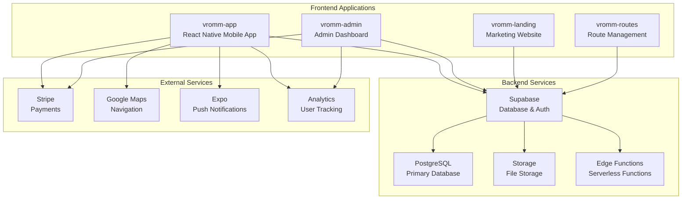
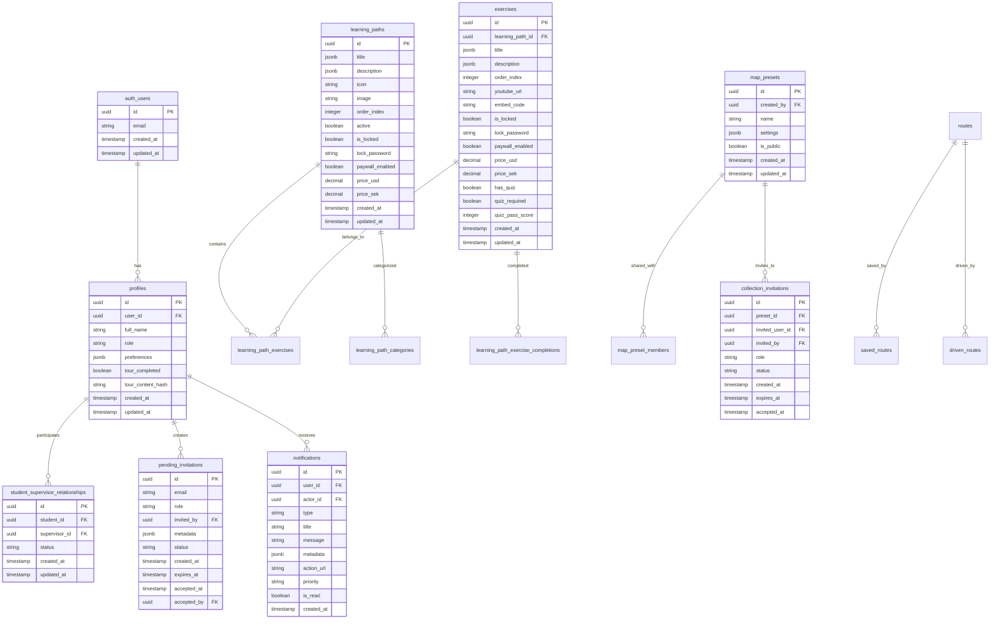

# VROMM Ecosystem Overview

## Table of Contents
1. [Ecosystem Architecture](#ecosystem-architecture)
2. [Project Overview](#project-overview)
3. [Database Architecture](#database-architecture)
4. [API & Integration](#api--integration)
5. [Development Workflow](#development-workflow)
6. [Deployment & Infrastructure](#deployment--infrastructure)

## Ecosystem Architecture



## Project Overview

### 1. vromm-app (React Native Mobile App)
**Primary Application** - Main user-facing mobile application

**Technology Stack:**
- React Native with Expo
- TypeScript
- Tamagui UI Framework
- React Navigation
- Supabase Client

**Key Features:**
- User authentication & profiles
- Learning path management
- Progress tracking & analytics
- Route creation & sharing
- Real-time notifications
- Offline capabilities
- Multi-language support

**Core Components:**
- `HomeScreen/` - Main dashboard
- `ProgressScreen/` - Learning progress
- `RouteScreen/` - Route management
- `ProfileScreen/` - User settings
- `OnboardingInteractive/` - User onboarding

### 2. vromm-admin (Admin Dashboard)
**Administrative Interface** - Content and user management

**Technology Stack:**
- Next.js 14
- TypeScript
- Tailwind CSS
- Supabase Admin SDK
- React Hook Form

**Key Features:**
- User management & analytics
- Content creation & editing
- Learning path administration
- Payment processing
- System monitoring
- Bulk operations

**Core Modules:**
- User Management
- Content Management System (CMS)
- Analytics Dashboard
- Payment Processing
- System Administration

### 3. vromm-landing (Marketing Website)
**Marketing & Information** - Public-facing website

**Technology Stack:**
- Next.js 14
- TypeScript
- Tailwind CSS
- Framer Motion
- Supabase

**Key Features:**
- Marketing pages
- User registration
- Pricing information
- Blog/content
- SEO optimization
- Contact forms

### 4. vromm-routes (Route Management)
**Route-Specific Application** - Specialized route handling

**Technology Stack:**
- React Native
- TypeScript
- Map integration
- GPS tracking
- Offline storage

**Key Features:**
- Route creation & editing
- GPS tracking
- Offline route storage
- Route sharing
- Performance analytics

## Database Architecture

### Core Tables



### Key Relationships

1. **User Management**
   - `auth_users` → `profiles` (1:1)
   - `profiles` → `student_supervisor_relationships` (1:many)
   - `profiles` → `pending_invitations` (1:many)

2. **Learning System**
   - `learning_paths` → `learning_path_exercises` (1:many)
   - `exercises` → `learning_path_exercise_completions` (1:many)
   - `profiles` → `learning_path_exercise_completions` (1:many)

3. **Content Sharing**
   - `map_presets` → `map_preset_members` (1:many)
   - `map_presets` → `collection_invitations` (1:many)
   - `profiles` → `collection_invitations` (1:many)

4. **Notifications**
   - `profiles` → `notifications` (1:many)
   - `profiles` → `notifications` (actor) (1:many)

## API & Integration

### Supabase Integration

**Authentication:**
```typescript
// User authentication
const { data: { user }, error } = await supabase.auth.signInWithPassword({
  email,
  password
});

// User profile management
const { data: profile } = await supabase
  .from('profiles')
  .select('*')
  .eq('user_id', user.id)
  .single();
```

**Real-time Subscriptions:**
```typescript
// Listen to notifications
const subscription = supabase
  .channel('notifications')
  .on('postgres_changes', {
    event: 'INSERT',
    schema: 'public',
    table: 'notifications',
    filter: `user_id=eq.${userId}`
  }, (payload) => {
    // Handle new notification
  })
  .subscribe();
```

**Row Level Security (RLS):**
```sql
-- Users can only see their own data
CREATE POLICY "Users can view own profile" ON profiles
  FOR SELECT USING (auth.uid() = user_id);

-- Supervisors can see their students
CREATE POLICY "Supervisors can view students" ON profiles
  FOR SELECT USING (
    auth.uid() IN (
      SELECT supervisor_id FROM student_supervisor_relationships 
      WHERE student_id = user_id
    )
  );
```

### External Integrations

**Stripe Payments:**
```typescript
// Create payment intent
const { data, error } = await supabase.functions.invoke('create-payment-intent', {
  amount: priceInCents,
  currency: 'usd',
  metadata: { contentId, contentType }
});
```

**Google Maps:**
```typescript
// Route navigation
import { GoogleMap, DirectionsService, DirectionsRenderer } from '@react-google-maps/api';

const MapComponent = () => {
  const [directions, setDirections] = useState(null);
  
  const directionsCallback = (result) => {
    if (result.status === 'OK') {
      setDirections(result);
    }
  };
  
  return (
    <GoogleMap>
      <DirectionsService
        options={{
          destination: destination,
          origin: origin,
          travelMode: 'DRIVING'
        }}
        callback={directionsCallback}
      />
      {directions && <DirectionsRenderer directions={directions} />}
    </GoogleMap>
  );
};
```

## Development Workflow

### Project Structure
```
vromm-ecosystem/
├── vromm-app/                 # React Native mobile app
│   ├── src/
│   │   ├── components/        # Reusable components
│   │   ├── screens/          # Screen components
│   │   ├── contexts/         # React contexts
│   │   ├── hooks/            # Custom hooks
│   │   ├── lib/              # Utilities & config
│   │   └── types/            # TypeScript types
│   ├── app.json              # Expo configuration
│   └── package.json
├── vromm-admin/              # Next.js admin dashboard
│   ├── src/
│   │   ├── app/              # Next.js 14 app router
│   │   ├── components/       # React components
│   │   ├── lib/              # Utilities
│   │   └── types/            # TypeScript types
│   └── package.json
├── vromm-landing/            # Next.js marketing site
│   ├── src/
│   │   ├── app/              # Next.js 14 app router
│   │   ├── components/       # React components
│   │   └── lib/              # Utilities
│   └── package.json
├── vromm-routes/             # Route management app
│   ├── src/
│   │   ├── components/       # React components
│   │   ├── screens/          # Screen components
│   │   └── lib/              # Utilities
│   └── package.json
└── shared/                   # Shared utilities
    ├── types/                # Shared TypeScript types
    ├── utils/                # Shared utilities
    └── constants/            # Shared constants
```

### Development Commands

**Mobile App (vromm-app):**
```bash
# Development
npm start                    # Start Expo dev server
npm run ios                  # Run on iOS simulator
npm run android              # Run on Android emulator
npm run web                  # Run on web

# Building
npm run build:ios           # Build for iOS
npm run build:android       # Build for Android
npm run build:web           # Build for web

# Testing
npm test                    # Run tests
npm run test:watch          # Watch mode
npm run test:coverage       # Coverage report
```

**Admin Dashboard (vromm-admin):**
```bash
# Development
npm run dev                 # Start development server
npm run build              # Build for production
npm run start              # Start production server

# Database
npm run db:generate        # Generate Prisma client
npm run db:push            # Push schema changes
npm run db:migrate         # Run migrations
```

**Landing Page (vromm-landing):**
```bash
# Development
npm run dev                 # Start development server
npm run build              # Build for production
npm run start              # Start production server

# SEO
npm run sitemap            # Generate sitemap
npm run robots             # Generate robots.txt
```

### Database Management

**Schema Changes:**
```sql
-- Create new table
CREATE TABLE new_feature (
  id UUID PRIMARY KEY DEFAULT gen_random_uuid(),
  name TEXT NOT NULL,
  created_at TIMESTAMP WITH TIME ZONE DEFAULT NOW(),
  updated_at TIMESTAMP WITH TIME ZONE DEFAULT NOW()
);

-- Add RLS policy
CREATE POLICY "Feature access policy" ON new_feature
  FOR ALL USING (auth.uid() = user_id);
```

**Migrations:**
```bash
# Create migration
supabase migration new add_new_feature

# Apply migrations
supabase db push

# Reset database
supabase db reset
```

## Deployment & Infrastructure

### Mobile App Deployment

**Expo Application Services (EAS):**
```bash
# Install EAS CLI
npm install -g @expo/eas-cli

# Configure EAS
eas build:configure

# Build for production
eas build --platform ios
eas build --platform android

# Submit to app stores
eas submit --platform ios
eas submit --platform android
```

**Environment Configuration:**
```typescript
// app.config.js
export default {
  expo: {
    name: "VROMM",
    slug: "vromm-app",
    version: "1.0.0",
    extra: {
      supabaseUrl: process.env.EXPO_PUBLIC_SUPABASE_URL,
      supabaseAnonKey: process.env.EXPO_PUBLIC_SUPABASE_ANON_KEY,
      stripePublishableKey: process.env.EXPO_PUBLIC_STRIPE_PUBLISHABLE_KEY,
    }
  }
};
```

### Web Applications Deployment

**Vercel Deployment:**
```bash
# Deploy to Vercel
vercel --prod

# Environment variables
vercel env add SUPABASE_URL
vercel env add SUPABASE_ANON_KEY
vercel env add STRIPE_SECRET_KEY
```

**Docker Configuration:**
```dockerfile
# Dockerfile for admin dashboard
FROM node:18-alpine

WORKDIR /app
COPY package*.json ./
RUN npm ci --only=production

COPY . .
RUN npm run build

EXPOSE 3000
CMD ["npm", "start"]
```

### Monitoring & Analytics

**Error Tracking:**
```typescript
// Sentry integration
import * as Sentry from '@sentry/react-native';

Sentry.init({
  dsn: process.env.SENTRY_DSN,
  environment: process.env.NODE_ENV,
});
```

**Performance Monitoring:**
```typescript
// Performance tracking
import { PerformanceMonitor } from './utils/performanceMonitor';

const monitor = new PerformanceMonitor();
monitor.trackMemoryAllocation();
monitor.trackDatabaseCalls();
monitor.trackNetworkCalls();
```

## Security Considerations

### Authentication & Authorization
- JWT tokens with refresh mechanism
- Row Level Security (RLS) policies
- Role-based access control
- API rate limiting

### Data Protection
- End-to-end encryption for sensitive data
- Secure file upload handling
- GDPR compliance
- Data retention policies

### Infrastructure Security
- HTTPS enforcement
- CORS configuration
- Environment variable protection
- Regular security audits

## Future Roadmap

### Short Term (3 months)
- [ ] Enhanced offline capabilities
- [ ] Advanced analytics dashboard
- [ ] Multi-language content management
- [ ] Automated testing pipeline

### Medium Term (6 months)
- [ ] AI-powered learning recommendations
- [ ] Advanced route optimization
- [ ] Social learning features
- [ ] Mobile app performance optimization

### Long Term (12 months)
- [ ] Web-based route editor
- [ ] Advanced reporting & analytics
- [ ] Third-party integrations
- [ ] Enterprise features

---

*This documentation is maintained by the VROMM development team. Last updated: January 2025*
