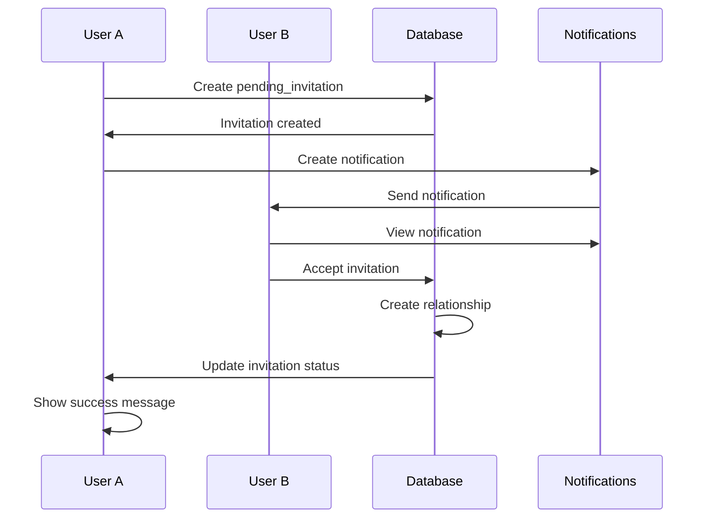
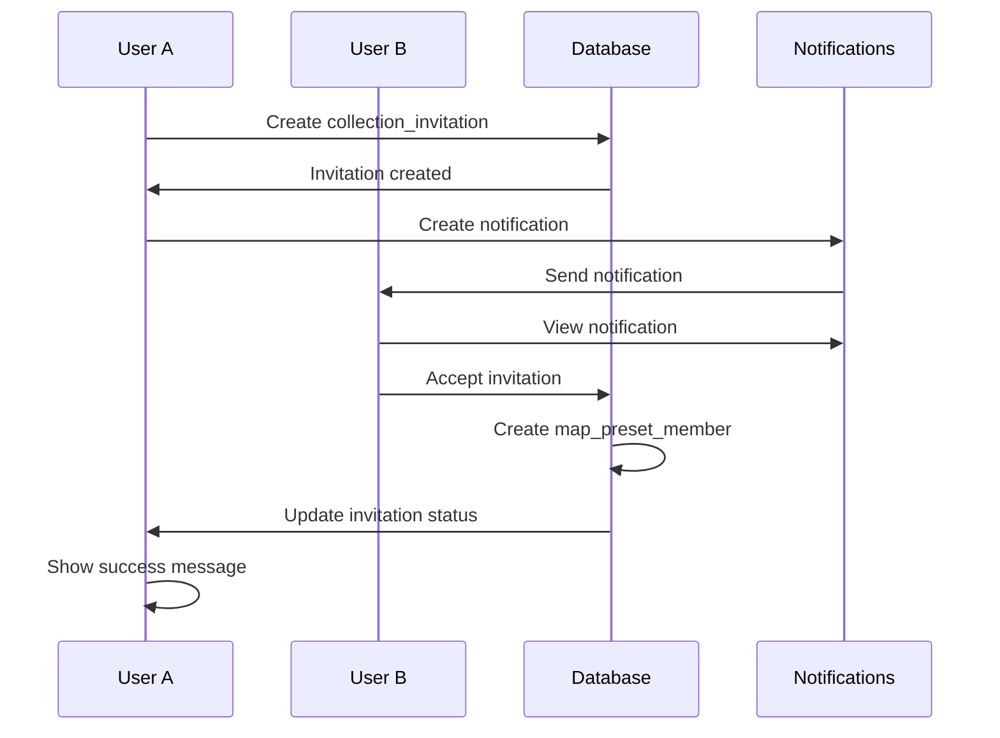

# VROMM Existing Invitation System Documentation

## Table of Contents
1. [System Overview](#system-overview)
2. [Existing Components](#existing-components)
3. [Database Schema](#database-schema)
4. [Invitation Flows](#invitation-flows)
5. [Missing Features](#missing-features)
6. [Implementation Gaps](#implementation-gaps)
7. [Improvement Recommendations](#improvement-recommendations)

## System Overview

The VROMM app has **two distinct invitation systems** that are already implemented:

### ✅ **1. Relationship Invitations System**
- **Purpose**: Connect students with instructors/supervisors
- **Status**: ✅ **FULLY IMPLEMENTED**
- **Components**: Multiple working components
- **Database**: Complete with `pending_invitations` table

### ❌ **2. Collection Invitations System**
- **Purpose**: Share map collections/presets with other users
- **Status**: ❌ **PARTIALLY IMPLEMENTED**
- **Components**: UI exists but database table missing
- **Database**: Missing `collection_invitations` table

## Existing Components

### ✅ **Relationship Invitations - FULLY WORKING**

#### 1. **OnboardingInteractive.tsx**
```typescript
// Main onboarding flow for new users
const handleCreateSelectedConnections = async () => {
  // Creates pending_invitations records
  // Sends notifications
  // Handles both student→instructor and instructor→student flows
};
```

**Features:**
- ✅ User search and selection
- ✅ Role-based invitation logic
- ✅ Custom message support
- ✅ Notification creation
- ✅ Database integration

#### 2. **GettingStarted.tsx**
```typescript
// Home screen getting started section
const handleCreateConnections = async () => {
  // Same logic as OnboardingInteractive
  // Creates pending_invitations records
  // Sends notifications
};
```

**Features:**
- ✅ User search and selection
- ✅ Role-based invitation logic
- ✅ Custom message support
- ✅ Notification creation
- ✅ Database integration

#### 3. **ProfileScreen.tsx**
```typescript
// Profile management with invitation capabilities
const handleInviteUsers = async (emails: string[], inviteRole: string) => {
  // Bulk invitation system
  // Auto-generated passwords
  // Email invitations via Supabase Auth
};
```

**Features:**
- ✅ Bulk email invitations
- ✅ Auto-generated passwords
- ✅ Supabase Auth integration
- ✅ Role-based targeting

#### 4. **RelationshipManagementModal.tsx**
```typescript
// Manage existing relationships
interface RelationshipManagementModalProps {
  visible: boolean;
  onClose: () => void;
  userRole: string;
  supervisedStudents: any[];
  onStudentSelect: (studentId: string) => void;
  availableSupervisors: any[];
  selectedSupervisorIds: string[];
  onSupervisorSelect: (supervisorId: string) => void;
  onAddSupervisors: () => void;
}
```

**Features:**
- ✅ Relationship management
- ✅ Student/supervisor selection
- ✅ Role-based permissions

### ❌ **Collection Invitations - PARTIALLY IMPLEMENTED**

#### 1. **AddToPresetSheet.tsx**
```typescript
// Add routes to collections
const showSharingSheet = () => {
  // Should show collection sharing modal
  // Depends on collection_invitations table
};
```

**Status:** ❌ **MISSING DATABASE TABLE**

#### 2. **CollectionSharingModal.tsx**
```typescript
// Share collections with users
const handleSendInvitations = async () => {
  // Should create collection_invitations records
  // Depends on collection_invitations table
};
```

**Status:** ❌ **MISSING DATABASE TABLE**

#### 3. **FilterSheet.tsx**
```typescript
// Filter and manage collections
// May include sharing functionality
```

**Status:** ❌ **MISSING DATABASE TABLE**

## Database Schema

### ✅ **Existing Tables - WORKING**

#### 1. **pending_invitations** (Relationship Invitations)
```sql
CREATE TABLE pending_invitations (
  id UUID PRIMARY KEY DEFAULT gen_random_uuid(),
  email TEXT NOT NULL,
  role TEXT CHECK (role IN ('student', 'instructor', 'supervisor', 'school')) NOT NULL,
  invited_by UUID REFERENCES profiles(id) NOT NULL,
  metadata JSONB DEFAULT '{}',
  status TEXT CHECK (status IN ('pending', 'accepted', 'declined', 'cancelled')) DEFAULT 'pending',
  created_at TIMESTAMP WITH TIME ZONE DEFAULT NOW(),
  updated_at TIMESTAMP WITH TIME ZONE DEFAULT NOW(),
  expires_at TIMESTAMP WITH TIME ZONE DEFAULT (NOW() + INTERVAL '7 days'),
  accepted_at TIMESTAMP WITH TIME ZONE,
  accepted_by UUID REFERENCES profiles(id)
);
```

**Features:**
- ✅ Email-based invitations
- ✅ Role-based targeting
- ✅ Metadata storage
- ✅ Status tracking
- ✅ Expiration handling
- ✅ Acceptance tracking

#### 2. **student_supervisor_relationships** (Active Relationships)
```sql
CREATE TABLE student_supervisor_relationships (
  id UUID PRIMARY KEY DEFAULT gen_random_uuid(),
  student_id UUID REFERENCES profiles(id) NOT NULL,
  supervisor_id UUID REFERENCES profiles(id) NOT NULL,
  status TEXT CHECK (status IN ('active', 'inactive', 'completed')) DEFAULT 'active',
  created_at TIMESTAMP WITH TIME ZONE DEFAULT NOW(),
  updated_at TIMESTAMP WITH TIME ZONE DEFAULT NOW(),
  UNIQUE(student_id, supervisor_id)
);
```

**Features:**
- ✅ Active relationship tracking
- ✅ Bidirectional relationships
- ✅ Status management
- ✅ Unique constraints

#### 3. **notifications** (Notification System)
```sql
CREATE TABLE notifications (
  id UUID PRIMARY KEY DEFAULT gen_random_uuid(),
  user_id UUID REFERENCES profiles(id) NOT NULL,
  type TEXT NOT NULL,
  title TEXT NOT NULL,
  message TEXT NOT NULL,
  data JSONB DEFAULT '{}',
  read BOOLEAN DEFAULT false,
  created_at TIMESTAMP WITH TIME ZONE DEFAULT NOW()
);
```

**Features:**
- ✅ User notifications
- ✅ Type-based categorization
- ✅ Read status tracking
- ✅ Data storage

### ❌ **Missing Tables - NEEDS IMPLEMENTATION**

#### 1. **collection_invitations** (Collection Sharing)
```sql
-- MISSING TABLE - NEEDS TO BE CREATED
CREATE TABLE collection_invitations (
  id UUID PRIMARY KEY DEFAULT gen_random_uuid(),
  collection_id UUID REFERENCES map_presets(id) NOT NULL,
  invited_user_id UUID REFERENCES profiles(id) NOT NULL,
  invited_by UUID REFERENCES profiles(id) NOT NULL,
  permission_level TEXT CHECK (permission_level IN ('read', 'write', 'admin')) DEFAULT 'read',
  status TEXT CHECK (status IN ('pending', 'accepted', 'declined', 'cancelled')) DEFAULT 'pending',
  message TEXT,
  created_at TIMESTAMP WITH TIME ZONE DEFAULT NOW(),
  updated_at TIMESTAMP WITH TIME ZONE DEFAULT NOW(),
  expires_at TIMESTAMP WITH TIME ZONE DEFAULT (NOW() + INTERVAL '30 days'),
  accepted_at TIMESTAMP WITH TIME ZONE,
  UNIQUE(collection_id, invited_user_id)
);
```

#### 2. **map_preset_members** (Collection Memberships)
```sql
-- MISSING TABLE - NEEDS TO BE CREATED
CREATE TABLE map_preset_members (
  id UUID PRIMARY KEY DEFAULT gen_random_uuid(),
  preset_id UUID REFERENCES map_presets(id) NOT NULL,
  user_id UUID REFERENCES profiles(id) NOT NULL,
  role TEXT CHECK (role IN ('owner', 'admin', 'write', 'read')) DEFAULT 'read',
  added_by UUID REFERENCES profiles(id) NOT NULL,
  added_at TIMESTAMP WITH TIME ZONE DEFAULT NOW(),
  UNIQUE(preset_id, user_id)
);
```

## Invitation Flows

### ✅ **Relationship Invitations - WORKING**



**Components Involved:**
- ✅ `OnboardingInteractive.tsx` - Main onboarding
- ✅ `GettingStarted.tsx` - Home screen
- ✅ `ProfileScreen.tsx` - Profile management
- ✅ `RelationshipManagementModal.tsx` - Relationship management
- ✅ `InvitationModal.tsx` - Handle incoming invitations
- ✅ `NotificationsSheet.tsx` - Display notifications

### ❌ **Collection Invitations - MISSING**



**Components Involved:**
- ❌ `AddToPresetSheet.tsx` - Add routes to collections
- ❌ `CollectionSharingModal.tsx` - Share collections
- ❌ `FilterSheet.tsx` - Filter collections
- ❌ `InvitationModal.tsx` - Handle incoming invitations
- ❌ `NotificationsSheet.tsx` - Display notifications

## Missing Features

### ❌ **Critical Missing Features**

#### 1. **Collection Invitations Database**
```sql
-- MISSING: Collection invitations table
CREATE TABLE collection_invitations (
  id UUID PRIMARY KEY DEFAULT gen_random_uuid(),
  collection_id UUID REFERENCES map_presets(id) NOT NULL,
  invited_user_id UUID REFERENCES profiles(id) NOT NULL,
  invited_by UUID REFERENCES profiles(id) NOT NULL,
  permission_level TEXT CHECK (permission_level IN ('read', 'write', 'admin')) DEFAULT 'read',
  status TEXT CHECK (status IN ('pending', 'accepted', 'declined', 'cancelled')) DEFAULT 'pending',
  message TEXT,
  created_at TIMESTAMP WITH TIME ZONE DEFAULT NOW(),
  updated_at TIMESTAMP WITH TIME ZONE DEFAULT NOW(),
  expires_at TIMESTAMP WITH TIME ZONE DEFAULT (NOW() + INTERVAL '30 days'),
  accepted_at TIMESTAMP WITH TIME ZONE,
  UNIQUE(collection_id, invited_user_id)
);
```

#### 2. **Collection Memberships Database**
```sql
-- MISSING: Collection memberships table
CREATE TABLE map_preset_members (
  id UUID PRIMARY KEY DEFAULT gen_random_uuid(),
  preset_id UUID REFERENCES map_presets(id) NOT NULL,
  user_id UUID REFERENCES profiles(id) NOT NULL,
  role TEXT CHECK (role IN ('owner', 'admin', 'write', 'read')) DEFAULT 'read',
  added_by UUID REFERENCES profiles(id) NOT NULL,
  added_at TIMESTAMP WITH TIME ZONE DEFAULT NOW(),
  UNIQUE(preset_id, user_id)
);
```

#### 3. **Collection Sharing Service**
```typescript
// MISSING: Collection sharing service
export class CollectionSharingService {
  static async inviteUserToCollection(
    collectionId: string,
    userId: string,
    permissionLevel: 'read' | 'write' | 'admin',
    message?: string
  ): Promise<void> {
    // Create collection_invitation record
    // Send notification
    // Handle permissions
  }
  
  static async acceptCollectionInvitation(
    invitationId: string
  ): Promise<void> {
    // Accept invitation
    // Create map_preset_member record
    // Update invitation status
  }
  
  static async getCollectionMembers(
    collectionId: string
  ): Promise<CollectionMember[]> {
    // Get all members of a collection
  }
}
```

#### 4. **Collection Permission System**
```typescript
// MISSING: Collection permission system
export class CollectionPermissionService {
  static async checkPermission(
    userId: string,
    collectionId: string,
    permission: 'read' | 'write' | 'admin'
  ): Promise<boolean> {
    // Check if user has permission
  }
  
  static async updateMemberRole(
    collectionId: string,
    userId: string,
    newRole: 'read' | 'write' | 'admin'
  ): Promise<void> {
    // Update member role
  }
  
  static async removeMember(
    collectionId: string,
    userId: string
  ): Promise<void> {
    // Remove member from collection
  }
}
```

## Implementation Gaps

### 1. **Database Tables Missing**
- ❌ `collection_invitations` table
- ❌ `map_preset_members` table
- ❌ RLS policies for collection sharing
- ❌ Triggers for automatic member management

### 2. **Service Layer Missing**
- ❌ `CollectionSharingService` class
- ❌ `CollectionPermissionService` class
- ❌ Collection invitation methods
- ❌ Permission checking methods

### 3. **UI Components Missing**
- ❌ Collection sharing modal functionality
- ❌ Member management interface
- ❌ Permission level selection
- ❌ Collection invitation handling

### 4. **Integration Missing**
- ❌ Collection invitations in notification system
- ❌ Permission-based collection access
- ❌ Member role management
- ❌ Collection sharing workflows

## Improvement Recommendations

### Phase 1: Create Missing Database Tables

```sql
-- Create collection_invitations table
CREATE TABLE collection_invitations (
  id UUID PRIMARY KEY DEFAULT gen_random_uuid(),
  collection_id UUID REFERENCES map_presets(id) NOT NULL,
  invited_user_id UUID REFERENCES profiles(id) NOT NULL,
  invited_by UUID REFERENCES profiles(id) NOT NULL,
  permission_level TEXT CHECK (permission_level IN ('read', 'write', 'admin')) DEFAULT 'read',
  status TEXT CHECK (status IN ('pending', 'accepted', 'declined', 'cancelled')) DEFAULT 'pending',
  message TEXT,
  created_at TIMESTAMP WITH TIME ZONE DEFAULT NOW(),
  updated_at TIMESTAMP WITH TIME ZONE DEFAULT NOW(),
  expires_at TIMESTAMP WITH TIME ZONE DEFAULT (NOW() + INTERVAL '30 days'),
  accepted_at TIMESTAMP WITH TIME ZONE,
  UNIQUE(collection_id, invited_user_id)
);

-- Create map_preset_members table
CREATE TABLE map_preset_members (
  id UUID PRIMARY KEY DEFAULT gen_random_uuid(),
  preset_id UUID REFERENCES map_presets(id) NOT NULL,
  user_id UUID REFERENCES profiles(id) NOT NULL,
  role TEXT CHECK (role IN ('owner', 'admin', 'write', 'read')) DEFAULT 'read',
  added_by UUID REFERENCES profiles(id) NOT NULL,
  added_at TIMESTAMP WITH TIME ZONE DEFAULT NOW(),
  UNIQUE(preset_id, user_id)
);

-- Add RLS policies
ALTER TABLE collection_invitations ENABLE ROW LEVEL SECURITY;
ALTER TABLE map_preset_members ENABLE ROW LEVEL SECURITY;

-- Collection invitations policies
CREATE POLICY "Users can view their collection invitations" ON collection_invitations
  FOR SELECT USING (invited_user_id = auth.uid() OR invited_by = auth.uid());

CREATE POLICY "Users can create collection invitations" ON collection_invitations
  FOR INSERT WITH CHECK (invited_by = auth.uid());

CREATE POLICY "Users can update their collection invitations" ON collection_invitations
  FOR UPDATE USING (invited_user_id = auth.uid() OR invited_by = auth.uid());

-- Collection members policies
CREATE POLICY "Users can view collection members" ON map_preset_members
  FOR SELECT USING (
    user_id = auth.uid() OR 
    EXISTS (
      SELECT 1 FROM map_preset_members mp 
      WHERE mp.preset_id = map_preset_members.preset_id 
      AND mp.user_id = auth.uid()
    )
  );

CREATE POLICY "Collection owners can manage members" ON map_preset_members
  FOR ALL USING (
    EXISTS (
      SELECT 1 FROM map_preset_members mp 
      WHERE mp.preset_id = map_preset_members.preset_id 
      AND mp.user_id = auth.uid() 
      AND mp.role IN ('owner', 'admin')
    )
  );
```

### Phase 2: Create Service Layer

```typescript
// Create CollectionSharingService
export class CollectionSharingService {
  static async inviteUserToCollection(
    collectionId: string,
    userId: string,
    permissionLevel: 'read' | 'write' | 'admin',
    message?: string
  ): Promise<void> {
    const { error } = await supabase
      .from('collection_invitations')
      .insert({
        collection_id: collectionId,
        invited_user_id: userId,
        invited_by: (await supabase.auth.getUser()).data.user?.id,
        permission_level: permissionLevel,
        message,
        status: 'pending'
      });
    
    if (error) throw error;
    
    // Create notification
    await this.createNotification(userId, collectionId, 'collection_invitation');
  }
  
  static async acceptCollectionInvitation(
    invitationId: string
  ): Promise<void> {
    const { data: invitation, error: fetchError } = await supabase
      .from('collection_invitations')
      .select('*')
      .eq('id', invitationId)
      .single();
    
    if (fetchError) throw fetchError;
    
    // Create member record
    const { error: memberError } = await supabase
      .from('map_preset_members')
      .insert({
        preset_id: invitation.collection_id,
        user_id: invitation.invited_user_id,
        role: invitation.permission_level,
        added_by: invitation.invited_by
      });
    
    if (memberError) throw memberError;
    
    // Update invitation status
    const { error: updateError } = await supabase
      .from('collection_invitations')
      .update({
        status: 'accepted',
        accepted_at: new Date().toISOString()
      })
      .eq('id', invitationId);
    
    if (updateError) throw updateError;
  }
  
  private static async createNotification(
    userId: string,
    collectionId: string,
    type: string
  ): Promise<void> {
    const { error } = await supabase
      .from('notifications')
      .insert({
        user_id: userId,
        type,
        title: 'Collection Invitation',
        message: 'You have been invited to join a collection',
        data: { collection_id: collectionId }
      });
    
    if (error) throw error;
  }
}
```

### Phase 3: Update UI Components

```typescript
// Update AddToPresetSheet.tsx
const showSharingSheet = () => {
  setShowSharingModal(true);
};

const handleSendInvitations = async (userIds: string[], permissionLevel: string) => {
  try {
    for (const userId of userIds) {
      await CollectionSharingService.inviteUserToCollection(
        selectedPreset.id,
        userId,
        permissionLevel,
        sharingMessage
      );
    }
    
    Alert.alert('Invitations Sent!', 'Collection invitations sent successfully!');
    setShowSharingModal(false);
  } catch (error) {
    console.error('Error sending invitations:', error);
    Alert.alert('Error', 'Failed to send invitations');
  }
};
```

### Phase 4: Add Permission System

```typescript
// Create CollectionPermissionService
export class CollectionPermissionService {
  static async checkPermission(
    userId: string,
    collectionId: string,
    permission: 'read' | 'write' | 'admin'
  ): Promise<boolean> {
    const { data, error } = await supabase
      .from('map_preset_members')
      .select('role')
      .eq('preset_id', collectionId)
      .eq('user_id', userId)
      .single();
    
    if (error || !data) return false;
    
    const roleHierarchy = { 'read': 1, 'write': 2, 'admin': 3 };
    const userRole = roleHierarchy[data.role as keyof typeof roleHierarchy] || 0;
    const requiredRole = roleHierarchy[permission];
    
    return userRole >= requiredRole;
  }
  
  static async getCollectionMembers(
    collectionId: string
  ): Promise<CollectionMember[]> {
    const { data, error } = await supabase
      .from('map_preset_members')
      .select(`
        *,
        user:profiles!user_id (id, full_name, avatar_url, role)
      `)
      .eq('preset_id', collectionId);
    
    if (error) throw error;
    return data || [];
  }
}
```

## Summary

### ✅ **What's Working**
- **Relationship invitations** - Fully implemented and working
- **User search and selection** - Working across multiple components
- **Notification system** - Working for relationship invitations
- **Database integration** - Complete for relationship invitations

### ❌ **What's Missing**
- **Collection invitations database** - Missing `collection_invitations` table
- **Collection memberships database** - Missing `map_preset_members` table
- **Collection sharing service** - Missing service layer
- **Permission system** - Missing collection permission management
- **UI integration** - Missing collection sharing functionality

### 🎯 **Next Steps**
1. **Create missing database tables** for collection sharing
2. **Implement service layer** for collection management
3. **Update UI components** to support collection sharing
4. **Add permission system** for collection access control
5. **Test and integrate** collection sharing workflows

---

*This documentation analyzes the existing VROMM invitation system and identifies missing features for collection sharing. Last updated: January 2025*
