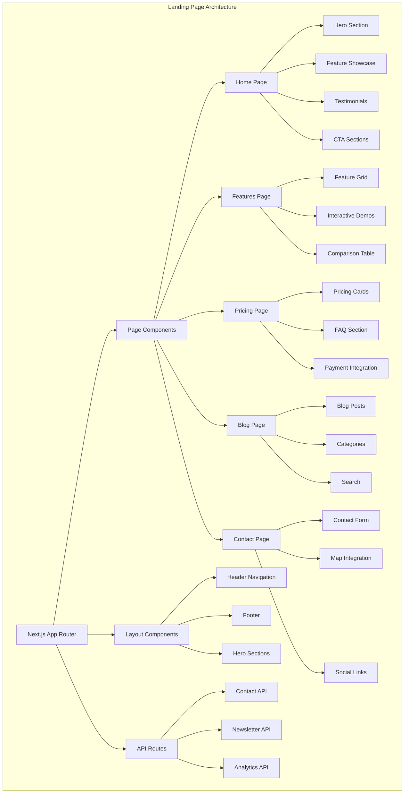

# VROMM Landing Page Documentation

## Table of Contents
1. [Project Overview](#project-overview)
2. [Technology Stack](#technology-stack)
3. [Architecture](#architecture)
4. [Core Features](#core-features)
5. [Page Structure](#page-structure)
6. [Content Management](#content-management)
7. [SEO & Performance](#seo--performance)
8. [Development Guide](#development-guide)
9. [Deployment](#deployment)

## Project Overview

The VROMM Landing Page is a modern, responsive marketing website built with Next.js 14, designed to showcase the VROMM learning platform, drive user acquisition, and provide information about features, pricing, and benefits.

### Key Capabilities
- **Marketing Pages** - Hero sections, feature showcases, testimonials
- **User Registration** - Seamless sign-up flow with Supabase integration
- **Pricing Information** - Dynamic pricing display with Stripe integration
- **Blog/Content** - Content management for articles and news
- **SEO Optimization** - Meta tags, structured data, and performance
- **Contact Forms** - Lead capture and customer inquiries
- **Analytics Integration** - User behavior tracking and conversion monitoring

## Technology Stack

### Frontend
- **Next.js 14** - React framework with App Router
- **TypeScript** - Type-safe development
- **Tailwind CSS** - Utility-first CSS framework
- **Framer Motion** - Smooth animations and transitions
- **React Hook Form** - Form handling and validation
- **React Query** - Data fetching and caching

### Backend Integration
- **Supabase** - Authentication and database
- **Stripe** - Payment processing and pricing
- **Vercel** - Hosting and deployment
- **Cloudinary** - Image optimization and CDN

### SEO & Performance
- **Next.js SEO** - Built-in SEO optimization
- **Sitemap Generation** - Automatic sitemap creation
- **Robots.txt** - Search engine crawling control
- **Google Analytics** - User behavior tracking
- **Core Web Vitals** - Performance monitoring

## Architecture



## Core Features

### 1. Hero Sections

#### Main Hero
```typescript
interface HeroSectionProps {
  title: string;
  subtitle: string;
  ctaText: string;
  ctaLink: string;
  backgroundImage?: string;
  videoUrl?: string;
}

const HeroSection = ({ title, subtitle, ctaText, ctaLink, backgroundImage, videoUrl }: HeroSectionProps) => {
  return (
    <section className="hero-section">
      <div className="hero-background">
        {videoUrl ? (
          <video autoPlay muted loop className="hero-video">
            <source src={videoUrl} type="video/mp4" />
          </video>
        ) : backgroundImage ? (
          
        ) : null}
      </div>
      
      <div className="hero-content">
        <motion.h1 
          initial={{ opacity: 0, y: 20 }}
          animate={{ opacity: 1, y: 0 }}
          transition={{ duration: 0.8 }}
          className="hero-title"
        >
          {title}
        </motion.h1>
        
        <motion.p 
          initial={{ opacity: 0, y: 20 }}
          animate={{ opacity: 1, y: 0 }}
          transition={{ duration: 0.8, delay: 0.2 }}
          className="hero-subtitle"
        >
          {subtitle}
        </motion.p>
        
        <motion.div
          initial={{ opacity: 0, y: 20 }}
          animate={{ opacity: 1, y: 0 }}
          transition={{ duration: 0.8, delay: 0.4 }}
          className="hero-cta"
        >
          <Button size="lg" href={ctaLink}>
            {ctaText}
          </Button>
        </motion.div>
      </div>
    </section>
  );
};
```

#### Feature Hero
```typescript
const FeatureHero = () => {
  const [activeFeature, setActiveFeature] = useState(0);
  
  const features = [
    {
      title: "Interactive Learning",
      description: "Engage with hands-on exercises and real-world scenarios",
      icon: "play-circle",
      color: "blue"
    },
    {
      title: "Progress Tracking",
      description: "Monitor your learning journey with detailed analytics",
      icon: "chart-line",
      color: "green"
    },
    {
      title: "Expert Guidance",
      description: "Learn from certified instructors and industry experts",
      icon: "users",
      color: "purple"
    }
  ];
  
  return (
    <section className="feature-hero">
      <div className="feature-hero-content">
        <div className="feature-tabs">
          {features.map((feature, index) => (
            <button
              key={index}
              onClick={() => setActiveFeature(index)}
              className={`feature-tab ${activeFeature === index ? 'active' : ''}`}
            >
              <Icon name={feature.icon} />
              <span>{feature.title}</span>
            </button>
          ))}
        </div>
        
        <div className="feature-content">
          <motion.div
            key={activeFeature}
            initial={{ opacity: 0, x: 20 }}
            animate={{ opacity: 1, x: 0 }}
            transition={{ duration: 0.5 }}
            className="feature-details"
          >
            <h3>{features[activeFeature].title}</h3>
            <p>{features[activeFeature].description}</p>
            <Button variant="outline">Learn More</Button>
          </motion.div>
        </div>
      </div>
    </section>
  );
};
```

### 2. Feature Showcase

#### Feature Grid
```typescript
interface Feature {
  id: string;
  title: string;
  description: string;
  icon: string;
  image?: string;
  video?: string;
  benefits: string[];
}

const FeatureGrid = ({ features }: { features: Feature[] }) => {
  return (
    <section className="feature-grid">
      <div className="container">
        <div className="grid grid-cols-1 md:grid-cols-2 lg:grid-cols-3 gap-8">
          {features.map((feature, index) => (
            <motion.div
              key={feature.id}
              initial={{ opacity: 0, y: 20 }}
              whileInView={{ opacity: 1, y: 0 }}
              transition={{ duration: 0.5, delay: index * 0.1 }}
              className="feature-card"
            >
              <div className="feature-icon">
                <Icon name={feature.icon} size={48} />
              </div>
              
              <h3 className="feature-title">{feature.title}</h3>
              <p className="feature-description">{feature.description}</p>
              
              <ul className="feature-benefits">
                {feature.benefits.map((benefit, idx) => (
                  <li key={idx} className="benefit-item">
                    <Icon name="check" size={16} />
                    <span>{benefit}</span>
                  </li>
                ))}
              </ul>
              
              {feature.image && (
                <div className="feature-media">
                  
                </div>
              )}
            </motion.div>
          ))}
        </div>
      </div>
    </section>
  );
};
```

#### Interactive Demo
```typescript
const InteractiveDemo = () => {
  const [demoStep, setDemoStep] = useState(0);
  
  const demoSteps = [
    {
      title: "Sign Up",
      description: "Create your account in seconds",
      action: "Get Started"
    },
    {
      title: "Choose Your Path",
      description: "Select from our curated learning paths",
      action: "Browse Paths"
    },
    {
      title: "Start Learning",
      description: "Begin your interactive learning journey",
      action: "Start Learning"
    }
  ];
  
  return (
    <section className="interactive-demo">
      <div className="demo-container">
        <div className="demo-steps">
          {demoSteps.map((step, index) => (
            <div
              key={index}
              className={`demo-step ${demoStep === index ? 'active' : ''}`}
              onClick={() => setDemoStep(index)}
            >
              <div className="step-number">{index + 1}</div>
              <h4>{step.title}</h4>
              <p>{step.description}</p>
            </div>
          ))}
        </div>
        
        <div className="demo-preview">
          <motion.div
            key={demoStep}
            initial={{ opacity: 0, scale: 0.9 }}
            animate={{ opacity: 1, scale: 1 }}
            transition={{ duration: 0.5 }}
            className="demo-screen"
          >
            
          </motion.div>
        </div>
      </div>
    </section>
  );
};
```

### 3. Pricing Section

#### Pricing Cards
```typescript
interface PricingPlan {
  id: string;
  name: string;
  price: number;
  currency: string;
  period: string;
  description: string;
  features: string[];
  cta: string;
  popular?: boolean;
  stripePriceId?: string;
}

const PricingSection = ({ plans }: { plans: PricingPlan[] }) => {
  const [billingPeriod, setBillingPeriod] = useState<'monthly' | 'yearly'>('monthly');
  
  return (
    <section className="pricing-section">
      <div className="container">
        <div className="pricing-header">
          <h2>Choose Your Plan</h2>
          <p>Start your learning journey with our flexible pricing options</p>
          
          <div className="billing-toggle">
            <button
              className={billingPeriod === 'monthly' ? 'active' : ''}
              onClick={() => setBillingPeriod('monthly')}
            >
              Monthly
            </button>
            <button
              className={billingPeriod === 'yearly' ? 'active' : ''}
              onClick={() => setBillingPeriod('yearly')}
            >
              Yearly
              <span className="discount-badge">Save 20%</span>
            </button>
          </div>
        </div>
        
        <div className="pricing-grid">
          {plans.map((plan) => (
            <motion.div
              key={plan.id}
              initial={{ opacity: 0, y: 20 }}
              whileInView={{ opacity: 1, y: 0 }}
              transition={{ duration: 0.5 }}
              className={`pricing-card ${plan.popular ? 'popular' : ''}`}
            >
              {plan.popular && (
                <div className="popular-badge">Most Popular</div>
              )}
              
              <div className="plan-header">
                <h3>{plan.name}</h3>
                <div className="plan-price">
                  <span className="currency">{plan.currency}</span>
                  <span className="amount">
                    {billingPeriod === 'yearly' ? plan.price * 10 : plan.price}
                  </span>
                  <span className="period">
                    /{billingPeriod === 'yearly' ? 'year' : plan.period}
                  </span>
                </div>
                <p className="plan-description">{plan.description}</p>
              </div>
              
              <ul className="plan-features">
                {plan.features.map((feature, index) => (
                  <li key={index} className="feature-item">
                    <Icon name="check" size={16} />
                    <span>{feature}</span>
                  </li>
                ))}
              </ul>
              
              <Button
                variant={plan.popular ? 'primary' : 'outline'}
                size="lg"
                className="plan-cta"
                onClick={() => handlePlanSelection(plan)}
              >
                {plan.cta}
              </Button>
            </motion.div>
          ))}
        </div>
      </div>
    </section>
  );
};
```

#### FAQ Section
```typescript
interface FAQItem {
  id: string;
  question: string;
  answer: string;
  category: string;
}

const FAQSection = ({ faqs }: { faqs: FAQItem[] }) => {
  const [activeCategory, setActiveCategory] = useState('general');
  const [openItems, setOpenItems] = useState<Set<string>>(new Set());
  
  const categories = ['general', 'pricing', 'features', 'support'];
  const filteredFaqs = faqs.filter(faq => faq.category === activeCategory);
  
  const toggleItem = (id: string) => {
    const newOpenItems = new Set(openItems);
    if (newOpenItems.has(id)) {
      newOpenItems.delete(id);
    } else {
      newOpenItems.add(id);
    }
    setOpenItems(newOpenItems);
  };
  
  return (
    <section className="faq-section">
      <div className="container">
        <div className="faq-header">
          <h2>Frequently Asked Questions</h2>
          <p>Find answers to common questions about VROMM</p>
        </div>
        
        <div className="faq-categories">
          {categories.map((category) => (
            <button
              key={category}
              className={`category-tab ${activeCategory === category ? 'active' : ''}`}
              onClick={() => setActiveCategory(category)}
            >
              {category.charAt(0).toUpperCase() + category.slice(1)}
            </button>
          ))}
        </div>
        
        <div className="faq-list">
          {filteredFaqs.map((faq) => (
            <motion.div
              key={faq.id}
              initial={{ opacity: 0, y: 10 }}
              animate={{ opacity: 1, y: 0 }}
              transition={{ duration: 0.3 }}
              className="faq-item"
            >
              <button
                className="faq-question"
                onClick={() => toggleItem(faq.id)}
              >
                <span>{faq.question}</span>
                <Icon 
                  name={openItems.has(faq.id) ? 'chevron-up' : 'chevron-down'} 
                  size={20} 
                />
              </button>
              
              <motion.div
                initial={false}
                animate={{
                  height: openItems.has(faq.id) ? 'auto' : 0,
                  opacity: openItems.has(faq.id) ? 1 : 0
                }}
                transition={{ duration: 0.3 }}
                className="faq-answer"
              >
                <p>{faq.answer}</p>
              </motion.div>
            </motion.div>
          ))}
        </div>
      </div>
    </section>
  );
};
```

### 4. Blog/Content Management

#### Blog Post List
```typescript
interface BlogPost {
  id: string;
  title: string;
  excerpt: string;
  content: string;
  author: string;
  publishedAt: string;
  category: string;
  tags: string[];
  image?: string;
  slug: string;
}

const BlogSection = ({ posts }: { posts: BlogPost[] }) => {
  const [selectedCategory, setSelectedCategory] = useState('all');
  const [searchQuery, setSearchQuery] = useState('');
  
  const categories = ['all', 'news', 'tutorials', 'updates', 'case-studies'];
  
  const filteredPosts = posts.filter(post => {
    const matchesCategory = selectedCategory === 'all' || post.category === selectedCategory;
    const matchesSearch = post.title.toLowerCase().includes(searchQuery.toLowerCase()) ||
                         post.excerpt.toLowerCase().includes(searchQuery.toLowerCase());
    return matchesCategory && matchesSearch;
  });
  
  return (
    <section className="blog-section">
      <div className="container">
        <div className="blog-header">
          <h2>Latest News & Updates</h2>
          <p>Stay informed about VROMM's latest features and developments</p>
        </div>
        
        <div className="blog-filters">
          <div className="search-box">
            <Icon name="search" size={20} />
            <input
              type="text"
              placeholder="Search articles..."
              value={searchQuery}
              onChange={(e) => setSearchQuery(e.target.value)}
            />
          </div>
          
          <div className="category-filters">
            {categories.map((category) => (
              <button
                key={category}
                className={`category-filter ${selectedCategory === category ? 'active' : ''}`}
                onClick={() => setSelectedCategory(category)}
              >
                {category.charAt(0).toUpperCase() + category.slice(1)}
              </button>
            ))}
          </div>
        </div>
        
        <div className="blog-grid">
          {filteredPosts.map((post, index) => (
            <motion.article
              key={post.id}
              initial={{ opacity: 0, y: 20 }}
              whileInView={{ opacity: 1, y: 0 }}
              transition={{ duration: 0.5, delay: index * 0.1 }}
              className="blog-card"
            >
              {post.image && (
                <div className="blog-image">
                  
                </div>
              )}
              
              <div className="blog-content">
                <div className="blog-meta">
                  <span className="blog-category">{post.category}</span>
                  <span className="blog-date">
                    {new Date(post.publishedAt).toLocaleDateString()}
                  </span>
                </div>
                
                <h3 className="blog-title">
                  <Link href={`/blog/${post.slug}`}>
                    {post.title}
                  </Link>
                </h3>
                
                <p className="blog-excerpt">{post.excerpt}</p>
                
                <div className="blog-footer">
                  <span className="blog-author">By {post.author}</span>
                  <Link href={`/blog/${post.slug}`} className="read-more">
                    Read More
                    <Icon name="arrow-right" size={16} />
                  </Link>
                </div>
              </div>
            </motion.article>
          ))}
        </div>
      </div>
    </section>
  );
};
```

### 5. Contact Forms

#### Contact Form
```typescript
interface ContactFormData {
  name: string;
  email: string;
  company?: string;
  subject: string;
  message: string;
  interest: string;
}

const ContactForm = () => {
  const [formData, setFormData] = useState<ContactFormData>({
    name: '',
    email: '',
    company: '',
    subject: '',
    message: '',
    interest: ''
  });
  
  const [isSubmitting, setIsSubmitting] = useState(false);
  const [submitStatus, setSubmitStatus] = useState<'idle' | 'success' | 'error'>('idle');
  
  const handleSubmit = async (e: React.FormEvent) => {
    e.preventDefault();
    setIsSubmitting(true);
    
    try {
      const response = await fetch('/api/contact', {
        method: 'POST',
        headers: {
          'Content-Type': 'application/json',
        },
        body: JSON.stringify(formData),
      });
      
      if (response.ok) {
        setSubmitStatus('success');
        setFormData({
          name: '',
          email: '',
          company: '',
          subject: '',
          message: '',
          interest: ''
        });
      } else {
        setSubmitStatus('error');
      }
    } catch (error) {
      setSubmitStatus('error');
    } finally {
      setIsSubmitting(false);
    }
  };
  
  return (
    <form onSubmit={handleSubmit} className="contact-form">
      <div className="form-row">
        <div className="form-group">
          <label htmlFor="name">Name *</label>
          <input
            type="text"
            id="name"
            value={formData.name}
            onChange={(e) => setFormData(prev => ({ ...prev, name: e.target.value }))}
            required
          />
        </div>
        
        <div className="form-group">
          <label htmlFor="email">Email *</label>
          <input
            type="email"
            id="email"
            value={formData.email}
            onChange={(e) => setFormData(prev => ({ ...prev, email: e.target.value }))}
            required
          />
        </div>
      </div>
      
      <div className="form-row">
        <div className="form-group">
          <label htmlFor="company">Company</label>
          <input
            type="text"
            id="company"
            value={formData.company}
            onChange={(e) => setFormData(prev => ({ ...prev, company: e.target.value }))}
          />
        </div>
        
        <div className="form-group">
          <label htmlFor="interest">Interest</label>
          <select
            id="interest"
            value={formData.interest}
            onChange={(e) => setFormData(prev => ({ ...prev, interest: e.target.value }))}
          >
            <option value="">Select an option</option>
            <option value="general">General Inquiry</option>
            <option value="pricing">Pricing Information</option>
            <option value="demo">Request Demo</option>
            <option value="partnership">Partnership</option>
            <option value="support">Technical Support</option>
          </select>
        </div>
      </div>
      
      <div className="form-group">
        <label htmlFor="subject">Subject *</label>
        <input
          type="text"
          id="subject"
          value={formData.subject}
          onChange={(e) => setFormData(prev => ({ ...prev, subject: e.target.value }))}
          required
        />
      </div>
      
      <div className="form-group">
        <label htmlFor="message">Message *</label>
        <textarea
          id="message"
          rows={5}
          value={formData.message}
          onChange={(e) => setFormData(prev => ({ ...prev, message: e.target.value }))}
          required
        />
      </div>
      
      <Button
        type="submit"
        size="lg"
        disabled={isSubmitting}
        className="submit-button"
      >
        {isSubmitting ? 'Sending...' : 'Send Message'}
      </Button>
      
      {submitStatus === 'success' && (
        <div className="success-message">
          <Icon name="check-circle" size={20} />
          <span>Message sent successfully! We'll get back to you soon.</span>
        </div>
      )}
      
      {submitStatus === 'error' && (
        <div className="error-message">
          <Icon name="alert-circle" size={20} />
          <span>Failed to send message. Please try again.</span>
        </div>
      )}
    </form>
  );
};
```

## Page Structure

### App Router Structure
```
src/app/
├── layout.tsx                 # Root layout
├── page.tsx                   # Home page
├── globals.css               # Global styles
├── features/
│   └── page.tsx             # Features page
├── pricing/
│   └── page.tsx             # Pricing page
├── blog/
│   ├── page.tsx             # Blog listing
│   └── [slug]/
│       └── page.tsx         # Blog post detail
├── contact/
│   └── page.tsx             # Contact page
├── about/
│   └── page.tsx             # About page
├── api/
│   ├── contact/
│   │   └── route.ts         # Contact form API
│   ├── newsletter/
│   │   └── route.ts         # Newsletter signup API
│   └── analytics/
│       └── route.ts         # Analytics API
└── components/
    ├── ui/                  # Base UI components
    ├── sections/            # Page sections
    ├── forms/               # Form components
    └── layout/              # Layout components
```

## Content Management

### Dynamic Content Loading

```typescript
// Load page content from CMS
export async function getPageContent(pageId: string) {
  try {
    const { data, error } = await supabase
      .from('page_content')
      .select('*')
      .eq('page_id', pageId)
      .eq('active', true)
      .single();
    
    if (error) throw error;
    return data;
  } catch (error) {
    console.error('Error loading page content:', error);
    return null;
  }
}

// Load blog posts
export async function getBlogPosts(limit: number = 10, offset: number = 0) {
  try {
    const { data, error } = await supabase
      .from('blog_posts')
      .select('*')
      .eq('published', true)
      .order('published_at', { ascending: false })
      .range(offset, offset + limit - 1);
    
    if (error) throw error;
    return data;
  } catch (error) {
    console.error('Error loading blog posts:', error);
    return [];
  }
}
```

### Content Components

```typescript
// Reusable content blocks
const ContentBlock = ({ block }: { block: ContentBlock }) => {
  switch (block.type) {
    case 'hero':
      return <HeroSection {...block.props} />;
    case 'features':
      return <FeatureSection {...block.props} />;
    case 'testimonials':
      return <TestimonialSection {...block.props} />;
    case 'cta':
      return <CTASection {...block.props} />;
    default:
      return null;
  }
};

// Dynamic page builder
const PageBuilder = ({ content }: { content: ContentBlock[] }) => {
  return (
    <div className="page-builder">
      {content.map((block, index) => (
        <ContentBlock key={index} block={block} />
      ))}
    </div>
  );
};
```

## SEO & Performance

### SEO Configuration

```typescript
// next.config.js
const nextConfig = {
  experimental: {
    appDir: true,
  },
  images: {
    domains: ['images.unsplash.com', 'via.placeholder.com'],
  },
  async headers() {
    return [
      {
        source: '/(.*)',
        headers: [
          {
            key: 'X-Frame-Options',
            value: 'DENY',
          },
          {
            key: 'X-Content-Type-Options',
            value: 'nosniff',
          },
          {
            key: 'Referrer-Policy',
            value: 'origin-when-cross-origin',
          },
        ],
      },
    ];
  },
};

// SEO metadata
export const metadata: Metadata = {
  title: 'VROMM - Interactive Driving Education Platform',
  description: 'Learn to drive with VROMM\'s interactive platform. Expert instructors, personalized learning paths, and real-world practice.',
  keywords: ['driving education', 'learn to drive', 'driving lessons', 'interactive learning'],
  authors: [{ name: 'VROMM Team' }],
  creator: 'VROMM',
  publisher: 'VROMM',
  formatDetection: {
    email: false,
    address: false,
    telephone: false,
  },
  metadataBase: new URL('https://vromm.com'),
  alternates: {
    canonical: '/',
    languages: {
      'en-US': '/en',
      'sv-SE': '/sv',
    },
  },
  openGraph: {
    title: 'VROMM - Interactive Driving Education Platform',
    description: 'Learn to drive with VROMM\'s interactive platform.',
    url: 'https://vromm.com',
    siteName: 'VROMM',
    images: [
      {
        url: '/og-image.jpg',
        width: 1200,
        height: 630,
        alt: 'VROMM Platform',
      },
    ],
    locale: 'en_US',
    type: 'website',
  },
  twitter: {
    card: 'summary_large_image',
    title: 'VROMM - Interactive Driving Education Platform',
    description: 'Learn to drive with VROMM\'s interactive platform.',
    images: ['/twitter-image.jpg'],
  },
  robots: {
    index: true,
    follow: true,
    googleBot: {
      index: true,
      follow: true,
      'max-video-preview': -1,
      'max-image-preview': 'large',
      'max-snippet': -1,
    },
  },
};
```

### Performance Optimization

```typescript
// Image optimization
import Image from 'next/image';

const OptimizedImage = ({ src, alt, ...props }: ImageProps) => {
  return (
    <Image
      src={src}
      alt={alt}
      placeholder="blur"
      blurDataURL="data:image/jpeg;base64,/9j/4AAQSkZJRgABAQAAAQABAAD/2wBDAAYEBQYFBAYGBQYHBwYIChAKCgkJChQODwwQFxQYGBcUFhYaHSUfGhsjHBYWICwgIyYnKSopGR8tMC0oMCUoKSj/2wBDAQcHBwoIChMKChMoGhYaKCgoKCgoKCgoKCgoKCgoKCgoKCgoKCgoKCgoKCgoKCgoKCgoKCgoKCgoKCgoKCgoKCj/wAARCAABAAEDASIAAhEBAxEB/8QAFQABAQAAAAAAAAAAAAAAAAAAAAv/xAAUEAEAAAAAAAAAAAAAAAAAAAAA/8QAFQEBAQAAAAAAAAAAAAAAAAAAAAX/xAAUEQEAAAAAAAAAAAAAAAAAAAAA/9oADAMBAAIRAxEAPwCdABmX/9k="
      {...props}
    />
  );
};

// Lazy loading components
const LazySection = dynamic(() => import('./Section'), {
  loading: () => <div className="loading-placeholder">Loading...</div>,
  ssr: false
});

// Code splitting
const BlogSection = dynamic(() => import('./BlogSection'), {
  loading: () => <div className="loading-placeholder">Loading blog...</div>
});
```

## Development Guide

### Getting Started

```bash
# Clone repository
git clone https://github.com/vromm/vromm-landing.git
cd vromm-landing

# Install dependencies
npm install

# Set up environment variables
cp .env.example .env.local
# Edit .env.local with your credentials

# Run development server
npm run dev
```

### Environment Variables

```bash
# .env.local
NEXT_PUBLIC_SUPABASE_URL=your_supabase_url
NEXT_PUBLIC_SUPABASE_ANON_KEY=your_supabase_anon_key
SUPABASE_SERVICE_ROLE_KEY=your_service_role_key
STRIPE_PUBLISHABLE_KEY=your_stripe_publishable_key
GOOGLE_ANALYTICS_ID=your_ga_id
```

### Development Commands

```bash
# Development
npm run dev                 # Start development server
npm run build              # Build for production
npm run start              # Start production server

# Code quality
npm run lint               # Run ESLint
npm run lint:fix           # Fix ESLint issues
npm run type-check         # Run TypeScript checks
npm run format             # Format code with Prettier

# SEO & Performance
npm run sitemap            # Generate sitemap
npm run robots             # Generate robots.txt
npm run lighthouse         # Run Lighthouse audit
```

## Deployment

### Vercel Deployment

```bash
# Install Vercel CLI
npm install -g vercel

# Deploy to Vercel
vercel --prod

# Set environment variables
vercel env add NEXT_PUBLIC_SUPABASE_URL
vercel env add SUPABASE_SERVICE_ROLE_KEY
vercel env add STRIPE_PUBLISHABLE_KEY
```

### Docker Deployment

```dockerfile
# Dockerfile
FROM node:18-alpine AS base

# Install dependencies only when needed
FROM base AS deps
RUN apk add --no-cache libc6-compat
WORKDIR /app

COPY package.json package-lock.json ./
RUN npm ci --only=production

# Rebuild the source code only when needed
FROM base AS builder
WORKDIR /app
COPY --from=deps /app/node_modules ./node_modules
COPY . .

RUN npm run build

# Production image, copy all the files and run next
FROM base AS runner
WORKDIR /app

ENV NODE_ENV production

RUN addgroup --system --gid 1001 nodejs
RUN adduser --system --uid 1001 nextjs

COPY --from=builder /app/public ./public

# Set the correct permission for prerender cache
RUN mkdir .next
RUN chown nextjs:nodejs .next

# Automatically leverage output traces to reduce image size
COPY --from=builder --chown=nextjs:nodejs /app/.next/standalone ./
COPY --from=builder --chown=nextjs:nodejs /app/.next/static ./.next/static

USER nextjs

EXPOSE 3000

ENV PORT 3000

CMD ["node", "server.js"]
```

---

*This documentation is maintained by the VROMM development team. Last updated: January 2025*
