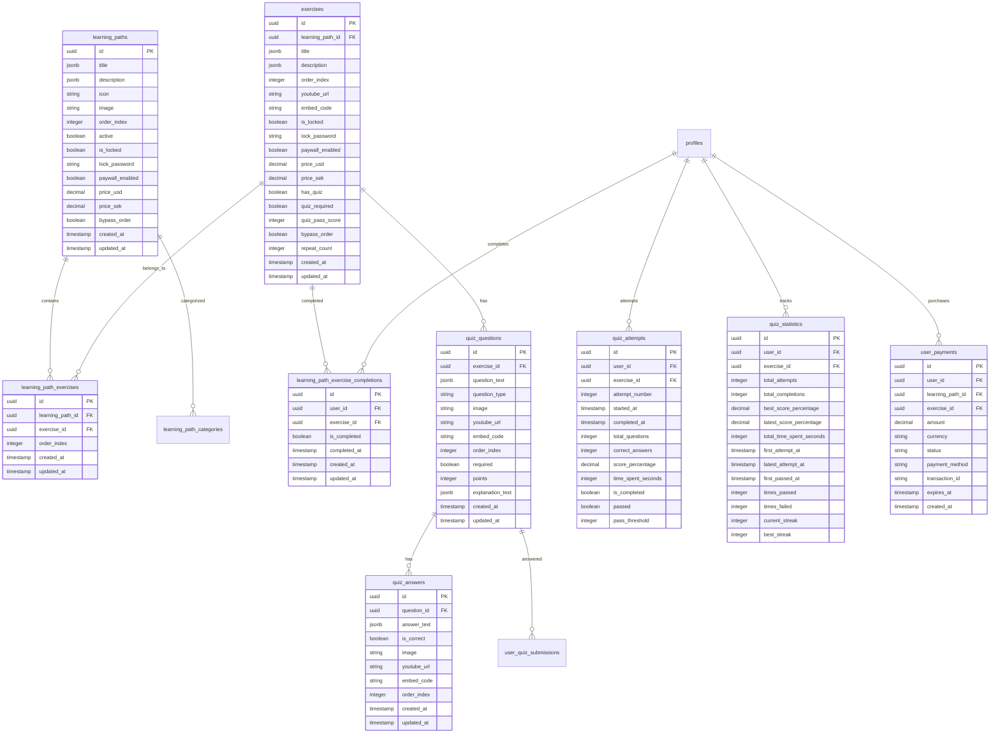

# VROMM Progress & Quiz System Documentation

## Table of Contents
1. [System Overview](#system-overview)
2. [Database Schema](#database-schema)
3. [Progress Tracking](#progress-tracking)
4. [Quiz System](#quiz-system)
5. [Paywall & Access Control](#paywall--access-control)
6. [User Relationships](#user-relationships)
7. [Component Architecture](#component-architecture)
8. [Usage Examples](#usage-examples)
9. [Troubleshooting](#troubleshooting)

## System Overview

The VROMM Progress & Quiz System is a comprehensive learning management system that tracks user progress through learning paths, manages quiz assessments, handles paywall restrictions, and supports instructor-student relationships.

### Key Features
- **Learning Path Management** - Structured learning content with exercises
- **Progress Tracking** - Real-time progress monitoring and analytics
- **Quiz System** - Interactive assessments with scoring and statistics
- **Paywall Integration** - Monetization through content access control
- **Relationship Management** - Instructor-student supervision system
- **Multi-language Support** - Swedish and English content
- **Offline Capabilities** - Progress syncing and offline access

## Database Schema

### Core Learning Tables



### Access Control Tables


## Progress Tracking

### Learning Path Structure

```typescript
interface LearningPath {
  id: string;
  title: { en: string; sv: string };
  description: { en: string; sv: string };
  icon: string | null;
  image: string | null;
  youtube_url?: string;
  embed_code?: string;
  order_index: number;
  active: boolean;
  bypass_order: boolean; // Skip order requirements
  
  // Access Control
  is_locked?: boolean;
  lock_password?: string | null;
  language_specific_media?: boolean;
  
  // Monetization
  paywall_enabled?: boolean;
  price_usd?: number;
  price_sek?: number;
  
  // Categorization
  platform?: string; // web/mobile/both
  type?: string; // learning/assessment/etc
  vehicle_type?: string;
  transmission_type?: string;
  license_type?: string;
  experience_level?: string;
  purpose?: string;
  user_profile?: string;
}
```

### Exercise Structure

```typescript
interface PathExercise {
  id: string;
  learning_path_id: string;
  title: { en: string; sv: string };
  description: { en: string; sv: string };
  order_index: number;
  youtube_url?: string;
  icon?: string;
  image?: string;
  embed_code?: string;
  created_at?: string;
  updated_at?: string;
  language_specific_media?: boolean;
  
  // Access Control
  is_locked?: boolean;
  lock_password?: string | null;
  bypass_order?: boolean; // Skip order requirements
  
  // Monetization
  paywall_enabled?: boolean;
  price_usd?: number;
  price_sek?: number;
  
  // Repeat functionality
  repeat_count?: number;
  isRepeat?: boolean;
  originalId?: string;
  repeatNumber?: number;
  
  // Quiz System
  has_quiz?: boolean;
  quiz_required?: boolean;
  quiz_pass_score?: number;
}
```

### Progress Calculation

```typescript
// Calculate path completion percentage
const calculatePathCompletion = (pathId: string): number => {
  const exercises = getExercisesForPath(pathId);
  const completedExercises = getCompletedExercisesForPath(pathId, userId);
  
  if (exercises.length === 0) return 0;
  
  return Math.round((completedExercises.length / exercises.length) * 100);
};

// Check if path is accessible
const isPathAccessible = (path: LearningPath): boolean => {
  // Check if path is locked by password
  if (path.is_locked && !isPathUnlocked(path.id)) {
    return false;
  }
  
  // Check if path is behind paywall
  if (path.paywall_enabled && !hasPathAccess(path.id)) {
    return false;
  }
  
  // Check order requirements
  if (!path.bypass_order && !isPathOrderUnlocked(path.id)) {
    return false;
  }
  
  return true;
};
```

## Quiz System

### Quiz Question Types

```typescript
interface QuizQuestion {
  id: string;
  exercise_id: string;
  question_text: { en: string; sv: string };
  question_type: 'single_choice' | 'multiple_choice' | 'true_false';
  image?: string;
  youtube_url?: string;
  embed_code?: string;
  order_index: number;
  required: boolean;
  points: number;
  explanation_text?: { en: string; sv: string };
  answers: QuizAnswer[];
}

interface QuizAnswer {
  id: string;
  question_id: string;
  answer_text: { en: string; sv: string };
  is_correct: boolean;
  image?: string;
  youtube_url?: string;
  embed_code?: string;
  order_index: number;
}
```

### Quiz Attempt Tracking

```typescript
interface QuizAttempt {
  id: string;
  user_id: string;
  exercise_id: string;
  attempt_number: number;
  started_at: string;
  completed_at?: string;
  total_questions: number;
  correct_answers: number;
  score_percentage: number;
  time_spent_seconds: number;
  is_completed: boolean;
  passed: boolean;
  pass_threshold: number;
}

interface QuizStatistics {
  id: string;
  user_id: string;
  exercise_id: string;
  total_attempts: number;
  total_completions: number;
  best_score_percentage: number;
  latest_score_percentage: number;
  total_time_spent_seconds: number;
  first_attempt_at?: string;
  latest_attempt_at?: string;
  first_passed_at?: string;
  times_passed: number;
  times_failed: number;
  current_streak: number;
  best_streak: number;
}
```

### Quiz Implementation

```typescript
// Start quiz attempt
const startQuizAttempt = async (exerciseId: string): Promise<string | null> => {
  try {
    const { data, error } = await supabase
      .from('quiz_attempts')
      .insert({
        user_id: user.id,
        exercise_id: exerciseId,
        attempt_number: await getNextAttemptNumber(exerciseId),
        started_at: new Date().toISOString(),
        total_questions: await getQuestionCount(exerciseId),
        correct_answers: 0,
        score_percentage: 0,
        time_spent_seconds: 0,
        is_completed: false,
        passed: false,
        pass_threshold: await getPassThreshold(exerciseId)
      })
      .select()
      .single();
    
    if (error) throw error;
    return data.id;
  } catch (error) {
    console.error('Error starting quiz attempt:', error);
    return null;
  }
};

// Save quiz question attempt
const saveQuizQuestionAttempt = async (
  questionId: string,
  selectedAnswerIds: string[],
  isCorrect: boolean,
  pointsEarned: number,
  timeSpent: number
) => {
  try {
    const { error } = await supabase
      .from('user_quiz_submissions')
      .insert({
        user_id: user.id,
        question_id: questionId,
        selected_answers: selectedAnswerIds,
        is_correct: isCorrect,
        points_earned: pointsEarned,
        time_spent: timeSpent,
        created_at: new Date().toISOString()
      });
    
    if (error) throw error;
  } catch (error) {
    console.error('Error saving quiz attempt:', error);
  }
};

// Complete quiz attempt
const completeQuizAttempt = async (
  attemptId: string,
  finalScore: { correct: number; total: number }
) => {
  try {
    const scorePercentage = (finalScore.correct / finalScore.total) * 100;
    const passThreshold = await getPassThreshold(exerciseId);
    const passed = scorePercentage >= passThreshold;
    
    const { error } = await supabase
      .from('quiz_attempts')
      .update({
        completed_at: new Date().toISOString(),
        correct_answers: finalScore.correct,
        score_percentage: scorePercentage,
        is_completed: true,
        passed: passed
      })
      .eq('id', attemptId);
    
    if (error) throw error;
    
    // Update statistics
    await updateQuizStatistics(exerciseId, scorePercentage, passed);
  } catch (error) {
    console.error('Error completing quiz attempt:', error);
  }
};
```

## Paywall & Access Control

### Payment Integration

```typescript
interface UserPayment {
  id: string;
  user_id: string;
  learning_path_id?: string;
  exercise_id?: string;
  amount: number;
  currency: string;
  status: 'completed' | 'pending' | 'failed';
  payment_method: string;
  transaction_id: string;
  expires_at?: string;
  created_at: string;
}

// Check payment status
const checkPaymentStatus = async (
  contentId: string,
  contentType: 'path' | 'exercise'
): Promise<boolean> => {
  try {
    const { data, error } = await supabase
      .from('user_payments')
      .select('status, expires_at')
      .eq('user_id', user.id)
      .eq(contentType === 'path' ? 'learning_path_id' : 'exercise_id', contentId)
      .eq('status', 'completed')
      .single();
    
    if (error || !data) return false;
    
    // Check if payment has expired
    if (data.expires_at && new Date(data.expires_at) < new Date()) {
      return false;
    }
    
    return true;
  } catch (error) {
    console.error('Error checking payment status:', error);
    return false;
  }
};

// Create payment intent
const createPaymentIntent = async (
  contentId: string,
  contentType: 'path' | 'exercise',
  amount: number,
  currency: string = 'usd'
) => {
  try {
    const { data, error } = await supabase.functions.invoke('create-payment-intent', {
      body: {
        content_id: contentId,
        content_type: contentType,
        amount: amount,
        currency: currency,
        user_id: user.id
      }
    });
    
    if (error) throw error;
    return data;
  } catch (error) {
    console.error('Error creating payment intent:', error);
    return null;
  }
};
```

### Access Control Logic

```typescript
// Check if content is accessible
const checkContentAccess = async (
  contentId: string,
  contentType: 'path' | 'exercise'
): Promise<boolean> => {
  // Check if content exists and is active
  const content = await getContent(contentId, contentType);
  if (!content || !content.active) return false;
  
  // Check password lock
  if (content.is_locked && !isContentUnlocked(contentId)) {
    return false;
  }
  
  // Check paywall
  if (content.paywall_enabled && !await checkPaymentStatus(contentId, contentType)) {
    return false;
  }
  
  // Check order requirements
  if (!content.bypass_order && !isContentOrderUnlocked(contentId, contentType)) {
    return false;
  }
  
  return true;
};

// Unlock content with password
const unlockContent = async (contentId: string, password: string): Promise<boolean> => {
  try {
    const { data, error } = await supabase
      .from('learning_paths') // or exercises
      .select('lock_password')
      .eq('id', contentId)
      .single();
    
    if (error || !data) return false;
    
    const isValid = data.lock_password === password;
    if (isValid) {
      // Store unlock in local state or database
      await storeUnlock(contentId, 'learning_path');
    }
    
    return isValid;
  } catch (error) {
    console.error('Error unlocking content:', error);
    return false;
  }
};
```

## User Relationships

### Instructor-Student System

```typescript
// Create relationship invitation
const createRelationshipInvitation = async (
  targetEmail: string,
  role: 'student' | 'instructor',
  customMessage?: string
) => {
  try {
    const { data: targetUser } = await supabase
      .from('profiles')
      .select('id, full_name, email')
      .eq('email', targetEmail.toLowerCase())
      .single();
    
    if (!targetUser) {
      throw new Error('User not found');
    }
    
    const relationshipType = role === 'student' 
      ? 'supervisor_invites_student' 
      : 'student_invites_supervisor';
    
    // Create invitation
    const { error: inviteError } = await supabase
      .from('pending_invitations')
      .insert({
        email: targetEmail.toLowerCase(),
        role: role,
        invited_by: user.id,
        metadata: {
          supervisorName: profile?.full_name || user.email,
          inviterRole: profile?.role,
          relationshipType,
          invitedAt: new Date().toISOString(),
          targetUserId: targetUser.id,
          targetUserName: targetUser.full_name,
          customMessage: customMessage?.trim() || undefined,
        },
        status: 'pending',
      });
    
    if (inviteError) throw inviteError;
    
    // Create notification
    const notificationType = role === 'student' 
      ? 'student_invitation' 
      : 'supervisor_invitation';
    
    const { error: notificationError } = await supabase
      .from('notifications')
      .insert({
        user_id: targetUser.id,
        actor_id: user.id,
        type: notificationType,
        title: 'New Supervision Request',
        message: `${profile?.full_name || user.email} wants to connect with you`,
        metadata: {
          relationship_type: relationshipType,
          from_user_id: user.id,
          from_user_name: profile?.full_name || user.email,
          customMessage: customMessage?.trim() || undefined,
        },
        action_url: 'vromm://notifications',
        priority: 'high',
        is_read: false,
      });
    
    if (notificationError) throw notificationError;
    
  } catch (error) {
    console.error('Error creating relationship invitation:', error);
    throw error;
  }
};

// Accept relationship invitation
const acceptRelationshipInvitation = async (invitationId: string) => {
  try {
    const { data: invitation } = await supabase
      .from('pending_invitations')
      .select('*')
      .eq('id', invitationId)
      .single();
    
    if (!invitation) throw new Error('Invitation not found');
    
    // Create relationship
    const { error: relationshipError } = await supabase
      .from('student_supervisor_relationships')
      .insert({
        student_id: invitation.role === 'student' ? user.id : invitation.invited_by,
        supervisor_id: invitation.role === 'instructor' ? user.id : invitation.invited_by,
        status: 'active'
      });
    
    if (relationshipError) throw relationshipError;
    
    // Update invitation
    const { error: updateError } = await supabase
      .from('pending_invitations')
      .update({
        status: 'accepted',
        accepted_at: new Date().toISOString(),
        accepted_by: user.id
      })
      .eq('id', invitationId);
    
    if (updateError) throw updateError;
    
  } catch (error) {
    console.error('Error accepting relationship invitation:', error);
    throw error;
  }
};
```

## Component Architecture

### ProgressScreen Component

```typescript
// Main progress tracking screen
export function ProgressScreen() {
  const [learningPaths, setLearningPaths] = useState<LearningPath[]>([]);
  const [exercises, setExercises] = useState<PathExercise[]>([]);
  const [completions, setCompletions] = useState<string[]>([]);
  const [filters, setFilters] = useState<Record<CategoryType, string>>({});
  
  // Load learning paths with filtering
  const fetchLearningPaths = async () => {
    try {
      const { data, error } = await supabase
        .from('learning_paths')
        .select('*')
        .eq('active', true)
        .order('order_index');
      
      if (error) throw error;
      setLearningPaths(data || []);
    } catch (error) {
      console.error('Error fetching learning paths:', error);
    }
  };
  
  // Calculate path progress
  const getPathProgress = (pathId: string): number => {
    const pathExercises = exercises.filter(ex => ex.learning_path_id === pathId);
    const completedExercises = pathExercises.filter(ex => completions.includes(ex.id));
    
    if (pathExercises.length === 0) return 0;
    return Math.round((completedExercises.length / pathExercises.length) * 100);
  };
  
  // Toggle exercise completion
  const toggleCompletion = async (exerciseId: string) => {
    try {
      const isCompleted = completions.includes(exerciseId);
      
      if (isCompleted) {
        // Remove completion
        const { error } = await supabase
          .from('learning_path_exercise_completions')
          .delete()
          .eq('user_id', user.id)
          .eq('exercise_id', exerciseId);
        
        if (error) throw error;
        
        setCompletions(prev => prev.filter(id => id !== exerciseId));
      } else {
        // Add completion
        const { error } = await supabase
          .from('learning_path_exercise_completions')
          .insert({
            user_id: user.id,
            exercise_id: exerciseId,
            is_completed: true,
            completed_at: new Date().toISOString()
          });
        
        if (error) throw error;
        
        setCompletions(prev => [...prev, exerciseId]);
      }
    } catch (error) {
      console.error('Error toggling completion:', error);
    }
  };
  
  return (
    <ScrollView>
      {learningPaths.map(path => (
        <PathCard
          key={path.id}
          path={path}
          progress={getPathProgress(path.id)}
          onPress={() => handlePathPress(path)}
        />
      ))}
    </ScrollView>
  );
}
```

### QuizInterface Component

```typescript
// Interactive quiz interface
export function QuizInterface({ exercise }: { exercise: PathExercise }) {
  const [questions, setQuestions] = useState<QuizQuestion[]>([]);
  const [currentQuestionIndex, setCurrentQuestionIndex] = useState(0);
  const [selectedAnswers, setSelectedAnswers] = useState<string[]>([]);
  const [quizAttempt, setQuizAttempt] = useState<QuizAttempt | null>(null);
  const [timeSpent, setTimeSpent] = useState(0);
  
  // Start quiz
  const startQuiz = async () => {
    try {
      const attemptId = await startQuizAttempt(exercise.id);
      if (attemptId) {
        setQuizAttempt({ id: attemptId, ...quizAttempt });
        loadQuizQuestions();
      }
    } catch (error) {
      console.error('Error starting quiz:', error);
    }
  };
  
  // Handle answer selection
  const handleAnswerSelect = async (answerIds: string[]) => {
    setSelectedAnswers(answerIds);
    
    const question = questions[currentQuestionIndex];
    const isCorrect = question.answers
      .filter(answer => answer.is_correct)
      .every(answer => answerIds.includes(answer.id));
    
    const pointsEarned = isCorrect ? question.points : 0;
    
    await saveQuizQuestionAttempt(
      question.id,
      answerIds,
      isCorrect,
      pointsEarned,
      timeSpent
    );
  };
  
  // Navigate to next question
  const handleQuizNext = async () => {
    if (currentQuestionIndex < questions.length - 1) {
      setCurrentQuestionIndex(prev => prev + 1);
      setSelectedAnswers([]);
    } else {
      // Complete quiz
      await completeQuizAttempt(quizAttempt.id, {
        correct: questions.filter(q => q.isCorrect).length,
        total: questions.length
      });
    }
  };
  
  return (
    <View>
      <Text>Question {currentQuestionIndex + 1} of {questions.length}</Text>
      
      {questions[currentQuestionIndex] && (
        <QuestionCard
          question={questions[currentQuestionIndex]}
          selectedAnswers={selectedAnswers}
          onAnswerSelect={handleAnswerSelect}
        />
      )}
      
      <Button onPress={handleQuizNext}>
        {currentQuestionIndex < questions.length - 1 ? 'Next' : 'Complete'}
      </Button>
    </View>
  );
}
```

## Usage Examples

### Basic Progress Tracking

```typescript
// Track user progress
const trackProgress = async (exerciseId: string) => {
  try {
    const { error } = await supabase
      .from('learning_path_exercise_completions')
      .insert({
        user_id: user.id,
        exercise_id: exerciseId,
        is_completed: true,
        completed_at: new Date().toISOString()
      });
    
    if (error) throw error;
    
    // Check for path completion
    await checkForPathCompletion(exerciseId);
  } catch (error) {
    console.error('Error tracking progress:', error);
  }
};
```

### Quiz Implementation

```typescript
// Create quiz questions
const createQuizQuestion = async (
  exerciseId: string,
  questionData: Partial<QuizQuestion>
) => {
  try {
    const { data, error } = await supabase
      .from('quiz_questions')
      .insert({
        exercise_id: exerciseId,
        question_text: questionData.question_text,
        question_type: questionData.question_type,
        points: questionData.points || 1,
        required: questionData.required || true,
        order_index: questionData.order_index || 0
      })
      .select()
      .single();
    
    if (error) throw error;
    return data;
  } catch (error) {
    console.error('Error creating quiz question:', error);
    return null;
  }
};
```

### Paywall Integration

```typescript
// Check content access
const checkContentAccess = async (contentId: string, contentType: string) => {
  const hasAccess = await checkPaymentStatus(contentId, contentType);
  const isUnlocked = await isContentUnlocked(contentId);
  const isOrderUnlocked = await isContentOrderUnlocked(contentId, contentType);
  
  return hasAccess && isUnlocked && isOrderUnlocked;
};
```

## Troubleshooting

### Common Issues

#### 1. Progress Not Saving

**Symptoms:**
- Exercise completions not persisting
- Progress resets on app restart

**Solutions:**
```typescript
// Ensure proper completion tracking
const toggleCompletion = async (exerciseId: string) => {
  try {
    const { data: existing } = await supabase
      .from('learning_path_exercise_completions')
      .select('id')
      .eq('user_id', user.id)
      .eq('exercise_id', exerciseId)
      .single();
    
    if (existing) {
      // Remove completion
      await supabase
        .from('learning_path_exercise_completions')
        .delete()
        .eq('id', existing.id);
    } else {
      // Add completion
      await supabase
        .from('learning_path_exercise_completions')
        .insert({
          user_id: user.id,
          exercise_id: exerciseId,
          is_completed: true,
          completed_at: new Date().toISOString()
        });
    }
  } catch (error) {
    console.error('Error toggling completion:', error);
  }
};
```

#### 2. Quiz Not Loading

**Symptoms:**
- Quiz questions not appearing
- Quiz interface not rendering

**Solutions:**
```typescript
// Debug quiz loading
const loadQuizQuestions = async (exerciseId: string) => {
  try {
    const { data, error } = await supabase
      .from('quiz_questions')
      .select(`
        *,
        quiz_answers (*)
      `)
      .eq('exercise_id', exerciseId)
      .order('order_index');
    
    if (error) throw error;
    console.log('Quiz questions loaded:', data);
    setQuestions(data || []);
  } catch (error) {
    console.error('Error loading quiz questions:', error);
  }
};
```

#### 3. Paywall Issues

**Symptoms:**
- Content not accessible after payment
- Payment status not updating

**Solutions:**
```typescript
// Verify payment status
const verifyPaymentStatus = async (contentId: string) => {
  try {
    const { data, error } = await supabase
      .from('user_payments')
      .select('*')
      .eq('user_id', user.id)
      .eq('learning_path_id', contentId)
      .eq('status', 'completed')
      .single();
    
    if (error || !data) {
      console.log('No payment found for content:', contentId);
      return false;
    }
    
    console.log('Payment found:', data);
    return true;
  } catch (error) {
    console.error('Error verifying payment:', error);
    return false;
  }
};
```

### Performance Optimization

```typescript
// Optimize progress loading
const loadProgressData = async () => {
  try {
    // Load completions in batch
    const { data: completions } = await supabase
      .from('learning_path_exercise_completions')
      .select('exercise_id')
      .eq('user_id', user.id)
      .eq('is_completed', true);
    
    setCompletions(completions?.map(c => c.exercise_id) || []);
    
    // Load exercises with progress
    const { data: exercises } = await supabase
      .from('exercises')
      .select(`
        *,
        learning_path_exercise_completions!inner (
          is_completed,
          completed_at
        )
      `)
      .eq('learning_path_exercise_completions.user_id', user.id);
    
    setExercises(exercises || []);
  } catch (error) {
    console.error('Error loading progress data:', error);
  }
};
```

---

*This documentation is maintained by the VROMM development team. Last updated: January 2025*
