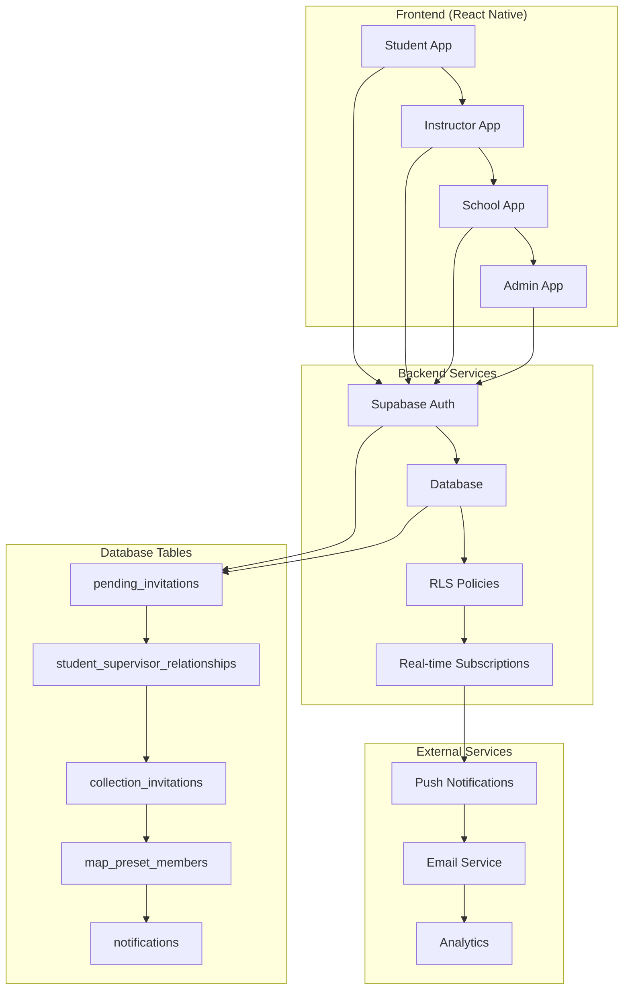
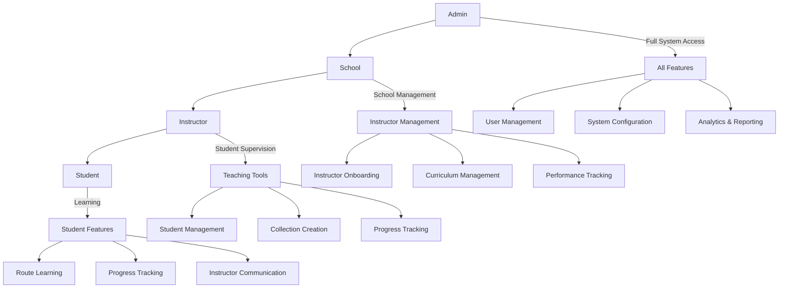
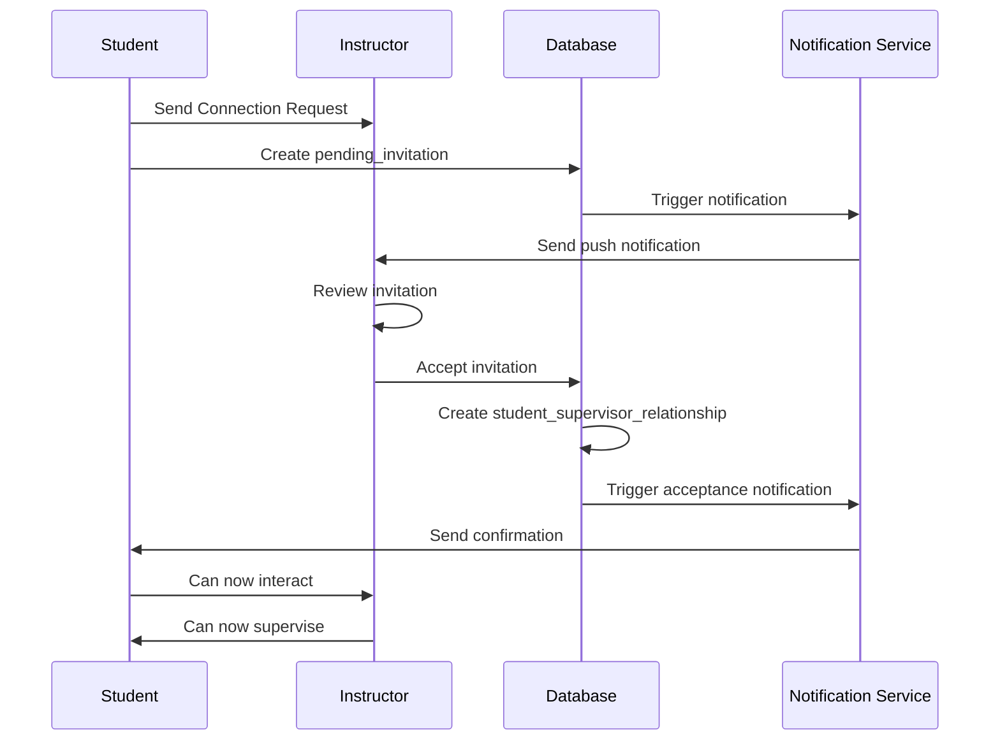
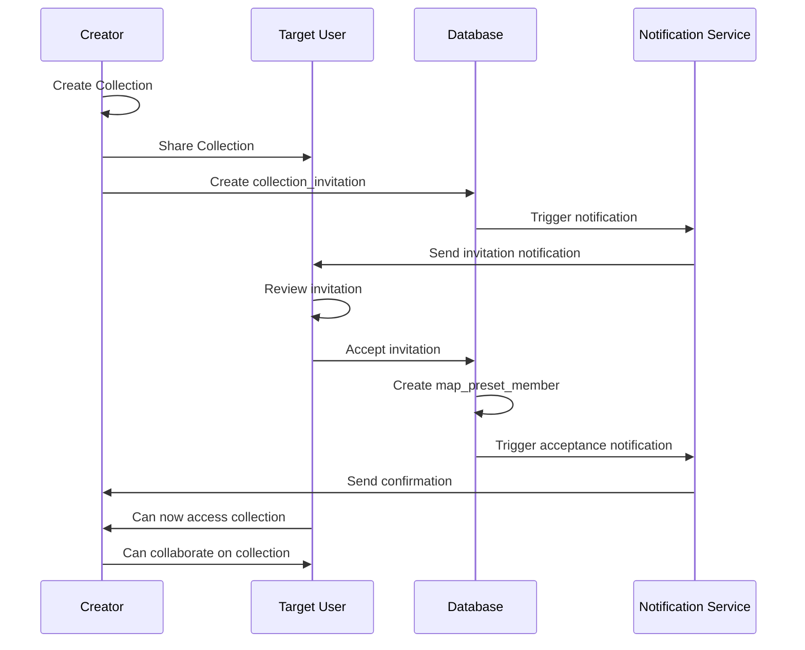
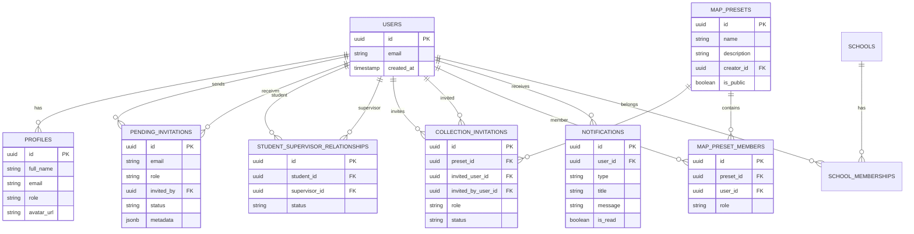
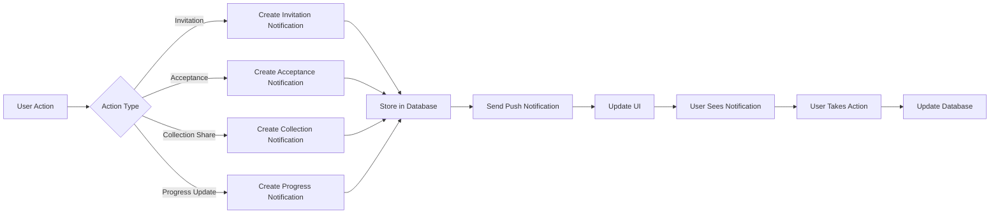
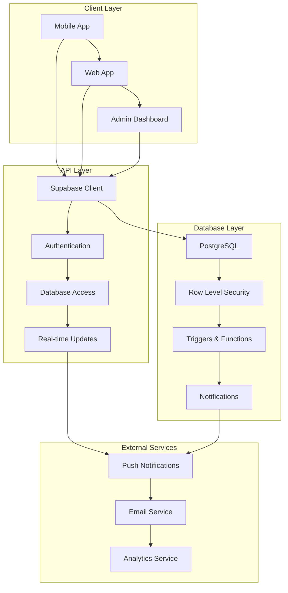
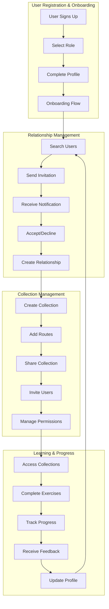
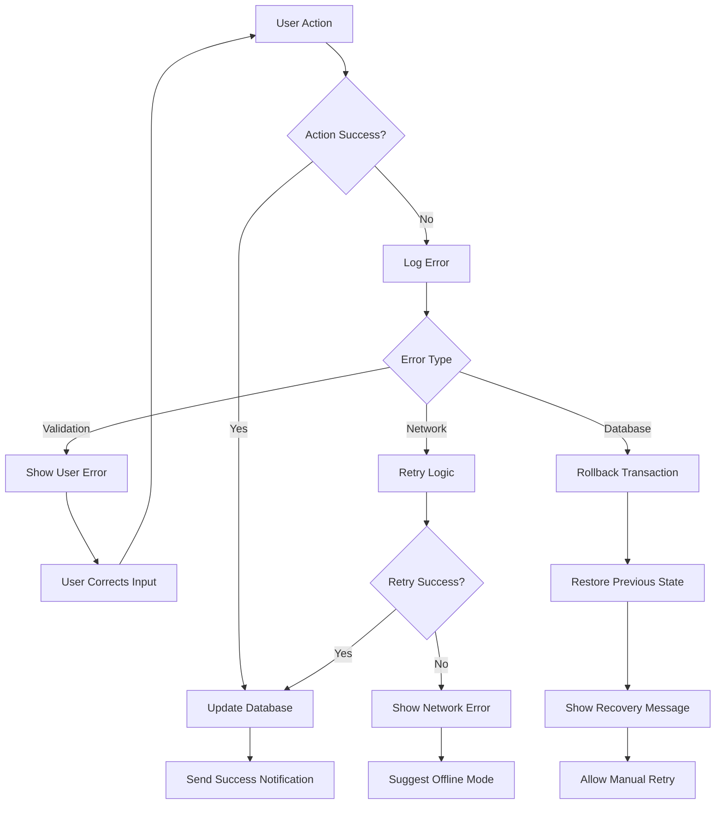

# VROMM Relationship & Invitation System Documentation

## Table of Contents
1. [System Overview](#system-overview)
2. [User Stories](#user-stories)
3. [User Journeys](#user-journeys)
4. [System Diagrams](#system-diagrams)
5. [User Roles & Permissions](#user-roles--permissions)
6. [Relationship Types](#relationship-types)
7. [Invitation System](#invitation-system)
8. [Database Schema](#database-schema)
9. [RLS Policies](#rls-policies)
10. [User Flows](#user-flows)
11. [UI/UX Components](#uiux-components)
12. [Notification System](#notification-system)
13. [Collection/Preset Sharing](#collectionpreset-sharing)
14. [Current Issues & Improvements](#current-issues--improvements)
15. [Future Enhancements](#future-enhancements)

---

## System Overview

VROMM is a driving education platform that connects students, instructors, and schools through a comprehensive relationship and invitation system. The platform supports:

- **Student-Instructor Relationships**: Direct supervision and guidance
- **School Management**: Institutional oversight and organization
- **Collection Sharing**: Collaborative map preset management
- **Multi-role Support**: Flexible user role assignments

### Core Concepts
- **Students**: Learning to drive, seeking instruction
- **Instructors/Supervisors**: Providing guidance and supervision
- **Schools**: Managing multiple instructors and students
- **Collections/Presets**: Shared map resources for learning

---

## User Stories

### Student Stories
**As a student, I want to:**
- Find and connect with qualified driving instructors in my area
- Receive personalized guidance and feedback on my driving progress
- Access curated driving routes and exercises from my instructor
- Track my learning progress and see areas for improvement
- Communicate directly with my instructor about lessons and questions
- Join school programs to access institutional resources

**Acceptance Criteria:**
- Can search for instructors by location, specialization, and ratings
- Can send connection requests with custom messages
- Can view instructor profiles, reviews, and availability
- Can access shared collections and exercises
- Can track progress through assigned routes
- Can send messages and receive notifications

### Instructor Stories
**As an instructor, I want to:**
- Manage multiple students and their learning progress
- Create and share custom driving routes and exercises
- Track student performance and provide targeted feedback
- Organize students into groups or classes
- Access teaching resources and best practices
- Communicate with students and parents about progress

**Acceptance Criteria:**
- Can invite students to connect via email
- Can create and manage collections of driving routes
- Can assign specific exercises to individual students
- Can view detailed analytics on student progress
- Can send notifications and updates to students
- Can manage student permissions and access levels

### School Stories
**As a driving school, I want to:**
- Manage multiple instructors and their students
- Create school-wide collections and standardized curricula
- Track institutional performance and student outcomes
- Provide centralized resources and training materials
- Monitor instructor performance and student satisfaction
- Generate reports for accreditation and compliance

**Acceptance Criteria:**
- Can invite instructors to join the school
- Can create and manage school-wide collections
- Can assign instructors to specific students or groups
- Can access institutional analytics and reporting
- Can manage permissions and access levels
- Can communicate with all school members

---

## User Journeys

### Journey 1: New Student Onboarding
```
1. Student downloads VROMM app
2. Student creates account and selects "Student" role
3. Student completes profile with driving experience
4. Student searches for instructors in their area
5. Student finds suitable instructor and sends connection request
6. Instructor receives notification and accepts request
7. Student receives confirmation and can now access instructor's resources
8. Student begins learning with instructor's guidance
```

### Journey 2: Instructor Student Management
```
1. Instructor logs into VROMM app
2. Instructor views dashboard with student list
3. Instructor creates new collection for specific lesson
4. Instructor adds routes and exercises to collection
5. Instructor shares collection with specific students
6. Students receive notifications about new content
7. Students complete assigned exercises
8. Instructor reviews student progress and provides feedback
```

### Journey 3: School Program Setup
```
1. School administrator creates school account
2. School invites instructors to join
3. Instructors accept invitations and join school
4. School creates standardized curriculum collections
5. School assigns instructors to student groups
6. Instructors use school resources for teaching
7. School monitors progress and generates reports
8. School provides ongoing support and training
```

### Journey 4: Collection Collaboration
```
1. Instructor creates specialized collection (e.g., "Highway Driving")
2. Instructor invites other instructors to collaborate
3. Collaborators add their own routes and exercises
4. Collection becomes comprehensive resource
5. Collection is shared with students
6. Students benefit from multiple instructor perspectives
7. Collection grows organically through community input
```

---

## System Diagrams

### 1. System Architecture Diagram


### 2. User Role Hierarchy


### 3. Invitation Flow Diagram


### 4. Collection Sharing Flow


### 5. Database Relationship Diagram


### 6. Permission Matrix Diagram

```mermaid
graph TB
    subgraph "Student Permissions"
        A1[View Own Profile] --> A2[Edit Own Profile]
        A2 --> A3[Search Instructors]
        A3 --> A4[Send Connection Requests]
        A4 --> A5[Access Shared Collections]
        A5 --> A6[Track Progress]
    end
    
    subgraph "Instructor Permissions"
        B1[Manage Students] --> B2[Create Collections]
        B2 --> B3[Share Collections]
        B3 --> B4[View Student Progress]
        B4 --> B5[Send Notifications]
        B5 --> B6[Create Exercises]
    end
    
    subgraph "School Permissions"
        C1[Manage Instructors] --> C2[Create School Collections]
        C2 --> C3[View Analytics]
        C3 --> C4[Manage Permissions]
        C4 --> C5[Generate Reports]
        C5 --> C6[System Configuration]
    end
    
    subgraph "Admin Permissions"
        D1[Full System Access] --> D2[User Management]
        D2 --> D3[System Configuration]
        D3 --> D4[Analytics & Reporting]
        D4 --> D5[Content Moderation]
        D5 --> D6[Security Management]
    end
```


### 7. Notification Flow Diagram


### 8. Data Flow Architecture


### 9. Complete System Flow Diagram


### 10. Error Handling & Recovery Flow


---

## Draw.io Import Instructions

### How to Import Mermaid Diagrams into Draw.io

1. **Copy the Mermaid Code**: Copy any of the mermaid code blocks from above
2. **Open Draw.io**: Go to [app.diagrams.net](https://app.diagrams.net)
3. **Create New Diagram**: Click "Create New Diagram"
4. **Import Mermaid**: 
   - Click "Arrange" → "Insert" → "Advanced" → "Mermaid"
   - Paste the mermaid code
   - Click "Insert"
5. **Customize**: Edit colors, shapes, and layout as needed
6. **Export**: Save as PNG, SVG, or PDF

### Recommended Diagrams for Draw.io

**For System Architecture:**
- Use Diagram #1: System Architecture Diagram
- Use Diagram #8: Data Flow Architecture

**For User Experience:**
- Use Diagram #3: Invitation Flow Diagram
- Use Diagram #4: Collection Sharing Flow
- Use Diagram #7: Notification Flow Diagram

**For Database Design:**
- Use Diagram #5: Database Relationship Diagram

**For Permission Management:**
- Use Diagram #2: User Role Hierarchy
- Use Diagram #6: Permission Matrix Diagram

**For Process Flow:**
- Use Diagram #9: Complete System Flow Diagram
- Use Diagram #10: Error Handling & Recovery Flow

### Additional Draw.io Templates

#### User Journey Map Template
```
1. Create a new diagram in Draw.io
2. Use the "User Journey" template
3. Add stages: Discovery → Onboarding → Usage → Retention
4. Map user actions, emotions, and touchpoints
5. Add pain points and opportunities
```

#### System Context Diagram Template
```
1. Create a new diagram in Draw.io
2. Use the "System Context" template
3. Place VROMM in the center
4. Add external systems: Supabase, Push Notifications, Email Service
5. Add user types: Students, Instructors, Schools, Admins
6. Connect with labeled arrows
```

#### Component Architecture Template
```
1. Create a new diagram in Draw.io
2. Use the "Component" template
3. Group components by layer:
   - Presentation Layer (React Native)
   - Business Logic Layer (Services)
   - Data Access Layer (Supabase)
   - External Services Layer
```

---

## User Roles & Permissions

### 1. Student (`student`)
**Capabilities:**
- ✅ Create and manage personal routes
- ✅ Request supervision from instructors
- ✅ Join collections shared by instructors
- ✅ View instructor profiles and reviews
- ✅ Send messages to supervisors
- ✅ Track learning progress
- ✅ Submit route reviews and feedback

**Restrictions:**
- ❌ Cannot supervise other students
- ❌ Cannot create school accounts
- ❌ Cannot access admin functions
- ❌ Limited collection creation (personal only)

### 2. Instructor/Supervisor (`instructor`, `teacher`, `supervisor`)
**Capabilities:**
- ✅ Supervise multiple students
- ✅ Create and share collections
- ✅ Manage student progress
- ✅ Create custom exercises
- ✅ Access student analytics
- ✅ Send invitations to students
- ✅ Moderate student content
- ✅ Create school-specific collections

**Restrictions:**
- ❌ Cannot supervise other instructors
- ❌ Cannot access school admin functions
- ❌ Cannot modify system settings

### 3. School (`school`)
**Capabilities:**
- ✅ Manage multiple instructors
- ✅ Oversee student progress across instructors
- ✅ Create school-wide collections
- ✅ Access institutional analytics
- ✅ Manage instructor permissions
- ✅ Create school-specific exercises
- ✅ Bulk invite students and instructors

**Restrictions:**
- ❌ Cannot directly supervise students
- ❌ Cannot access admin functions
- ❌ Limited to school scope

### 4. Admin (`admin`)
**Capabilities:**
- ✅ Full system access
- ✅ Manage all users and relationships
- ✅ Access system analytics
- ✅ Modify system settings
- ✅ Handle user reports
- ✅ Manage content moderation

---

## Relationship Types

### 1. Student-Supervisor Relationships
**Purpose**: Direct learning supervision and guidance

**Database Table**: `student_supervisor_relationships`
```sql
CREATE TABLE student_supervisor_relationships (
  id UUID PRIMARY KEY DEFAULT gen_random_uuid(),
  student_id UUID NOT NULL REFERENCES auth.users(id),
  supervisor_id UUID NOT NULL REFERENCES auth.users(id),
  status TEXT DEFAULT 'active' CHECK (status IN ('active', 'inactive', 'pending')),
  created_at TIMESTAMP WITH TIME ZONE DEFAULT NOW(),
  updated_at TIMESTAMP WITH TIME ZONE DEFAULT NOW(),
  UNIQUE(student_id, supervisor_id)
);
```

**Relationship Flow:**
1. Student or Instructor initiates invitation
2. Invitation sent via `pending_invitations` table
3. Recipient accepts/declines
4. Relationship created in `student_supervisor_relationships`
5. Both parties can now interact

### 2. School Memberships
**Purpose**: Institutional organization and management

**Database Table**: `school_memberships`
```sql
CREATE TABLE school_memberships (
  id UUID PRIMARY KEY DEFAULT gen_random_uuid(),
  user_id UUID NOT NULL REFERENCES auth.users(id),
  school_id UUID NOT NULL REFERENCES schools(id),
  role TEXT DEFAULT 'student' CHECK (role IN ('student', 'instructor', 'admin')),
  created_at TIMESTAMP WITH TIME ZONE DEFAULT NOW(),
  UNIQUE(user_id, school_id)
);
```

---

## Invitation System

### 1. Relationship Invitations
**Purpose**: Connect students with instructors for supervision

**Components:**
- `OnboardingInteractive.tsx` - Initial connection setup
- `GettingStarted.tsx` - Ongoing connection management
- `InvitationModal.tsx` - Invitation handling

**Database Table**: `pending_invitations`
```sql
CREATE TABLE pending_invitations (
  id UUID PRIMARY KEY DEFAULT gen_random_uuid(),
  email TEXT NOT NULL,
  role TEXT NOT NULL CHECK (role IN ('student', 'instructor', 'teacher', 'supervisor', 'admin')),
  invited_by UUID REFERENCES auth.users(id),
  status TEXT DEFAULT 'pending' CHECK (status IN ('pending', 'accepted', 'declined', 'cancelled', 'failed')),
  metadata JSONB DEFAULT '{}',
  accepted_at TIMESTAMP WITH TIME ZONE,
  accepted_by UUID REFERENCES auth.users(id),
  created_at TIMESTAMP WITH TIME ZONE DEFAULT NOW(),
  updated_at TIMESTAMP WITH TIME ZONE DEFAULT NOW()
);
```

**Metadata Structure:**
```json
{
  "relationshipType": "student_invites_supervisor" | "supervisor_invites_student",
  "inviterRole": "student" | "instructor" | "school",
  "supervisorName": "Inviter's name",
  "targetUserId": "Target user's ID",
  "targetUserName": "Target user's name",
  "customMessage": "Optional personal message",
  "invitedAt": "2025-01-21T12:00:00.000Z"
}
```

### 2. Collection Invitations
**Purpose**: Share map collections/presets with other users

**Database Table**: `collection_invitations`
```sql
CREATE TABLE collection_invitations (
  id UUID PRIMARY KEY DEFAULT gen_random_uuid(),
  preset_id UUID NOT NULL REFERENCES map_presets(id) ON DELETE CASCADE,
  invited_user_id UUID NOT NULL REFERENCES auth.users(id) ON DELETE CASCADE,
  invited_by_user_id UUID NOT NULL REFERENCES auth.users(id) ON DELETE CASCADE,
  role TEXT NOT NULL DEFAULT 'read' CHECK (role IN ('read', 'write', 'admin')),
  status TEXT NOT NULL DEFAULT 'pending' CHECK (status IN ('pending', 'accepted', 'declined', 'archived')),
  message TEXT,
  created_at TIMESTAMP WITH TIME ZONE DEFAULT NOW(),
  responded_at TIMESTAMP WITH TIME ZONE,
  expires_at TIMESTAMP WITH TIME ZONE DEFAULT (NOW() + INTERVAL '30 days'),
  UNIQUE(preset_id, invited_user_id)
);
```

**Collection Roles:**
- **`read`**: View collection and routes
- **`write`**: Add/edit routes in collection
- **`admin`**: Full collection management

---

## Database Schema

### Core Tables

#### 1. Users & Profiles
```sql
-- Auth users (Supabase managed)
auth.users (
  id UUID PRIMARY KEY,
  email TEXT UNIQUE,
  created_at TIMESTAMP,
  updated_at TIMESTAMP
);

-- User profiles
profiles (
  id UUID PRIMARY KEY REFERENCES auth.users(id),
  full_name TEXT,
  email TEXT,
  role user_role DEFAULT 'student',
  avatar_url TEXT,
  created_at TIMESTAMP,
  updated_at TIMESTAMP
);
```

#### 2. Relationships
```sql
-- Student-supervisor relationships
student_supervisor_relationships (
  id UUID PRIMARY KEY,
  student_id UUID REFERENCES auth.users(id),
  supervisor_id UUID REFERENCES auth.users(id),
  status TEXT DEFAULT 'active',
  created_at TIMESTAMP,
  updated_at TIMESTAMP,
  UNIQUE(student_id, supervisor_id)
);

-- School memberships
school_memberships (
  id UUID PRIMARY KEY,
  user_id UUID REFERENCES auth.users(id),
  school_id UUID REFERENCES schools(id),
  role TEXT DEFAULT 'student',
  created_at TIMESTAMP,
  UNIQUE(user_id, school_id)
);
```

#### 3. Invitations
```sql
-- Pending invitations
pending_invitations (
  id UUID PRIMARY KEY,
  email TEXT NOT NULL,
  role TEXT NOT NULL,
  invited_by UUID REFERENCES auth.users(id),
  status TEXT DEFAULT 'pending',
  metadata JSONB DEFAULT '{}',
  accepted_at TIMESTAMP,
  accepted_by UUID REFERENCES auth.users(id),
  created_at TIMESTAMP,
  updated_at TIMESTAMP
);

-- Collection invitations
collection_invitations (
  id UUID PRIMARY KEY,
  preset_id UUID REFERENCES map_presets(id),
  invited_user_id UUID REFERENCES auth.users(id),
  invited_by_user_id UUID REFERENCES auth.users(id),
  role TEXT DEFAULT 'read',
  status TEXT DEFAULT 'pending',
  message TEXT,
  created_at TIMESTAMP,
  responded_at TIMESTAMP,
  expires_at TIMESTAMP,
  UNIQUE(preset_id, invited_user_id)
);
```

#### 4. Collections & Memberships
```sql
-- Map presets (collections)
map_presets (
  id UUID PRIMARY KEY,
  name TEXT NOT NULL,
  description TEXT,
  creator_id UUID REFERENCES auth.users(id),
  is_public BOOLEAN DEFAULT false,
  created_at TIMESTAMP,
  updated_at TIMESTAMP
);

-- Collection memberships
map_preset_members (
  id UUID PRIMARY KEY,
  preset_id UUID REFERENCES map_presets(id),
  user_id UUID REFERENCES auth.users(id),
  added_by UUID REFERENCES auth.users(id),
  role TEXT DEFAULT 'read',
  added_at TIMESTAMP,
  updated_at TIMESTAMP,
  UNIQUE(preset_id, user_id)
);
```

#### 5. Notifications
```sql
-- Notifications
notifications (
  id UUID PRIMARY KEY,
  user_id UUID REFERENCES auth.users(id),
  actor_id UUID REFERENCES auth.users(id),
  type notification_type NOT NULL,
  title TEXT NOT NULL,
  message TEXT NOT NULL,
  metadata JSONB DEFAULT '{}',
  action_url TEXT,
  priority TEXT DEFAULT 'normal',
  is_read BOOLEAN DEFAULT false,
  created_at TIMESTAMP,
  updated_at TIMESTAMP
);
```

---

## RLS Policies

### 1. Pending Invitations
```sql
-- Users can view invitations they sent or received
CREATE POLICY "Users can view their invitations" ON pending_invitations
  FOR SELECT USING (
    auth.uid() = invited_by OR 
    email = (SELECT email FROM auth.users WHERE id = auth.uid())
  );

-- Users can create invitations
CREATE POLICY "Users can create invitations" ON pending_invitations
  FOR INSERT WITH CHECK (auth.uid() = invited_by);

-- Users can update invitations they received
CREATE POLICY "Users can accept invitations" ON pending_invitations
  FOR UPDATE USING (
    email = (SELECT email FROM auth.users WHERE id = auth.uid())
  );
```

### 2. Collection Invitations
```sql
-- Users can view invitations sent to them or sent by them
CREATE POLICY "Users can view their own invitations" ON collection_invitations
  FOR SELECT USING (
    auth.uid() = invited_user_id OR 
    auth.uid() = invited_by_user_id
  );

-- Users can create invitations for collections they own
CREATE POLICY "Users can create invitations for their collections" ON collection_invitations
  FOR INSERT WITH CHECK (
    auth.uid() = invited_by_user_id AND
    EXISTS (
      SELECT 1 FROM map_preset_members 
      WHERE preset_id = collection_invitations.preset_id 
      AND user_id = auth.uid() 
      AND role IN ('admin', 'write')
    )
  );
```

### 3. Student-Supervisor Relationships
```sql
-- Users can view relationships they're part of
CREATE POLICY "Users can view own relationships" ON student_supervisor_relationships
  FOR SELECT USING (auth.uid() = supervisor_id OR auth.uid() = student_id);

-- Users can create relationships
CREATE POLICY "Users can create relationships" ON student_supervisor_relationships
  FOR INSERT WITH CHECK (auth.uid() = supervisor_id OR auth.uid() = student_id);

-- Users can update their own relationships
CREATE POLICY "Users can update own relationships" ON student_supervisor_relationships
  FOR UPDATE USING (auth.uid() = supervisor_id OR auth.uid() = student_id);
```

---

## User Flows

### 1. Student Invites Instructor
```
1. Student opens OnboardingInteractive or GettingStarted
2. Student searches for instructor by email
3. Student sends invitation with custom message
4. Invitation stored in pending_invitations
5. Notification sent to instructor
6. Instructor receives notification
7. Instructor accepts/declines
8. If accepted: relationship created in student_supervisor_relationships
9. Both parties can now interact
```

### 2. Instructor Invites Student
```
1. Instructor opens student management screen
2. Instructor searches for student by email
3. Instructor sends invitation with custom message
4. Invitation stored in pending_invitations
5. Notification sent to student
6. Student receives notification
7. Student accepts/declines
8. If accepted: relationship created in student_supervisor_relationships
9. Both parties can now interact
```

### 3. Collection Sharing
```
1. User creates or selects collection
2. User opens collection sharing modal
3. User enters target user email
4. User selects permission level (read/write/admin)
5. Collection invitation created in collection_invitations
6. Notification sent to target user
7. Target user receives notification
8. Target user accepts/declines
9. If accepted: membership created in map_preset_members
10. Target user can now access collection
```

### 4. Relationship Termination
```
1. Either party initiates termination
2. System checks for active relationships
3. Relationship status updated to 'inactive'
4. Notification sent to other party
5. Access permissions revoked
6. Historical data preserved
```

---

## UI/UX Components

### 1. Onboarding Flow
**File**: `OnboardingInteractive.tsx`
- Role selection (student/instructor/school)
- Connection setup
- Initial relationship establishment
- Custom message support

### 2. Getting Started
**File**: `GettingStarted.tsx`
- Ongoing connection management
- Relationship status display
- Invitation sending/receiving

### 3. Invitation Handling
**File**: `InvitationModal.tsx`
- Invitation display
- Accept/decline actions
- Custom message display
- Relationship preview

### 4. Collection Sharing
**File**: `CollectionSharingModal.tsx`
- Collection selection
- User search and selection
- Permission level selection
- Custom message support

### 5. Notifications
**File**: `NotificationsScreen.tsx`
- Notification list
- Action handling
- Mark as read functionality
- Filtering and sorting

---

## Notification System

### Notification Types
```typescript
type NotificationType = 
  | 'follow_new_route'
  | 'supervisor_invitation'
  | 'student_invitation'
  | 'collection_invitation'
  | 'route_reviewed'
  | 'route_driven'
  | 'route_saved'
  | 'new_follower'
  | 'new_message'
  | 'event_invitation'
  | 'event_updated'
  | 'event_invite';
```

### Notification Flow
1. **Trigger**: User action (invitation, acceptance, etc.)
2. **Creation**: Notification record in database
3. **Delivery**: Push notification sent
4. **Display**: User sees notification in app
5. **Action**: User interacts with notification
6. **Update**: Notification marked as read

### Notification Components
- **Title**: Brief description of the action
- **Message**: Detailed information
- **Action URL**: Deep link to relevant screen
- **Metadata**: Additional context data
- **Priority**: Low, normal, high, critical

---

## Collection/Preset Sharing

### Collection Roles
- **`read`**: View collection and routes
- **`write`**: Add/edit routes in collection
- **`admin`**: Full collection management

### Sharing Flow
1. **Collection Creation**: User creates collection
2. **Sharing Setup**: User selects sharing options
3. **Invitation Creation**: Collection invitation created
4. **Notification**: Target user notified
5. **Acceptance**: Target user accepts invitation
6. **Membership**: User added to collection
7. **Access**: User can now access collection

### Collection Management
- **Public Collections**: Visible to all users
- **Private Collections**: Only accessible to members
- **School Collections**: Restricted to school members
- **Personal Collections**: Individual user collections

---

## Current Issues & Improvements

### 1. Fixed Issues ✅
- **Duplicate Key Constraint**: Resolved duplicate membership errors
- **Accepted By Constraint**: Fixed NOT NULL constraint on accepted_by
- **UUID Syntax Error**: Fixed invalid UUID format in translations
- **Enum Type Mismatch**: Resolved notification type enum errors

### 2. Current Issues 🔧
- **Invitation Expiration**: No automatic cleanup of expired invitations
- **Bulk Operations**: Limited support for bulk invitations
- **Role Transitions**: No automatic role updates when relationships change
- **Analytics**: Limited relationship and invitation analytics

### 3. Performance Issues ⚡
- **Large Datasets**: Slow queries with many relationships
- **Notification Spam**: Potential for notification overload
- **Search Performance**: Slow user search in large databases

### 4. UX Issues 🎨
- **Invitation Status**: Unclear invitation status display
- **Relationship Management**: Limited relationship management tools
- **Collection Discovery**: Difficult to discover relevant collections
- **Mobile Experience**: Some components not mobile-optimized

---

## Future Enhancements

### 1. Short Term (Next Sprint)
- **Invitation Analytics**: Track invitation success rates
- **Bulk Invitations**: Support for inviting multiple users
- **Role Transitions**: Automatic role updates
- **Expiration Cleanup**: Automatic cleanup of expired invitations

### 2. Medium Term (Next Quarter)
- **Advanced Permissions**: Granular permission system
- **Relationship Analytics**: Detailed relationship metrics
- **Collection Discovery**: Improved collection search and discovery
- **Mobile Optimization**: Enhanced mobile experience

### 3. Long Term (Next 6 Months)
- **AI-Powered Matching**: Smart instructor-student matching
- **Advanced Analytics**: Comprehensive relationship analytics
- **Integration APIs**: Third-party system integration
- **Scalability Improvements**: Handle larger user bases

### 4. New Features
- **Group Invitations**: Invite multiple users to collections
- **Relationship Templates**: Predefined relationship types
- **Advanced Notifications**: Smart notification filtering
- **Collection Versioning**: Version control for collections

---

## Debugging & Troubleshooting

### Common Issues
1. **Invitation Not Received**: Check email address and notification settings
2. **Relationship Not Created**: Verify invitation acceptance and database constraints
3. **Collection Access Denied**: Check membership status and permissions
4. **Notification Missing**: Verify notification service and database records

### Debug Queries
```sql
-- Check pending invitations
SELECT * FROM pending_invitations WHERE status = 'pending';

-- Check collection invitations
SELECT * FROM collection_invitations WHERE status = 'pending';

-- Check relationships
SELECT * FROM student_supervisor_relationships WHERE status = 'active';

-- Check notifications
SELECT * FROM notifications WHERE is_read = false;

-- Check collection memberships
SELECT * FROM map_preset_members WHERE role = 'read';
```

### Monitoring
- **Database Performance**: Monitor query performance
- **Notification Delivery**: Track notification success rates
- **User Engagement**: Monitor relationship and invitation usage
- **Error Rates**: Track and resolve system errors

---

## Conclusion

The VROMM relationship and invitation system provides a comprehensive platform for driving education with robust user management, relationship tracking, and collaborative features. The system supports multiple user roles, flexible invitation flows, and extensive notification capabilities.

### Key Strengths
- ✅ Comprehensive role-based permissions
- ✅ Flexible invitation system
- ✅ Robust notification system
- ✅ Collection sharing capabilities
- ✅ Strong database security with RLS

### Areas for Improvement
- 🔧 Performance optimization for large datasets
- 🔧 Enhanced mobile experience
- 🔧 Advanced analytics and reporting
- 🔧 AI-powered user matching
- 🔧 Third-party integrations

The system is well-architected and provides a solid foundation for future enhancements and scalability improvements.
