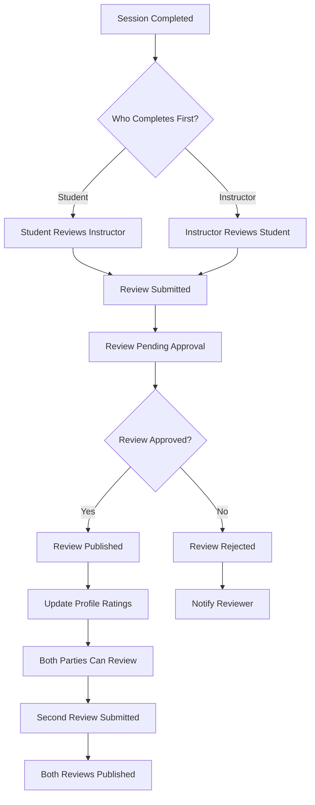

# VROMM Review System Documentation

## Table of Contents
1. [Current System Analysis](#current-system-analysis)
2. [Proposed Review System](#proposed-review-system)
3. [Database Schema](#database-schema)
4. [User Experience Flow](#user-experience-flow)
5. [UI/UX Components](#uiux-components)
6. [Implementation Plan](#implementation-plan)
7. [Technical Requirements](#technical-requirements)

## Current System Analysis

### Existing Relationship System
The current VROMM system has basic instructor-student relationships but lacks a comprehensive review and rating system.

**Current State:**
- ✅ **Relationship Management** - Students can connect with instructors
- ✅ **Basic Status Tracking** - Relationships have 'active' status
- ❌ **No Review System** - No way to rate or review experiences
- ❌ **No Completion Tracking** - No "finished teaching" workflow
- ❌ **No Profile Ratings** - No aggregated ratings for instructors
- ❌ **No Feedback Loop** - No structured feedback mechanism

### Current Database Structure
```sql
-- Existing relationship table
CREATE TABLE student_supervisor_relationships (
  id UUID PRIMARY KEY DEFAULT gen_random_uuid(),
  student_id UUID REFERENCES profiles(id),
  supervisor_id UUID REFERENCES profiles(id),
  status TEXT CHECK (status IN ('active', 'inactive', 'completed')),
  created_at TIMESTAMP WITH TIME ZONE DEFAULT NOW(),
  updated_at TIMESTAMP WITH TIME ZONE DEFAULT NOW()
);
```

**Limitations:**
- No completion tracking
- No review/rating system
- No teaching session management
- No feedback collection

## Proposed Review System

### System Overview
A comprehensive review and rating system similar to Airbnb/Uber, allowing students and instructors to rate each other after completed teaching sessions.

### Key Features
- **Session Management** - Track individual teaching sessions
- **Bidirectional Reviews** - Both students and instructors can review each other
- **Rating System** - 5-star rating with detailed criteria
- **Review Categories** - Specific feedback areas (communication, knowledge, etc.)
- **Profile Ratings** - Aggregated ratings displayed on profiles
- **Completion Workflow** - "Finished Teaching" button and review prompts
- **Moderation System** - Review approval and content moderation

## Database Schema

### New Tables Required

```sql
-- Teaching sessions table
CREATE TABLE teaching_sessions (
  id UUID PRIMARY KEY DEFAULT gen_random_uuid(),
  student_id UUID REFERENCES profiles(id) NOT NULL,
  instructor_id UUID REFERENCES profiles(id) NOT NULL,
  relationship_id UUID REFERENCES student_supervisor_relationships(id) NOT NULL,
  session_type TEXT CHECK (session_type IN ('lesson', 'practice', 'theory', 'exam_prep')) NOT NULL,
  session_date DATE NOT NULL,
  duration_minutes INTEGER NOT NULL,
  location TEXT,
  notes TEXT,
  status TEXT CHECK (status IN ('scheduled', 'in_progress', 'completed', 'cancelled')) DEFAULT 'scheduled',
  completed_at TIMESTAMP WITH TIME ZONE,
  created_at TIMESTAMP WITH TIME ZONE DEFAULT NOW(),
  updated_at TIMESTAMP WITH TIME ZONE DEFAULT NOW()
);

-- Reviews table
CREATE TABLE reviews (
  id UUID PRIMARY KEY DEFAULT gen_random_uuid(),
  session_id UUID REFERENCES teaching_sessions(id) NOT NULL,
  reviewer_id UUID REFERENCES profiles(id) NOT NULL,
  reviewee_id UUID REFERENCES profiles(id) NOT NULL,
  rating INTEGER CHECK (rating >= 1 AND rating <= 5) NOT NULL,
  title TEXT NOT NULL,
  review_text TEXT NOT NULL,
  review_categories JSONB NOT NULL, -- Detailed category ratings
  is_anonymous BOOLEAN DEFAULT false,
  status TEXT CHECK (status IN ('pending', 'approved', 'rejected', 'flagged')) DEFAULT 'pending',
  moderator_notes TEXT,
  created_at TIMESTAMP WITH TIME ZONE DEFAULT NOW(),
  updated_at TIMESTAMP WITH TIME ZONE DEFAULT NOW(),
  
  -- Ensure one review per session per reviewer
  UNIQUE(session_id, reviewer_id)
);

-- Review categories for detailed feedback
CREATE TABLE review_categories (
  id UUID PRIMARY KEY DEFAULT gen_random_uuid(),
  name TEXT NOT NULL,
  description TEXT,
  icon TEXT,
  order_index INTEGER DEFAULT 0,
  active BOOLEAN DEFAULT true,
  created_at TIMESTAMP WITH TIME ZONE DEFAULT NOW()
);

-- Insert default review categories
INSERT INTO review_categories (name, description, icon, order_index) VALUES
('Communication', 'How well did they communicate?', 'message-circle', 1),
('Knowledge', 'How knowledgeable were they?', 'book-open', 2),
('Patience', 'How patient were they?', 'heart', 3),
('Punctuality', 'Were they on time?', 'clock', 4),
('Teaching Style', 'How effective was their teaching?', 'graduation-cap', 5),
('Safety', 'How safety-conscious were they?', 'shield', 6),
('Preparation', 'How well prepared were they?', 'checklist', 7),
('Encouragement', 'How encouraging were they?', 'thumbs-up', 8);

-- Profile ratings aggregation
CREATE TABLE profile_ratings (
  id UUID PRIMARY KEY DEFAULT gen_random_uuid(),
  user_id UUID REFERENCES profiles(id) NOT NULL,
  total_reviews INTEGER DEFAULT 0,
  average_rating DECIMAL(3,2) DEFAULT 0.00,
  category_ratings JSONB DEFAULT '{}',
  last_updated TIMESTAMP WITH TIME ZONE DEFAULT NOW(),
  
  UNIQUE(user_id)
);

-- Review flags for moderation
CREATE TABLE review_flags (
  id UUID PRIMARY KEY DEFAULT gen_random_uuid(),
  review_id UUID REFERENCES reviews(id) NOT NULL,
  flagged_by UUID REFERENCES profiles(id) NOT NULL,
  reason TEXT NOT NULL,
  description TEXT,
  status TEXT CHECK (status IN ('pending', 'resolved', 'dismissed')) DEFAULT 'pending',
  created_at TIMESTAMP WITH TIME ZONE DEFAULT NOW()
);
```

### Updated Relationship Table
```sql
-- Add completion tracking to existing table
ALTER TABLE student_supervisor_relationships 
ADD COLUMN total_sessions INTEGER DEFAULT 0,
ADD COLUMN completed_sessions INTEGER DEFAULT 0,
ADD COLUMN relationship_status TEXT CHECK (relationship_status IN ('active', 'paused', 'completed', 'terminated')) DEFAULT 'active',
ADD COLUMN started_at TIMESTAMP WITH TIME ZONE DEFAULT NOW(),
ADD COLUMN completed_at TIMESTAMP WITH TIME ZONE;
```

## User Experience Flow

### 1. Session Completion Flow

```mermaid
sequenceDiagram
    participant S as Student
    participant I as Instructor
    participant SYS as System
    participant DB as Database

    Note over S,I: Teaching Session Occurs
    
    I->>SYS: Mark Session as Complete
    SYS->>DB: Update session status
    SYS->>S: Send completion notification
    
    S->>SYS: Click "Leave Review" button
    SYS->>S: Show review form
    S->>SYS: Submit review
    SYS->>DB: Save review
    SYS->>I: Send review notification
    
    I->>SYS: Click "Leave Review" button
    SYS->>I: Show review form
    I->>SYS: Submit review
    SYS->>DB: Save review
    SYS->>S: Send review notification
    
    SYS->>DB: Update profile ratings
    SYS->>S,I: Show updated ratings
```

### 2. Review Process Flow



## UI/UX Components

### 1. Session Completion Modal

```typescript
interface SessionCompletionModalProps {
  session: TeachingSession;
  onComplete: (sessionId: string) => void;
  onReview: (sessionId: string, revieweeId: string) => void;
}

const SessionCompletionModal = ({ session, onComplete, onReview }: SessionCompletionModalProps) => {
  const [completionNotes, setCompletionNotes] = useState('');
  const [isCompleting, setIsCompleting] = useState(false);
  
  const handleComplete = async () => {
    setIsCompleting(true);
    try {
      await onComplete(session.id);
      // Show review prompt
      setTimeout(() => {
        onReview(session.id, session.instructor_id);
      }, 1000);
    } catch (error) {
      console.error('Error completing session:', error);
    } finally {
      setIsCompleting(false);
    }
  };
  
  return (
    <Modal visible={true} transparent animationType="slide">
      <View style={styles.modalContainer}>
        <View style={styles.modalContent}>
          <Text style={styles.title}>Session Complete!</Text>
          <Text style={styles.subtitle}>
            How was your session with {session.instructor_name}?
          </Text>
          
          <TextArea
            placeholder="Add any notes about the session (optional)"
            value={completionNotes}
            onChangeText={setCompletionNotes}
            style={styles.notesInput}
          />
          
          <View style={styles.buttonContainer}>
            <Button
              variant="outline"
              onPress={() => {/* Skip review */}}
            >
              Skip Review
            </Button>
            <Button
              onPress={handleComplete}
              loading={isCompleting}
            >
              Leave Review
            </Button>
          </View>
        </View>
      </View>
    </Modal>
  );
};
```

### 2. Review Form Component

```typescript
interface ReviewFormProps {
  sessionId: string;
  revieweeId: string;
  revieweeName: string;
  onSubmit: (review: ReviewData) => Promise<void>;
}

const ReviewForm = ({ sessionId, revieweeId, revieweeName, onSubmit }: ReviewFormProps) => {
  const [rating, setRating] = useState(0);
  const [title, setTitle] = useState('');
  const [reviewText, setReviewText] = useState('');
  const [categoryRatings, setCategoryRatings] = useState<Record<string, number>>({});
  const [isAnonymous, setIsAnonymous] = useState(false);
  const [isSubmitting, setIsSubmitting] = useState(false);
  
  const reviewCategories = [
    { id: 'communication', name: 'Communication', icon: 'message-circle' },
    { id: 'knowledge', name: 'Knowledge', icon: 'book-open' },
    { id: 'patience', name: 'Patience', icon: 'heart' },
    { id: 'punctuality', name: 'Punctuality', icon: 'clock' },
    { id: 'teaching_style', name: 'Teaching Style', icon: 'graduation-cap' },
    { id: 'safety', name: 'Safety', icon: 'shield' }
  ];
  
  const handleSubmit = async () => {
    if (rating === 0) {
      alert('Please select a rating');
      return;
    }
    
    setIsSubmitting(true);
    try {
      await onSubmit({
        sessionId,
        revieweeId,
        rating,
        title,
        reviewText,
        categoryRatings,
        isAnonymous
      });
    } catch (error) {
      console.error('Error submitting review:', error);
    } finally {
      setIsSubmitting(false);
    }
  };
  
  return (
    <ScrollView style={styles.reviewForm}>
      <Text style={styles.header}>Rate {revieweeName}</Text>
      
      {/* Overall Rating */}
      <View style={styles.ratingSection}>
        <Text style={styles.sectionTitle}>Overall Rating</Text>
        <StarRating
          rating={rating}
          onRatingChange={setRating}
          size={40}
          color="#FFD700"
        />
      </View>
      
      {/* Category Ratings */}
      <View style={styles.categoriesSection}>
        <Text style={styles.sectionTitle}>Rate Specific Areas</Text>
        {reviewCategories.map((category) => (
          <View key={category.id} style={styles.categoryRow}>
            <View style={styles.categoryInfo}>
              <Icon name={category.icon} size={20} />
              <Text style={styles.categoryName}>{category.name}</Text>
            </View>
            <StarRating
              rating={categoryRatings[category.id] || 0}
              onRatingChange={(rating) => 
                setCategoryRatings(prev => ({ ...prev, [category.id]: rating }))
              }
              size={20}
              color="#FFD700"
            />
          </View>
        ))}
      </View>
      
      {/* Review Title */}
      <View style={styles.inputSection}>
        <Text style={styles.inputLabel}>Review Title</Text>
        <TextInput
          style={styles.textInput}
          value={title}
          onChangeText={setTitle}
          placeholder="Summarize your experience"
        />
      </View>
      
      {/* Review Text */}
      <View style={styles.inputSection}>
        <Text style={styles.inputLabel}>Detailed Review</Text>
        <TextArea
          style={styles.textArea}
          value={reviewText}
          onChangeText={setReviewText}
          placeholder="Tell others about your experience..."
          numberOfLines={4}
        />
      </View>
      
      {/* Anonymous Option */}
      <View style={styles.anonymousSection}>
        <Switch
          value={isAnonymous}
          onValueChange={setIsAnonymous}
        />
        <Text style={styles.anonymousLabel}>
          Submit anonymously
        </Text>
      </View>
      
      {/* Submit Button */}
      <Button
        onPress={handleSubmit}
        loading={isSubmitting}
        disabled={rating === 0}
        style={styles.submitButton}
      >
        Submit Review
      </Button>
    </ScrollView>
  );
};
```

### 3. Profile Rating Display

```typescript
interface ProfileRatingProps {
  userId: string;
  showDetailed?: boolean;
}

const ProfileRating = ({ userId, showDetailed = false }: ProfileRatingProps) => {
  const [ratingData, setRatingData] = useState<ProfileRatingData | null>(null);
  const [recentReviews, setRecentReviews] = useState<Review[]>([]);
  
  useEffect(() => {
    loadRatingData();
    if (showDetailed) {
      loadRecentReviews();
    }
  }, [userId]);
  
  const loadRatingData = async () => {
    try {
      const { data, error } = await supabase
        .from('profile_ratings')
        .select('*')
        .eq('user_id', userId)
        .single();
      
      if (error) throw error;
      setRatingData(data);
    } catch (error) {
      console.error('Error loading rating data:', error);
    }
  };
  
  const loadRecentReviews = async () => {
    try {
      const { data, error } = await supabase
        .from('reviews')
        .select(`
          *,
          profiles!reviews_reviewer_id_fkey (full_name, avatar_url)
        `)
        .eq('reviewee_id', userId)
        .eq('status', 'approved')
        .order('created_at', { ascending: false })
        .limit(5);
      
      if (error) throw error;
      setRecentReviews(data || []);
    } catch (error) {
      console.error('Error loading recent reviews:', error);
    }
  };
  
  if (!ratingData) return <LoadingSpinner />;
  
  return (
    <View style={styles.ratingContainer}>
      {/* Overall Rating */}
      <View style={styles.overallRating}>
        <View style={styles.ratingDisplay}>
          <Text style={styles.ratingNumber}>
            {ratingData.average_rating.toFixed(1)}
          </Text>
          <StarRating
            rating={Math.round(ratingData.average_rating)}
            size={20}
            color="#FFD700"
            readonly
          />
          <Text style={styles.reviewCount}>
            ({ratingData.total_reviews} reviews)
          </Text>
        </View>
      </View>
      
      {/* Category Breakdown */}
      {showDetailed && (
        <View style={styles.categoryBreakdown}>
          <Text style={styles.sectionTitle}>Rating Breakdown</Text>
          {Object.entries(ratingData.category_ratings).map(([category, rating]) => (
            <View key={category} style={styles.categoryRow}>
              <Text style={styles.categoryName}>
                {category.charAt(0).toUpperCase() + category.slice(1)}
              </Text>
              <View style={styles.categoryRating}>
                <StarRating
                  rating={Math.round(rating)}
                  size={16}
                  color="#FFD700"
                  readonly
                />
                <Text style={styles.categoryValue}>
                  {rating.toFixed(1)}
                </Text>
              </View>
            </View>
          ))}
        </View>
      )}
      
      {/* Recent Reviews */}
      {showDetailed && recentReviews.length > 0 && (
        <View style={styles.recentReviews}>
          <Text style={styles.sectionTitle}>Recent Reviews</Text>
          {recentReviews.map((review) => (
            <ReviewCard key={review.id} review={review} />
          ))}
        </View>
      )}
    </View>
  );
};
```

### 4. Review Card Component

```typescript
interface ReviewCardProps {
  review: Review;
  showReviewee?: boolean;
}

const ReviewCard = ({ review, showReviewee = false }: ReviewCardProps) => {
  const formatDate = (date: string) => {
    return new Date(date).toLocaleDateString('en-US', {
      year: 'numeric',
      month: 'long',
      day: 'numeric'
    });
  };
  
  return (
    <View style={styles.reviewCard}>
      <View style={styles.reviewHeader}>
        <View style={styles.reviewerInfo}>
          {review.is_anonymous ? (
            <View style={styles.anonymousAvatar}>
              <Icon name="user" size={20} color="#666" />
            </View>
          ) : (
            <Image
              source={{ uri: review.reviewer_avatar }}
              style={styles.avatar}
            />
          )}
          <View style={styles.reviewerDetails}>
            <Text style={styles.reviewerName}>
              {review.is_anonymous ? 'Anonymous' : review.reviewer_name}
            </Text>
            <Text style={styles.reviewDate}>
              {formatDate(review.created_at)}
            </Text>
          </View>
        </View>
        <StarRating
          rating={review.rating}
          size={16}
          color="#FFD700"
          readonly
        />
      </View>
      
      <Text style={styles.reviewTitle}>{review.title}</Text>
      <Text style={styles.reviewText}>{review.review_text}</Text>
      
      {/* Category Ratings */}
      {Object.keys(review.review_categories).length > 0 && (
        <View style={styles.categoryRatings}>
          {Object.entries(review.review_categories).map(([category, rating]) => (
            <View key={category} style={styles.categoryRating}>
              <Text style={styles.categoryName}>
                {category.charAt(0).toUpperCase() + category.slice(1)}
              </Text>
              <StarRating
                rating={rating}
                size={12}
                color="#FFD700"
                readonly
              />
            </View>
          ))}
        </View>
      )}
    </View>
  );
};
```

## Implementation Plan

### Phase 1: Database Setup (Week 1)
1. **Create new tables** for sessions, reviews, and ratings
2. **Add triggers** for automatic rating calculations
3. **Set up RLS policies** for data access control
4. **Create indexes** for performance optimization

### Phase 2: Core Functionality (Week 2-3)
1. **Session management** - Create, update, complete sessions
2. **Review system** - Submit, approve, display reviews
3. **Rating calculations** - Automatic profile rating updates
4. **Basic UI components** - Review forms and displays

### Phase 3: Advanced Features (Week 4-5)
1. **Moderation system** - Review approval workflow
2. **Notification system** - Review alerts and updates
3. **Analytics dashboard** - Review insights for instructors
4. **Mobile optimization** - Responsive design improvements

### Phase 4: Polish & Launch (Week 6)
1. **Testing** - Comprehensive testing of all features
2. **Performance optimization** - Database queries and caching
3. **User feedback** - Beta testing with real users
4. **Launch preparation** - Documentation and training

## Technical Requirements

### Database Functions

```sql
-- Function to update profile ratings after review submission
CREATE OR REPLACE FUNCTION update_profile_ratings()
RETURNS TRIGGER AS $$
BEGIN
  -- Update or insert profile rating for reviewee
  INSERT INTO profile_ratings (user_id, total_reviews, average_rating, category_ratings)
  VALUES (
    NEW.reviewee_id,
    1,
    NEW.rating,
    NEW.review_categories
  )
  ON CONFLICT (user_id) DO UPDATE SET
    total_reviews = profile_ratings.total_reviews + 1,
    average_rating = (
      (profile_ratings.average_rating * profile_ratings.total_reviews + NEW.rating) 
      / (profile_ratings.total_reviews + 1)
    ),
    category_ratings = profile_ratings.category_ratings || NEW.review_categories,
    last_updated = NOW();
  
  RETURN NEW;
END;
$$ LANGUAGE plpgsql;

-- Trigger to automatically update ratings
CREATE TRIGGER update_ratings_trigger
  AFTER INSERT ON reviews
  FOR EACH ROW
  EXECUTE FUNCTION update_profile_ratings();
```

### API Endpoints

```typescript
// Session management endpoints
export const sessionAPI = {
  // Create new teaching session
  createSession: async (sessionData: CreateSessionData) => {
    const { data, error } = await supabase
      .from('teaching_sessions')
      .insert(sessionData)
      .select()
      .single();
    
    if (error) throw error;
    return data;
  },
  
  // Complete session
  completeSession: async (sessionId: string, completionData: SessionCompletionData) => {
    const { data, error } = await supabase
      .from('teaching_sessions')
      .update({
        status: 'completed',
        completed_at: new Date().toISOString(),
        ...completionData
      })
      .eq('id', sessionId)
      .select()
      .single();
    
    if (error) throw error;
    return data;
  },
  
  // Get sessions for user
  getUserSessions: async (userId: string, status?: string) => {
    let query = supabase
      .from('teaching_sessions')
      .select(`
        *,
        student:profiles!student_id (full_name, avatar_url),
        instructor:profiles!instructor_id (full_name, avatar_url)
      `)
      .or(`student_id.eq.${userId},instructor_id.eq.${userId}`);
    
    if (status) {
      query = query.eq('status', status);
    }
    
    const { data, error } = await query.order('session_date', { ascending: false });
    
    if (error) throw error;
    return data;
  }
};

// Review management endpoints
export const reviewAPI = {
  // Submit review
  submitReview: async (reviewData: ReviewData) => {
    const { data, error } = await supabase
      .from('reviews')
      .insert({
        ...reviewData,
        status: 'pending'
      })
      .select()
      .single();
    
    if (error) throw error;
    return data;
  },
  
  // Get reviews for user
  getUserReviews: async (userId: string, type: 'received' | 'given') => {
    const column = type === 'received' ? 'reviewee_id' : 'reviewer_id';
    
    const { data, error } = await supabase
      .from('reviews')
      .select(`
        *,
        reviewer:profiles!reviewer_id (full_name, avatar_url),
        reviewee:profiles!reviewee_id (full_name, avatar_url),
        session:teaching_sessions (session_type, session_date)
      `)
      .eq(column, userId)
      .eq('status', 'approved')
      .order('created_at', { ascending: false });
    
    if (error) throw error;
    return data;
  },
  
  // Get profile rating
  getProfileRating: async (userId: string) => {
    const { data, error } = await supabase
      .from('profile_ratings')
      .select('*')
      .eq('user_id', userId)
      .single();
    
    if (error && error.code !== 'PGRST116') throw error;
    return data;
  }
};
```

### RLS Policies

```sql
-- Reviews can be read by anyone (for public display)
CREATE POLICY "Reviews are viewable by everyone" ON reviews
  FOR SELECT USING (status = 'approved');

-- Users can only create reviews for sessions they participated in
CREATE POLICY "Users can create reviews for their sessions" ON reviews
  FOR INSERT WITH CHECK (
    EXISTS (
      SELECT 1 FROM teaching_sessions 
      WHERE id = session_id 
      AND (student_id = auth.uid() OR instructor_id = auth.uid())
    )
  );

-- Users can update their own reviews
CREATE POLICY "Users can update their own reviews" ON reviews
  FOR UPDATE USING (reviewer_id = auth.uid());

-- Profile ratings are viewable by everyone
CREATE POLICY "Profile ratings are viewable by everyone" ON profile_ratings
  FOR SELECT USING (true);

-- Teaching sessions are viewable by participants
CREATE POLICY "Sessions are viewable by participants" ON teaching_sessions
  FOR SELECT USING (
    student_id = auth.uid() OR instructor_id = auth.uid()
  );
```

## Current System Improvements Needed

### 1. Immediate Improvements
- **Add session tracking** to existing relationships
- **Implement basic rating system** for completed sessions
- **Create review prompts** after session completion
- **Display ratings** on instructor profiles

### 2. Medium-term Enhancements
- **Advanced review categories** for detailed feedback
- **Moderation system** for review quality control
- **Analytics dashboard** for instructors to track their ratings
- **Notification system** for review updates

### 3. Long-term Features
- **AI-powered review analysis** for insights
- **Review response system** for instructors to reply
- **Advanced filtering** and search for reviews
- **Integration with external platforms** for verification

## Success Metrics

### Key Performance Indicators
- **Review completion rate** - % of completed sessions that receive reviews
- **Average rating** - Overall platform rating quality
- **Review response time** - Time from session completion to review submission
- **User satisfaction** - Feedback on review system usability

### Business Impact
- **Instructor quality improvement** - Better instructors get more students
- **Student confidence** - Reviews help students choose instructors
- **Platform credibility** - Transparent review system builds trust
- **Revenue growth** - Higher quality leads to more users

---

*This documentation is maintained by the VROMM development team. Last updated: January 2025*
