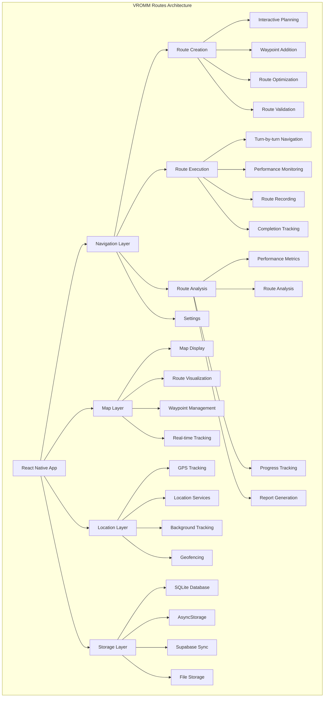

# VROMM Routes Documentation

## Table of Contents
1. [Project Overview](#project-overview)
2. [Technology Stack](#technology-stack)
3. [Architecture](#architecture)
4. [Core Features](#core-features)
5. [Route Management](#route-management)
6. [GPS Tracking](#gps-tracking)
7. [Offline Capabilities](#offline-capabilities)
8. [Performance Analytics](#performance-analytics)
9. [Development Guide](#development-guide)
10. [Deployment](#deployment)

## Project Overview

The VROMM Routes application is a specialized React Native application focused on route creation, GPS tracking, and performance analytics for driving education. It provides instructors and students with advanced tools for planning, executing, and analyzing driving routes.

### Key Capabilities
- **Route Creation** - Interactive route planning with waypoints
- **GPS Tracking** - Real-time location tracking during drives
- **Offline Storage** - Routes and data available without internet
- **Performance Analytics** - Detailed driving performance metrics
- **Route Sharing** - Share routes between instructors and students
- **Integration** - Seamless integration with main VROMM app

## Technology Stack

### Frontend
- **React Native** - Cross-platform mobile development
- **TypeScript** - Type-safe development
- **React Navigation** - Navigation management
- **React Native Maps** - Map integration and display
- **React Native Reanimated** - Smooth animations
- **React Native Gesture Handler** - Touch interactions

### Location & Maps
- **Google Maps API** - Map rendering and geocoding
- **React Native Location** - GPS tracking and positioning
- **React Native Background Job** - Background location tracking
- **Geolib** - Geographic calculations and utilities

### Storage & Sync
- **SQLite** - Local database for offline storage
- **AsyncStorage** - Key-value storage for settings
- **Supabase** - Cloud synchronization and backup
- **React Query** - Data fetching and caching

### Performance
- **Flipper** - Debugging and performance monitoring
- **React Native Performance** - Performance optimization
- **Memory Management** - Efficient resource usage

## Architecture



## Core Features

### 1. Route Creation

#### Interactive Route Planner
```typescript
interface RoutePlannerProps {
  onRouteCreated: (route: Route) => void;
  onRouteUpdated: (route: Route) => void;
  initialLocation?: LatLng;
}

const RoutePlanner = ({ onRouteCreated, onRouteUpdated, initialLocation }: RoutePlannerProps) => {
  const [waypoints, setWaypoints] = useState<Waypoint[]>([]);
  const [route, setRoute] = useState<Route | null>(null);
  const [isPlanning, setIsPlanning] = useState(false);
  const [mapRef, setMapRef] = useState<MapView | null>(null);
  
  const addWaypoint = (coordinate: LatLng) => {
    const newWaypoint: Waypoint = {
      id: generateId(),
      coordinate,
      name: `Waypoint ${waypoints.length + 1}`,
      description: '',
      order: waypoints.length,
      createdAt: new Date().toISOString()
    };
    
    setWaypoints(prev => [...prev, newWaypoint]);
  };
  
  const removeWaypoint = (waypointId: string) => {
    setWaypoints(prev => prev.filter(wp => wp.id !== waypointId));
  };
  
  const reorderWaypoints = (fromIndex: number, toIndex: number) => {
    setWaypoints(prev => {
      const newWaypoints = [...prev];
      const [movedWaypoint] = newWaypoints.splice(fromIndex, 1);
      newWaypoints.splice(toIndex, 0, movedWaypoint);
      
      // Update order indices
      return newWaypoints.map((wp, index) => ({
        ...wp,
        order: index
      }));
    });
  };
  
  const calculateRoute = async () => {
    if (waypoints.length < 2) return;
    
    setIsPlanning(true);
    try {
      const routeData = await calculateOptimalRoute(waypoints);
      setRoute(routeData);
      onRouteCreated(routeData);
    } catch (error) {
      console.error('Error calculating route:', error);
    } finally {
      setIsPlanning(false);
    }
  };
  
  return (
    <View style={styles.routePlanner}>
      <MapView
        ref={setMapRef}
        style={styles.map}
        initialRegion={{
          latitude: initialLocation?.latitude || 59.3293,
          longitude: initialLocation?.longitude || 18.0686,
          latitudeDelta: 0.0922,
          longitudeDelta: 0.0421,
        }}
        onPress={(event) => addWaypoint(event.nativeEvent.coordinate)}
      >
        {/* Render waypoints */}
        {waypoints.map((waypoint, index) => (
          <Marker
            key={waypoint.id}
            coordinate={waypoint.coordinate}
            title={waypoint.name}
            description={waypoint.description}
            pinColor={getWaypointColor(index)}
            onPress={() => {/* Show waypoint details */}}
          />
        ))}
        
        {/* Render route polyline */}
        {route && (
          <Polyline
            coordinates={route.coordinates}
            strokeColor="#007AFF"
            strokeWidth={4}
          />
        )}
      </MapView>
      
      <View style={styles.controls}>
        <WaypointList
          waypoints={waypoints}
          onRemove={removeWaypoint}
          onReorder={reorderWaypoints}
        />
        
        <View style={styles.actionButtons}>
          <Button
            onPress={calculateRoute}
            loading={isPlanning}
            disabled={waypoints.length < 2}
          >
            Calculate Route
          </Button>
          
          <Button
            variant="outline"
            onPress={() => setWaypoints([])}
          >
            Clear All
          </Button>
        </View>
      </View>
    </View>
  );
};
```

#### Waypoint Management
```typescript
interface Waypoint {
  id: string;
  coordinate: LatLng;
  name: string;
  description: string;
  order: number;
  createdAt: string;
  type?: 'start' | 'end' | 'checkpoint' | 'instruction';
  instruction?: string;
  duration?: number; // seconds to spend at this waypoint
}

const WaypointList = ({ 
  waypoints, 
  onRemove, 
  onReorder 
}: { 
  waypoints: Waypoint[];
  onRemove: (id: string) => void;
  onReorder: (from: number, to: number) => void;
}) => {
  const [draggedIndex, setDraggedIndex] = useState<number | null>(null);
  
  return (
    <View style={styles.waypointList}>
      <Text style={styles.listTitle}>Route Waypoints</Text>
      
      {waypoints.map((waypoint, index) => (
        <DraggableItem
          key={waypoint.id}
          index={index}
          onDragStart={() => setDraggedIndex(index)}
          onDragEnd={(from, to) => onReorder(from, to)}
        >
          <View style={styles.waypointItem}>
            <View style={styles.waypointInfo}>
              <Text style={styles.waypointName}>{waypoint.name}</Text>
              <Text style={styles.waypointDescription}>
                {waypoint.description || 'No description'}
              </Text>
              <Text style={styles.waypointCoordinates}>
                {waypoint.coordinate.latitude.toFixed(6)}, {waypoint.coordinate.longitude.toFixed(6)}
              </Text>
            </View>
            
            <View style={styles.waypointActions}>
              <Button
                size="sm"
                variant="outline"
                onPress={() => {/* Edit waypoint */}}
              >
                Edit
              </Button>
              <Button
                size="sm"
                variant="destructive"
                onPress={() => onRemove(waypoint.id)}
              >
                Remove
              </Button>
            </View>
          </View>
        </DraggableItem>
      ))}
    </View>
  );
};
```

### 2. GPS Tracking

#### Real-time Location Tracking
```typescript
interface LocationTrackerProps {
  onLocationUpdate: (location: LocationData) => void;
  onRouteComplete: (routeData: RouteData) => void;
  isTracking: boolean;
}

const LocationTracker = ({ onLocationUpdate, onRouteComplete, isTracking }: LocationTrackerProps) => {
  const [currentLocation, setCurrentLocation] = useState<LocationData | null>(null);
  const [trackingData, setTrackingData] = useState<TrackingData[]>([]);
  const [startTime, setStartTime] = useState<Date | null>(null);
  
  useEffect(() => {
    if (isTracking) {
      startLocationTracking();
    } else {
      stopLocationTracking();
    }
  }, [isTracking]);
  
  const startLocationTracking = async () => {
    try {
      // Request location permissions
      const { status } = await Location.requestForegroundPermissionsAsync();
      if (status !== 'granted') {
        throw new Error('Location permission denied');
      }
      
      // Start location tracking
      const subscription = await Location.watchPositionAsync(
        {
          accuracy: Location.Accuracy.High,
          timeInterval: 1000, // Update every second
          distanceInterval: 1, // Update every meter
        },
        (location) => {
          const locationData: LocationData = {
            latitude: location.coords.latitude,
            longitude: location.coords.longitude,
            altitude: location.coords.altitude,
            speed: location.coords.speed,
            heading: location.coords.heading,
            accuracy: location.coords.accuracy,
            timestamp: new Date().toISOString()
          };
          
          setCurrentLocation(locationData);
          onLocationUpdate(locationData);
          
          // Store tracking data
          setTrackingData(prev => [...prev, {
            ...locationData,
            distance: calculateDistance(prev[prev.length - 1], locationData)
          }]);
        }
      );
      
      setStartTime(new Date());
      return subscription;
    } catch (error) {
      console.error('Error starting location tracking:', error);
    }
  };
  
  const stopLocationTracking = () => {
    // Stop tracking and process data
    if (trackingData.length > 0) {
      const routeData: RouteData = {
        startTime: startTime?.toISOString() || '',
        endTime: new Date().toISOString(),
        totalDistance: calculateTotalDistance(trackingData),
        averageSpeed: calculateAverageSpeed(trackingData),
        maxSpeed: calculateMaxSpeed(trackingData),
        coordinates: trackingData.map(point => ({
          latitude: point.latitude,
          longitude: point.longitude
        })),
        performance: calculatePerformanceMetrics(trackingData)
      };
      
      onRouteComplete(routeData);
    }
  };
  
  return (
    <View style={styles.locationTracker}>
      {currentLocation && (
        <View style={styles.locationInfo}>
          <Text style={styles.locationText}>
            Lat: {currentLocation.latitude.toFixed(6)}
          </Text>
          <Text style={styles.locationText}>
            Lng: {currentLocation.longitude.toFixed(6)}
          </Text>
          <Text style={styles.locationText}>
            Speed: {currentLocation.speed?.toFixed(1) || 0} km/h
          </Text>
          <Text style={styles.locationText}>
            Accuracy: {currentLocation.accuracy?.toFixed(1) || 0}m
          </Text>
        </View>
      )}
    </View>
  );
};
```

#### Background Location Tracking
```typescript
// Background location tracking service
class BackgroundLocationService {
  private static instance: BackgroundLocationService;
  private subscription: Location.LocationSubscription | null = null;
  private isTracking = false;
  
  static getInstance(): BackgroundLocationService {
    if (!BackgroundLocationService.instance) {
      BackgroundLocationService.instance = new BackgroundLocationService();
    }
    return BackgroundLocationService.instance;
  }
  
  async startBackgroundTracking(routeId: string) {
    try {
      // Request background location permissions
      const { status } = await Location.requestBackgroundPermissionsAsync();
      if (status !== 'granted') {
        throw new Error('Background location permission denied');
      }
      
      // Start background location tracking
      this.subscription = await Location.watchPositionAsync(
        {
          accuracy: Location.Accuracy.High,
          timeInterval: 5000, // Update every 5 seconds in background
          distanceInterval: 5, // Update every 5 meters
        },
        (location) => {
          this.handleLocationUpdate(location, routeId);
        }
      );
      
      this.isTracking = true;
    } catch (error) {
      console.error('Error starting background tracking:', error);
    }
  }
  
  private async handleLocationUpdate(location: Location.LocationObject, routeId: string) {
    const locationData = {
      routeId,
      latitude: location.coords.latitude,
      longitude: location.coords.longitude,
      altitude: location.coords.altitude,
      speed: location.coords.speed,
      heading: location.coords.heading,
      accuracy: location.coords.accuracy,
      timestamp: new Date().toISOString()
    };
    
    // Store in local database
    await this.storeLocationData(locationData);
    
    // Sync with cloud when possible
    await this.syncLocationData(locationData);
  }
  
  private async storeLocationData(data: LocationData) {
    try {
      await SQLite.openDatabase('routes.db').then(db => {
        db.transaction(tx => {
          tx.executeSql(
            'INSERT INTO location_data (route_id, latitude, longitude, altitude, speed, heading, accuracy, timestamp) VALUES (?, ?, ?, ?, ?, ?, ?, ?)',
            [data.routeId, data.latitude, data.longitude, data.altitude, data.speed, data.heading, data.accuracy, data.timestamp]
          );
        });
      });
    } catch (error) {
      console.error('Error storing location data:', error);
    }
  }
  
  async stopBackgroundTracking() {
    if (this.subscription) {
      this.subscription.remove();
      this.subscription = null;
    }
    this.isTracking = false;
  }
}
```

### 3. Offline Capabilities

#### Local Database Setup
```typescript
// SQLite database setup for offline storage
class RouteDatabase {
  private db: SQLite.SQLiteDatabase | null = null;
  
  async initialize() {
    try {
      this.db = await SQLite.openDatabase('routes.db');
      await this.createTables();
    } catch (error) {
      console.error('Error initializing database:', error);
    }
  }
  
  private async createTables() {
    if (!this.db) return;
    
    await this.db.transaction(tx => {
      // Routes table
      tx.executeSql(`
        CREATE TABLE IF NOT EXISTS routes (
          id TEXT PRIMARY KEY,
          name TEXT NOT NULL,
          description TEXT,
          waypoints TEXT NOT NULL,
          coordinates TEXT NOT NULL,
          distance REAL,
          duration INTEGER,
          difficulty TEXT,
          created_at TEXT,
          updated_at TEXT,
          synced INTEGER DEFAULT 0
        )
      `);
      
      // Location data table
      tx.executeSql(`
        CREATE TABLE IF NOT EXISTS location_data (
          id INTEGER PRIMARY KEY AUTOINCREMENT,
          route_id TEXT,
          latitude REAL,
          longitude REAL,
          altitude REAL,
          speed REAL,
          heading REAL,
          accuracy REAL,
          timestamp TEXT,
          synced INTEGER DEFAULT 0
        )
      `);
      
      // Route sessions table
      tx.executeSql(`
        CREATE TABLE IF NOT EXISTS route_sessions (
          id TEXT PRIMARY KEY,
          route_id TEXT,
          student_id TEXT,
          instructor_id TEXT,
          start_time TEXT,
          end_time TEXT,
          total_distance REAL,
          average_speed REAL,
          max_speed REAL,
          performance_data TEXT,
          completed INTEGER DEFAULT 0,
          created_at TEXT,
          synced INTEGER DEFAULT 0
        )
      `);
    });
  }
  
  async saveRoute(route: Route): Promise<void> {
    if (!this.db) return;
    
    try {
      await this.db.transaction(tx => {
        tx.executeSql(
          'INSERT OR REPLACE INTO routes (id, name, description, waypoints, coordinates, distance, duration, difficulty, created_at, updated_at, synced) VALUES (?, ?, ?, ?, ?, ?, ?, ?, ?, ?, ?)',
          [
            route.id,
            route.name,
            route.description,
            JSON.stringify(route.waypoints),
            JSON.stringify(route.coordinates),
            route.distance,
            route.duration,
            route.difficulty,
            route.createdAt,
            route.updatedAt,
            0 // Not synced yet
          ]
        );
      });
    } catch (error) {
      console.error('Error saving route:', error);
    }
  }
  
  async getRoutes(): Promise<Route[]> {
    if (!this.db) return [];
    
    try {
      return new Promise((resolve, reject) => {
        this.db!.transaction(tx => {
          tx.executeSql(
            'SELECT * FROM routes ORDER BY created_at DESC',
            [],
            (_, result) => {
              const routes = result.rows._array.map(row => ({
                id: row.id,
                name: row.name,
                description: row.description,
                waypoints: JSON.parse(row.waypoints),
                coordinates: JSON.parse(row.coordinates),
                distance: row.distance,
                duration: row.duration,
                difficulty: row.difficulty,
                createdAt: row.created_at,
                updatedAt: row.updated_at,
                synced: row.synced === 1
              }));
              resolve(routes);
            },
            (_, error) => {
              reject(error);
              return false;
            }
          );
        });
      });
    } catch (error) {
      console.error('Error getting routes:', error);
      return [];
    }
  }
  
  async syncWithCloud() {
    if (!this.db) return;
    
    try {
      // Get unsynced routes
      const unsyncedRoutes = await this.getUnsyncedRoutes();
      
      for (const route of unsyncedRoutes) {
        try {
          // Sync with Supabase
          const { error } = await supabase
            .from('routes')
            .upsert({
              id: route.id,
              name: route.name,
              description: route.description,
              waypoints: route.waypoints,
              coordinates: route.coordinates,
              distance: route.distance,
              duration: route.duration,
              difficulty: route.difficulty,
              created_at: route.createdAt,
              updated_at: route.updatedAt
            });
          
          if (!error) {
            // Mark as synced
            await this.markAsSynced(route.id);
          }
        } catch (error) {
          console.error('Error syncing route:', error);
        }
      }
    } catch (error) {
      console.error('Error syncing with cloud:', error);
    }
  }
}
```

### 4. Performance Analytics

#### Driving Performance Metrics
```typescript
interface PerformanceMetrics {
  averageSpeed: number;
  maxSpeed: number;
  totalDistance: number;
  totalTime: number;
  averageAcceleration: number;
  maxAcceleration: number;
  brakingEvents: number;
  accelerationEvents: number;
  speedViolations: number;
  smoothnessScore: number;
  efficiencyScore: number;
}

const PerformanceAnalyzer = {
  calculateMetrics(trackingData: TrackingData[]): PerformanceMetrics {
    const speeds = trackingData.map(point => point.speed || 0);
    const accelerations = this.calculateAccelerations(trackingData);
    
    return {
      averageSpeed: this.calculateAverage(speeds),
      maxSpeed: Math.max(...speeds),
      totalDistance: this.calculateTotalDistance(trackingData),
      totalTime: this.calculateTotalTime(trackingData),
      averageAcceleration: this.calculateAverage(accelerations),
      maxAcceleration: Math.max(...accelerations),
      brakingEvents: this.countBrakingEvents(accelerations),
      accelerationEvents: this.countAccelerationEvents(accelerations),
      speedViolations: this.countSpeedViolations(speeds),
      smoothnessScore: this.calculateSmoothnessScore(accelerations),
      efficiencyScore: this.calculateEfficiencyScore(trackingData)
    };
  },
  
  calculateAccelerations(trackingData: TrackingData[]): number[] {
    const accelerations: number[] = [];
    
    for (let i = 1; i < trackingData.length; i++) {
      const prev = trackingData[i - 1];
      const curr = trackingData[i];
      
      const timeDiff = (new Date(curr.timestamp).getTime() - new Date(prev.timestamp).getTime()) / 1000;
      const speedDiff = (curr.speed || 0) - (prev.speed || 0);
      
      const acceleration = speedDiff / timeDiff; // m/s²
      accelerations.push(acceleration);
    }
    
    return accelerations;
  },
  
  calculateSmoothnessScore(accelerations: number[]): number {
    // Calculate standard deviation of accelerations
    const mean = this.calculateAverage(accelerations);
    const variance = accelerations.reduce((sum, acc) => sum + Math.pow(acc - mean, 2), 0) / accelerations.length;
    const standardDeviation = Math.sqrt(variance);
    
    // Convert to 0-100 score (lower deviation = higher score)
    return Math.max(0, 100 - (standardDeviation * 10));
  },
  
  calculateEfficiencyScore(trackingData: TrackingData[]): number {
    const totalDistance = this.calculateTotalDistance(trackingData);
    const totalTime = this.calculateTotalTime(trackingData);
    const averageSpeed = totalDistance / totalTime;
    
    // Efficiency based on consistent speed and minimal stops
    const speedConsistency = this.calculateSpeedConsistency(trackingData);
    const stopEvents = this.countStopEvents(trackingData);
    
    return (speedConsistency * 0.7) + ((100 - stopEvents) * 0.3);
  }
};
```

#### Performance Dashboard
```typescript
const PerformanceDashboard = ({ routeId }: { routeId: string }) => {
  const [performanceData, setPerformanceData] = useState<PerformanceMetrics | null>(null);
  const [sessionData, setSessionData] = useState<RouteSession | null>(null);
  const [isLoading, setIsLoading] = useState(true);
  
  useEffect(() => {
    loadPerformanceData();
  }, [routeId]);
  
  const loadPerformanceData = async () => {
    try {
      setIsLoading(true);
      
      // Load session data
      const session = await getRouteSession(routeId);
      setSessionData(session);
      
      // Load tracking data
      const trackingData = await getTrackingData(routeId);
      
      // Calculate performance metrics
      const metrics = PerformanceAnalyzer.calculateMetrics(trackingData);
      setPerformanceData(metrics);
    } catch (error) {
      console.error('Error loading performance data:', error);
    } finally {
      setIsLoading(false);
    }
  };
  
  if (isLoading) return <LoadingSpinner />;
  if (!performanceData || !sessionData) return <ErrorMessage />;
  
  return (
    <ScrollView style={styles.dashboard}>
      {/* Overview Cards */}
      <View style={styles.overviewCards}>
        <MetricCard
          title="Total Distance"
          value={`${performanceData.totalDistance.toFixed(2)} km`}
          icon="map"
          color="#007AFF"
        />
        <MetricCard
          title="Average Speed"
          value={`${performanceData.averageSpeed.toFixed(1)} km/h`}
          icon="speedometer"
          color="#34C759"
        />
        <MetricCard
          title="Max Speed"
          value={`${performanceData.maxSpeed.toFixed(1)} km/h`}
          icon="gauge"
          color="#FF3B30"
        />
        <MetricCard
          title="Duration"
          value={formatDuration(performanceData.totalTime)}
          icon="clock"
          color="#FF9500"
        />
      </View>
      
      {/* Performance Scores */}
      <View style={styles.scoreSection}>
        <Text style={styles.sectionTitle}>Performance Scores</Text>
        
        <ScoreCard
          title="Smoothness"
          score={performanceData.smoothnessScore}
          description="How smoothly you drove"
          color="#34C759"
        />
        <ScoreCard
          title="Efficiency"
          score={performanceData.efficiencyScore}
          description="How efficiently you completed the route"
          color="#007AFF"
        />
      </View>
      
      {/* Detailed Metrics */}
      <View style={styles.detailedSection}>
        <Text style={styles.sectionTitle}>Detailed Analysis</Text>
        
        <DetailCard
          title="Acceleration Events"
          value={performanceData.accelerationEvents}
          description="Number of acceleration events"
        />
        <DetailCard
          title="Braking Events"
          value={performanceData.brakingEvents}
          description="Number of braking events"
        />
        <DetailCard
          title="Speed Violations"
          value={performanceData.speedViolations}
          description="Number of speed limit violations"
        />
      </View>
      
      {/* Performance Chart */}
      <View style={styles.chartSection}>
        <Text style={styles.sectionTitle}>Speed Over Time</Text>
        <PerformanceChart data={performanceData} />
      </View>
    </ScrollView>
  );
};
```

## Development Guide

### Getting Started

```bash
# Clone repository
git clone https://github.com/vromm/vromm-routes.git
cd vromm-routes

# Install dependencies
npm install

# iOS setup
cd ios && pod install && cd ..

# Android setup
# Ensure Android SDK is installed and configured

# Run on iOS
npm run ios

# Run on Android
npm run android
```

### Environment Configuration

```bash
# .env
GOOGLE_MAPS_API_KEY=your_google_maps_api_key
SUPABASE_URL=your_supabase_url
SUPABASE_ANON_KEY=your_supabase_anon_key
```

### Development Commands

```bash
# Development
npm start                 # Start Metro bundler
npm run ios              # Run on iOS simulator
npm run android          # Run on Android emulator
npm run web              # Run on web

# Building
npm run build:ios        # Build for iOS
npm run build:android    # Build for Android

# Testing
npm test                 # Run tests
npm run test:watch       # Watch mode
npm run test:coverage    # Coverage report

# Code quality
npm run lint             # Run ESLint
npm run lint:fix         # Fix ESLint issues
npm run type-check       # Run TypeScript checks
```

## Deployment

### iOS Deployment

```bash
# Build for iOS
npm run build:ios

# Archive for App Store
xcodebuild -workspace ios/VrommRoutes.xcworkspace \
  -scheme VrommRoutes \
  -configuration Release \
  -archivePath build/VrommRoutes.xcarchive \
  archive

# Upload to App Store
xcodebuild -exportArchive \
  -archivePath build/VrommRoutes.xcarchive \
  -exportPath build/ \
  -exportOptionsPlist ExportOptions.plist
```

### Android Deployment

```bash
# Build for Android
npm run build:android

# Generate signed APK
cd android
./gradlew assembleRelease

# Generate AAB for Play Store
./gradlew bundleRelease
```

### Environment Variables

```bash
# Production environment
GOOGLE_MAPS_API_KEY=production_google_maps_key
SUPABASE_URL=production_supabase_url
SUPABASE_ANON_KEY=production_supabase_anon_key
```

---

*This documentation is maintained by the VROMM development team. Last updated: January 2025*
