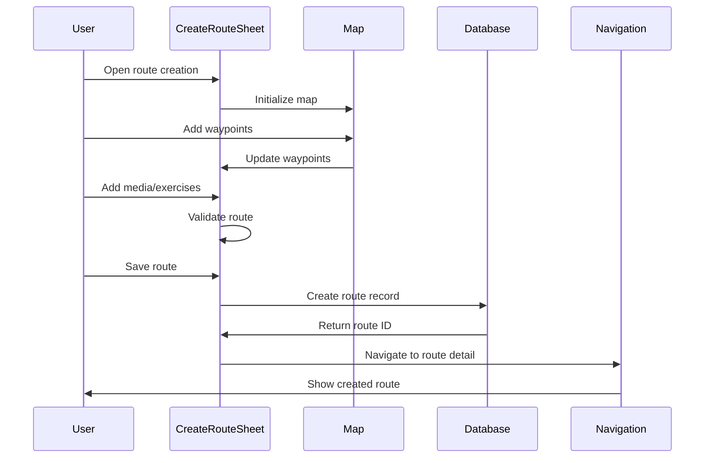
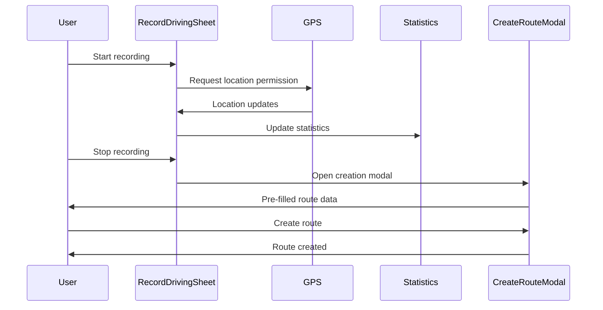
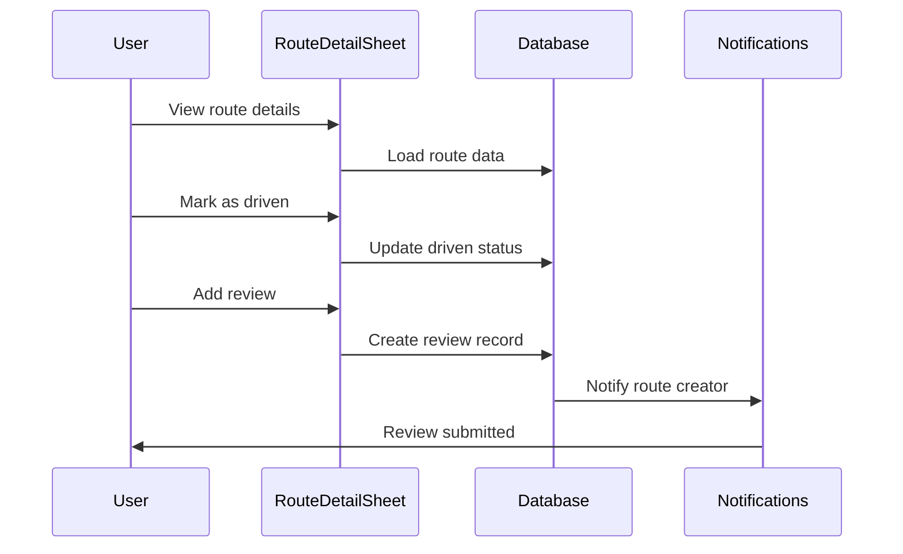
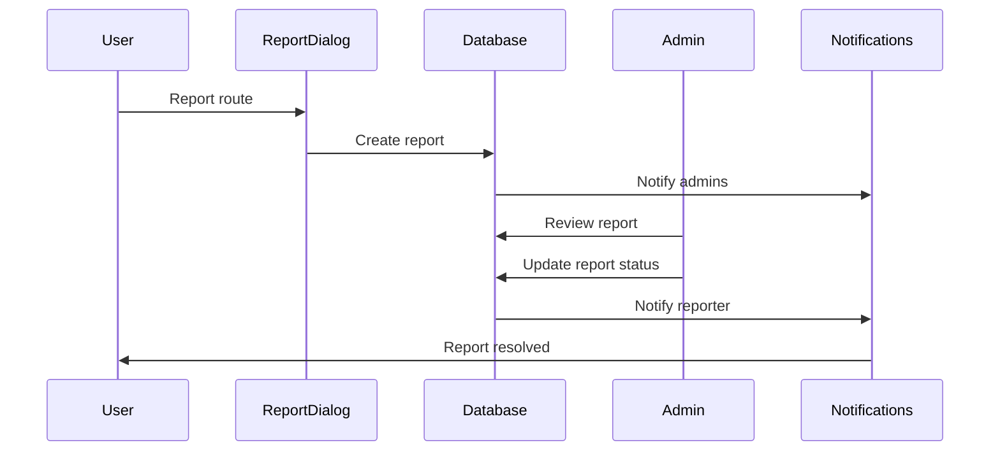

# VROMM Route System Documentation

## Table of Contents
1. [System Overview](#system-overview)
2. [Core Route Components](#core-route-components)
3. [Route Creation System](#route-creation-system)
4. [Route Display System](#route-display-system)
5. [Route Management System](#route-management-system)
6. [Route Recording System](#route-recording-system)
7. [Route Admin System](#route-admin-system)
8. [Route Reporting System](#route-reporting-system)
9. [Database Schema](#database-schema)
10. [API Integration](#api-integration)
11. [User Experience Flows](#user-experience-flows)

## System Overview

The VROMM Route System is a comprehensive platform for creating, managing, and sharing driving routes. It includes multiple interfaces across different platforms (mobile app, admin dashboard, web routes) with full CRUD operations, GPS recording, and social features.

### 🎯 **Core Capabilities**
- **Route Creation** - Interactive route planning with waypoints
- **GPS Recording** - Real-time route recording with statistics
- **Route Sharing** - Social features with reviews and comments
- **Route Management** - Admin tools for content moderation
- **Route Analytics** - Performance tracking and statistics
- **Route Collections** - Organizing routes into preset collections

## Core Route Components

### 1. **RouteCard.tsx** (Mobile App)
```typescript
interface RouteCardProps {
  route: Route;
  onPress?: () => void;
}
```

**Features:**
- ✅ **Interactive Display** - Animated route cards with press effects
- ✅ **Media Carousel** - Maps, images, and videos in carousel format
- ✅ **Route Information** - Difficulty, type, creator, ratings
- ✅ **Recording Stats** - GPS tracking data for recorded routes
- ✅ **Navigation Integration** - Tap to open route details
- ✅ **Analytics Tracking** - User interaction monitoring

**Key Functionality:**
```typescript
// Animated press handling with spring effects
const handlePress = () => {
  scale.value = withSequence(
    withSpring(0.95, { damping: 15, stiffness: 300 }),
    withSpring(1.05, { damping: 15, stiffness: 300 }),
    withSpring(1, { damping: 15, stiffness: 300 })
  );
  
  // Navigate to route detail
  navigation.navigate('MainTabs', {
    screen: 'MapTab',
    params: { screen: 'RouteDetail', params: { routeId: route.id } }
  });
};
```

### 2. **RouteDetailSheet.tsx** (Mobile App)
```typescript
interface RouteDetailSheetProps {
  visible: boolean;
  onClose: () => void;
  routeId: string | null;
  onStartRoute?: (routeId: string) => void;
  onNavigateToProfile?: (userId: string) => void;
  onReopen?: () => void;
  nearbyRoutes?: Array<{ id: string; name: string; waypoint_details?: any[] }>;
  onRouteChange?: (routeId: string) => void;
}
```

**Features:**
- ✅ **Gesture Handling** - Drag-to-dismiss with snap points
- ✅ **Swipe Navigation** - Tinder-like swipe between routes
- ✅ **Media Carousel** - Maps, images, videos with pagination
- ✅ **Route Actions** - Save, mark as driven, add to collection
- ✅ **Exercise Integration** - Route-specific exercises and quizzes
- ✅ **Review System** - User reviews and ratings
- ✅ **Comments System** - Social interaction features
- ✅ **Admin Controls** - Moderation tools for admins

**Key Functionality:**
```typescript
// Gesture handling for drag-to-dismiss and snap points
const panGesture = Gesture.Pan()
  .onUpdate((event) => {
    const newPosition = currentState.value + event.translationY;
    translateY.value = newPosition;
  })
  .onEnd((event) => {
    // Determine target snap point based on position and velocity
    let targetSnapPoint;
    if (event.velocityY < -500) {
      targetSnapPoint = snapPoints.large;
    } else if (event.velocityY > 500) {
      targetSnapPoint = snapPoints.mini;
    } else {
      // Find closest snap point
      targetSnapPoint = findClosestSnapPoint(currentPosition);
    }
    
    translateY.value = withSpring(targetSnapPoint);
  });

// Horizontal swipe for route navigation
const swipeGesture = Gesture.Pan()
  .onUpdate((event) => {
    if (Math.abs(event.translationX) > Math.abs(event.translationY) * 2) {
      swipeTranslateX.value = event.translationX;
      swipeRotate.value = event.translationX / width * 0.3;
    }
  })
  .onEnd((event) => {
    if (Math.abs(event.translationX) > 50 || Math.abs(event.velocityX) > 500) {
      // Animate card off screen and switch to next/previous route
      handleRouteChange(event.translationX > 0 ? 'previous' : 'next');
    }
  });
```

### 3. **RouteDetailScreen.tsx** (Mobile App)
```typescript
type RouteDetailProps = {
  route: {
    params: {
      routeId: string;
    };
  };
};
```

**Features:**
- ✅ **Full Route Display** - Complete route information
- ✅ **Media Gallery** - Images, videos, and maps
- ✅ **Route Statistics** - Distance, duration, difficulty
- ✅ **User Interactions** - Save, mark as driven, share
- ✅ **Exercise System** - Route-specific learning exercises
- ✅ **Review System** - User reviews and ratings
- ✅ **Comments System** - Social interaction features
- ✅ **Admin Controls** - Moderation and management tools

## Route Creation System

### 1. **CreateRouteSheet.tsx** (Mobile App)
```typescript
interface CreateRouteSheetProps {
  visible: boolean;
  onClose: () => void;
  routeId?: string | null;
  onRouteCreated?: (routeId: string) => void;
  onRouteUpdated?: (routeId: string) => void;
  onNavigateToMap?: (routeId: string) => void;
  initialWaypoints?: Waypoint[];
  initialName?: string;
  initialDescription?: string;
  initialSearchCoordinates?: string;
  initialRoutePath?: Array<{ latitude: number; longitude: number }>;
  initialStartPoint?: { latitude: number; longitude: number };
  initialEndPoint?: { latitude: number; longitude: number };
  isModal?: boolean;
}
```

**Features:**
- ✅ **Interactive Map** - Touch-based waypoint placement
- ✅ **Multiple Drawing Modes** - Pin, waypoint, pen drawing
- ✅ **Media Upload** - Images, videos, YouTube links
- ✅ **Exercise Creation** - Route-specific learning exercises
- ✅ **Collection Integration** - Add to existing collections
- ✅ **Draft Saving** - Auto-save and resume functionality
- ✅ **Validation System** - Route validation and error handling

**Key Functionality:**
```typescript
// Map interaction handling
const handleMapPress = (e: MapPressEvent) => {
  const { latitude, longitude } = e.nativeEvent.coordinate;
  
  if (drawingMode === 'pin') {
    handlePinMode(latitude, longitude);
  } else if (drawingMode === 'waypoint') {
    handleWaypointMode(latitude, longitude);
  } else if (drawingMode === 'pen') {
    handlePenMode(latitude, longitude);
  }
};

// Continuous drawing for pen mode
const startContinuousDrawing = (latitude: number, longitude: number) => {
  setDrawingMode('pen');
  setPenCoordinates([{ latitude, longitude }]);
  setIsDrawing(true);
};

const addContinuousDrawingPoint = (latitude: number, longitude: number) => {
  if (isDrawing) {
    setPenCoordinates(prev => [...prev, { latitude, longitude }]);
  }
};
```

### 2. **CreateRouteScreen.tsx** (Mobile App)
```typescript
type Props = {
  route?: {
    params?: {
      routeId?: string;
      initialWaypoints?: Waypoint[];
      initialName?: string;
      initialDescription?: string;
      initialSearchCoordinates?: string;
      initialRoutePath?: Array<{ latitude: number; longitude: number }>;
      initialStartPoint?: { latitude: number; longitude: number };
      initialEndPoint?: { latitude: number; longitude: number };
      onClose?: () => void;
      onRouteCreated?: (routeId: string) => void;
    };
  };
  isModal?: boolean;
  hideHeader?: boolean;
};
```

**Features:**
- ✅ **Full-Screen Creation** - Complete route creation interface
- ✅ **Advanced Features** - All creation features from sheet
- ✅ **Navigation Integration** - Seamless navigation flow
- ✅ **State Management** - Persistent creation state
- ✅ **Error Handling** - Comprehensive validation

### 3. **CreateRouteModal.tsx** (Mobile App)
```typescript
interface CreateRouteModalProps {
  routeData: RecordedRouteData;
  onRouteCreated?: (routeId: string) => void;
}
```

**Features:**
- ✅ **Recorded Route Creation** - Convert GPS recordings to routes
- ✅ **Data Pre-population** - Auto-fill from recording data
- ✅ **Quick Creation** - Streamlined creation process
- ✅ **Error Handling** - Validation and error management

### 4. **CreateRouteDialog.tsx** (Admin Dashboard)
```typescript
interface CreateRouteDialogProps {
  open: boolean;
  onOpenChange: (open: boolean) => void;
  onRouteCreated?: () => void;
}
```

**Features:**
- ✅ **Admin Route Creation** - Administrative route creation
- ✅ **Waypoint Management** - Add, remove, reorder waypoints
- ✅ **Route Validation** - Server-side validation
- ✅ **Bulk Operations** - Mass route creation

## Route Recording System

### 1. **RecordDrivingSheet.tsx** (Mobile App)
```typescript
interface RecordDrivingSheetProps {
  isVisible: boolean;
  onClose: () => void;
  onCreateRoute?: (routeData: RecordedRouteData) => void;
}
```

**Features:**
- ✅ **GPS Tracking** - Real-time location recording
- ✅ **Performance Metrics** - Speed, distance, duration tracking
- ✅ **Background Recording** - Continuous recording when app is backgrounded
- ✅ **Route Statistics** - Live statistics display
- ✅ **Route Export** - Convert recordings to routes

**Key Functionality:**
```typescript
// GPS tracking implementation
const startRecording = async () => {
  try {
    const { status } = await Location.requestForegroundPermissionsAsync();
    if (status !== 'granted') {
      throw new Error('Location permission denied');
    }
    
    const subscription = await Location.watchPositionAsync(
      {
        accuracy: Location.Accuracy.High,
        timeInterval: 1000,
        distanceInterval: 1,
      },
      (location) => {
        const newWaypoint = {
          latitude: location.coords.latitude,
          longitude: location.coords.longitude,
          timestamp: Date.now(),
          speed: location.coords.speed,
          accuracy: location.coords.accuracy,
        };
        
        setRecordedWaypoints(prev => [...prev, newWaypoint]);
        updateStatistics(newWaypoint);
      }
    );
    
    setRecordingSubscription(subscription);
    setIsRecording(true);
  } catch (error) {
    console.error('Error starting recording:', error);
  }
};
```

### 2. **ActionSheet.tsx** (Mobile App)
```typescript
interface ActionSheetProps {
  isVisible: boolean;
  onClose: () => void;
  onCreateRoute: (routeData?: RecordedRouteData) => void;
  onMaximizeWizard?: (routeData: any) => void;
  onCreateEvent?: () => void;
  onNavigateToMap?: (routeId: string) => void;
}
```

**Features:**
- ✅ **Quick Actions** - Route creation shortcuts
- ✅ **Recording Integration** - Start GPS recording
- ✅ **Event Creation** - Create driving events
- ✅ **Navigation** - Quick navigation to map

## Route Display System

### 1. **RouteGrid.tsx** (Web Routes)
```typescript
const RouteGrid = () => {
  const [routes, setRoutes] = useState<RouteData[]>([]);
  const [selectedRoute, setSelectedRoute] = useState<RouteData | null>(null);
  const [filters, setFilters] = useState<RouteFilters>({});
  const [searchQuery, setSearchQuery] = useState('');
  const [location, setLocation] = useState<LocationData | null>(null);
  const [profileToShow, setProfileToShow] = useState<string | null>(null);
}
```

**Features:**
- ✅ **Grid Layout** - Responsive route grid display
- ✅ **Search & Filter** - Advanced filtering options
- ✅ **Location-Based** - Distance-based sorting
- ✅ **Profile Integration** - User profile display
- ✅ **Route Selection** - Interactive route selection

### 2. **RouteList.tsx** (Web Routes)
```typescript
const RouteList = () => {
  const [routes, setRoutes] = useState<RouteData[]>([]);
  const [selectedRoute, setSelectedRoute] = useState<RouteData | null>(null);
  const [filters, setFilters] = useState<RouteFilters>({});
  const [searchQuery, setSearchQuery] = useState('');
}
```

**Features:**
- ✅ **List Layout** - Compact route list display
- ✅ **Search Integration** - Text-based route search
- ✅ **Filtering** - Category and difficulty filtering
- ✅ **Route Selection** - Click to view route details

### 3. **RoutesBottomSheet.tsx** (Web Routes)
```typescript
type SnapMode = 'minimized' | 'collapsed' | 'half' | 'full';

const RoutesBottomSheet: React.FC = () => {
  const [snapMode, setSnapMode] = useState<SnapMode>('collapsed');
  const [routes, setRoutes] = useState<RouteData[]>([]);
  const [selectedRoute, setSelectedRoute] = useState<RouteData | null>(null);
  const [isDragging, setIsDragging] = useState(false);
  const [dragStartY, setDragStartY] = useState(0);
  const [dragStartHeight, setDragStartHeight] = useState(0);
}
```

**Features:**
- ✅ **Snap Points** - Multiple height states
- ✅ **Drag Handling** - Touch and mouse drag support
- ✅ **Route Display** - Integrated route list
- ✅ **Responsive Design** - Mobile-optimized interface

### 4. **RouteBuilderUI.tsx** (Web Routes)
```typescript
export default function RouteBuilderUI() {
  const [waypoints, setWaypoints] = useState<Waypoint[]>([]);
  const [isRecording, setIsRecording] = useState(false);
  const [recordedWaypoints, setRecordedWaypoints] = useState<Waypoint[]>([]);
  const [snapToRoads, setSnapToRoads] = useState(false);
  const [routeData, setRouteData] = useState<RouteData | null>(null);
  const [media, setMedia] = useState<MediaItem[]>([]);
  const [exercises, setExercises] = useState<RouteExercise[]>([]);
}
```

**Features:**
- ✅ **Interactive Map** - Full-featured map interface
- ✅ **Waypoint Management** - Add, remove, reorder waypoints
- ✅ **GPS Recording** - Real-time route recording
- ✅ **Snap to Roads** - Automatic road alignment
- ✅ **Media Upload** - Images and videos
- ✅ **Exercise Creation** - Route-specific exercises
- ✅ **AI Integration** - AI-powered route suggestions

**Key Functionality:**
```typescript
// GPS recording with snap to roads
const startRecording = () => {
  setIsRecording(true);
  setRecordedWaypoints([]);
  
  // Start GPS tracking
  navigator.geolocation.watchPosition(
    (position) => {
      const newWaypoint = {
        lat: position.coords.latitude,
        lng: position.coords.longitude,
        timestamp: Date.now(),
        speed: position.coords.speed,
        accuracy: position.coords.accuracy,
      };
      
      if (snapToRoads) {
        snapWaypointToRoad(newWaypoint);
      } else {
        addRecordedWaypoint(newWaypoint);
      }
    },
    (error) => console.error('GPS error:', error),
    { enableHighAccuracy: true, timeout: 10000, maximumAge: 1000 }
  );
};

// Snap waypoints to roads using Mapbox
const snapWaypointToRoad = async (waypoint: Waypoint) => {
  try {
    const response = await fetch(
      `https://api.mapbox.com/matching/v5/mapbox/driving/${waypoint.lng},${waypoint.lat}?access_token=${mapboxToken}`
    );
    const data = await response.json();
    
    if (data.matchings && data.matchings[0]) {
      const snappedWaypoint = {
        ...waypoint,
        lat: data.matchings[0].geometry.coordinates[0][1],
        lng: data.matchings[0].geometry.coordinates[0][0],
      };
      addRecordedWaypoint(snappedWaypoint);
    }
  } catch (error) {
    console.error('Snap to roads error:', error);
    addRecordedWaypoint(waypoint);
  }
};
```

## Route Management System

### 1. **RoutesList.tsx** (Admin Dashboard)
```typescript
export const RoutesList = () => {
  const [routes, setRoutes] = useState<Route[]>([]);
  const [selectedRoutes, setSelectedRoutes] = useState<Set<string>>(new Set());
  const [creatorNames, setCreatorNames] = useState<Record<string, string>>({});
  const [routeStats, setRouteStats] = useState<Record<string, RouteStats>>({});
  const [loading, setLoading] = useState(true);
  const [error, setError] = useState<string | null>(null);
}
```

**Features:**
- ✅ **Route Management** - Full CRUD operations
- ✅ **Bulk Operations** - Mass selection and actions
- ✅ **Statistics Display** - Route performance metrics
- ✅ **Creator Information** - User profile integration
- ✅ **Media Management** - Route media handling
- ✅ **Search & Filter** - Advanced filtering options

### 2. **RouteDetailsDialog.tsx** (Admin Dashboard)
```typescript
interface RouteDetailsDialogProps {
  route: Route | null;
  open: boolean;
  onOpenChange: (open: boolean) => void;
  creatorName?: string;
  onEditClick?: () => void;
}
```

**Features:**
- ✅ **Detailed View** - Complete route information
- ✅ **Media Gallery** - Route images and videos
- ✅ **Statistics** - Performance metrics
- ✅ **Reviews** - User reviews and ratings
- ✅ **Edit Integration** - Direct editing access

### 3. **Routes.tsx** (Admin Dashboard)
```typescript
export const Routes = () => {
  const [routes, setRoutes] = useState<Route[]>([]);
  const [selectedRoutes, setSelectedRoutes] = useState<Set<string>>(new Set());
  const [loading, setLoading] = useState(true);
  const [error, setError] = useState<string | null>(null);
  const [showCreateDialog, setShowCreateDialog] = useState(false);
  const [showEditDialog, setShowEditDialog] = useState(false);
  const [editingRoute, setEditingRoute] = useState<Route | null>(null);
}
```

**Features:**
- ✅ **Route Administration** - Complete route management
- ✅ **Bulk Operations** - Mass actions on routes
- ✅ **AI Integration** - AI-powered route generation
- ✅ **Statistics Dashboard** - Route performance analytics
- ✅ **Content Moderation** - Review and approve routes

## Route Reporting System

### 1. **ReportDialog.tsx** (Mobile App)
```typescript
interface ReportDialogProps {
  reportableId: string;
  reportableType: 'route' | 'event' | 'learning_path' | 'exercise' | 'conversation' | 'comment' | 'route_comment' | 'event_comment' | 'exercise_comment' | 'learning_path_comment' | 'review' | 'user';
  onClose: () => void;
}
```

**Features:**
- ✅ **Report Types** - Spam, privacy, incorrect info, impersonation
- ✅ **Context Capture** - Automatic context collection
- ✅ **User Feedback** - Detailed reporting options
- ✅ **Moderation Integration** - Direct admin notification

### 2. **ReportDetailsDialog.tsx** (Admin Dashboard)
```typescript
interface ReportDetailsDialogProps {
  report: Report | null;
  open: boolean;
  onOpenChange: (open: boolean) => void;
  onStatusChange?: (reportId: string, newStatus: 'resolved' | 'dismissed') => void;
  onDelete?: (reportId: string) => void;
}
```

**Features:**
- ✅ **Report Review** - Detailed report information
- ✅ **Status Management** - Resolve, dismiss, or delete reports
- ✅ **Context Display** - Full report context
- ✅ **Action History** - Track moderation actions

### 3. **Reports.tsx** (Admin Dashboard)
```typescript
export const Reports = () => {
  const [reports, setReports] = useState<Report[]>([]);
  const [selectedReports, setSelectedReports] = useState<Set<string>>(new Set());
  const [loading, setLoading] = useState(true);
  const [error, setError] = useState<string | null>(null);
  const [filters, setFilters] = useState<ReportFilters>({});
}
```

**Features:**
- ✅ **Report Management** - Complete report administration
- ✅ **Bulk Operations** - Mass report actions
- ✅ **Filtering** - Advanced report filtering
- ✅ **Status Tracking** - Report status management
- ✅ **Moderation Tools** - Content moderation features

## Database Schema

### Core Route Tables
```sql
-- Routes table
CREATE TABLE routes (
  id UUID PRIMARY KEY DEFAULT gen_random_uuid(),
  name TEXT NOT NULL,
  description TEXT,
  creator_id UUID REFERENCES profiles(id) NOT NULL,
  difficulty difficulty_level NOT NULL,
  spot_type spot_type NOT NULL,
  category spot_category,
  visibility spot_visibility DEFAULT 'public',
  is_public BOOLEAN DEFAULT true,
  is_verified BOOLEAN DEFAULT false,
  waypoint_details JSONB DEFAULT '[]',
  media_attachments JSONB DEFAULT '[]',
  suggested_exercises JSONB DEFAULT '[]',
  metadata JSONB DEFAULT '{}',
  created_at TIMESTAMP WITH TIME ZONE DEFAULT NOW(),
  updated_at TIMESTAMP WITH TIME ZONE DEFAULT NOW()
);

-- Route reviews
CREATE TABLE route_reviews (
  id UUID PRIMARY KEY DEFAULT gen_random_uuid(),
  route_id UUID REFERENCES routes(id) NOT NULL,
  user_id UUID REFERENCES profiles(id) NOT NULL,
  rating INTEGER CHECK (rating >= 1 AND rating <= 5) NOT NULL,
  content TEXT,
  difficulty difficulty_level,
  visited_at TIMESTAMP WITH TIME ZONE,
  images JSONB DEFAULT '[]',
  created_at TIMESTAMP WITH TIME ZONE DEFAULT NOW(),
  updated_at TIMESTAMP WITH TIME ZONE DEFAULT NOW()
);

-- Saved routes
CREATE TABLE saved_routes (
  id UUID PRIMARY KEY DEFAULT gen_random_uuid(),
  route_id UUID REFERENCES routes(id) NOT NULL,
  user_id UUID REFERENCES profiles(id) NOT NULL,
  saved_at TIMESTAMP WITH TIME ZONE DEFAULT NOW(),
  UNIQUE(route_id, user_id)
);

-- Driven routes
CREATE TABLE driven_routes (
  id UUID PRIMARY KEY DEFAULT gen_random_uuid(),
  route_id UUID REFERENCES routes(id) NOT NULL,
  user_id UUID REFERENCES profiles(id) NOT NULL,
  driven_at TIMESTAMP WITH TIME ZONE DEFAULT NOW(),
  UNIQUE(route_id, user_id)
);

-- Route reports
CREATE TABLE reports (
  id UUID PRIMARY KEY DEFAULT gen_random_uuid(),
  reporter_id UUID REFERENCES profiles(id) NOT NULL,
  reportable_id UUID NOT NULL,
  reportable_type TEXT NOT NULL,
  report_type report_type NOT NULL,
  content TEXT,
  context JSONB DEFAULT '{}',
  status TEXT CHECK (status IN ('pending', 'resolved', 'dismissed')) DEFAULT 'pending',
  created_at TIMESTAMP WITH TIME ZONE DEFAULT NOW(),
  updated_at TIMESTAMP WITH TIME ZONE DEFAULT NOW()
);
```

## API Integration

### Route Management APIs
```typescript
// Route CRUD operations
export const routeAPI = {
  // Get routes with filters
  getRoutes: async (filters: RouteFilters) => {
    const { data, error } = await supabase
      .from('routes')
      .select(`
        *,
        creator:profiles!creator_id (id, full_name, avatar_url),
        reviews:route_reviews (id, rating, content, user:profiles!user_id (full_name)),
        saved_routes (id, user_id),
        driven_routes (id, user_id)
      `)
      .eq('is_public', true)
      .order('created_at', { ascending: false });
    
    if (error) throw error;
    return data;
  },
  
  // Create new route
  createRoute: async (routeData: CreateRouteData) => {
    const { data, error } = await supabase
      .from('routes')
      .insert(routeData)
      .select()
      .single();
    
    if (error) throw error;
    return data;
  },
  
  // Update route
  updateRoute: async (routeId: string, updates: Partial<RouteData>) => {
    const { data, error } = await supabase
      .from('routes')
      .update(updates)
      .eq('id', routeId)
      .select()
      .single();
    
    if (error) throw error;
    return data;
  },
  
  // Delete route
  deleteRoute: async (routeId: string) => {
    const { error } = await supabase
      .from('routes')
      .delete()
      .eq('id', routeId);
    
    if (error) throw error;
  }
};

// Route interaction APIs
export const routeInteractionAPI = {
  // Save route
  saveRoute: async (routeId: string, userId: string) => {
    const { error } = await supabase
      .from('saved_routes')
      .insert({ route_id: routeId, user_id: userId });
    
    if (error) throw error;
  },
  
  // Mark as driven
  markAsDriven: async (routeId: string, userId: string) => {
    const { error } = await supabase
      .from('driven_routes')
      .insert({ route_id: routeId, user_id: userId });
    
    if (error) throw error;
  },
  
  // Add review
  addReview: async (reviewData: RouteReviewData) => {
    const { data, error } = await supabase
      .from('route_reviews')
      .insert(reviewData)
      .select()
      .single();
    
    if (error) throw error;
    return data;
  }
};

// Report management APIs
export const reportAPI = {
  // Create report
  createReport: async (reportData: ReportData) => {
    const { data, error } = await supabase
      .from('reports')
      .insert(reportData)
      .select()
      .single();
    
    if (error) throw error;
    return data;
  },
  
  // Get reports
  getReports: async (filters: ReportFilters) => {
    const { data, error } = await supabase
      .from('reports')
      .select(`
        *,
        reporter:profiles!reporter_id (id, full_name, email)
      `)
      .order('created_at', { ascending: false });
    
    if (error) throw error;
    return data;
  },
  
  // Update report status
  updateReportStatus: async (reportId: string, status: 'resolved' | 'dismissed') => {
    const { error } = await supabase
      .from('reports')
      .update({ status })
      .eq('id', reportId);
    
    if (error) throw error;
  }
};
```

## User Experience Flows

### 1. **Route Creation Flow**


### 2. **Route Recording Flow**


### 3. **Route Review Flow**


### 4. **Report Flow**


## Key Features Summary

### ✅ **Implemented Features**
- **Route Creation** - Interactive route planning with multiple drawing modes
- **GPS Recording** - Real-time route recording with statistics
- **Route Display** - Rich media carousels with maps, images, and videos
- **Social Features** - Reviews, comments, and user interactions
- **Admin Management** - Complete route administration tools
- **Reporting System** - Content moderation and user reporting
- **Collection Integration** - Route organization and sharing
- **Exercise System** - Route-specific learning exercises
- **Analytics** - User interaction and performance tracking

### 🎯 **Technical Highlights**
- **Gesture Handling** - Advanced touch interactions with snap points
- **Animation System** - Smooth transitions and micro-interactions
- **Media Management** - Comprehensive media upload and display
- **GPS Integration** - Real-time location tracking and recording
- **Database Design** - Optimized schema for performance and scalability
- **API Architecture** - RESTful APIs with real-time updates
- **Cross-Platform** - Mobile app, web routes, and admin dashboard
- **Performance** - Optimized for mobile devices and slow networks

---

*This documentation covers the complete VROMM Route System including all components, features, and technical implementation details. Last updated: January 2025*
