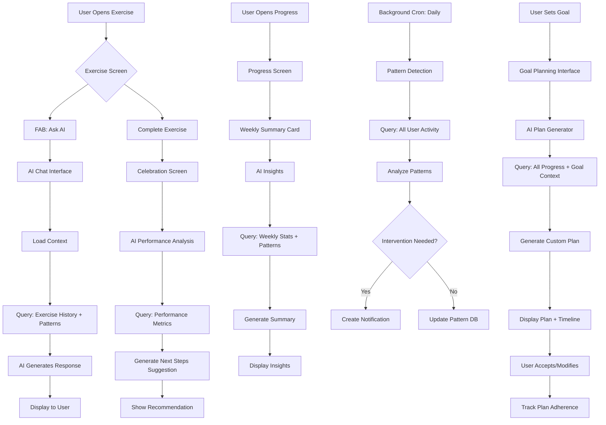

# AI Learning Path Integration - Design Document

**Version:** 1.0  
**Date:** February 14, 2026  
**Status:** Design & Specification  
**Branch:** feature/ai-driving-assistant

---

## Executive Summary

This document outlines the design for integrating context-aware AI assistance into Vromm's learning paths and exercises. The AI will act as an intelligent driving instructor that knows exactly where each student is in their learning journey and provides personalized, contextual guidance.

**Core Principle:** AI knows WHERE the user is in their learning journey and provides assistance WITHIN that context.

---

## 1. Vision & Goals

### 1.1 Primary Goals
- **Contextual Assistance**: AI understands the student's current exercise, progress, and history
- **Personalized Guidance**: Recommendations based on individual performance patterns
- **Learning Acceleration**: Help students overcome specific obstacles faster
- **Confidence Building**: Provide encouragement and identify when students are ready to advance
- **Theory-Practice Bridge**: Explain Swedish driving rules in context of practical exercises

### 1.2 Non-Goals (Phase 1)
- Real-time driving feedback during actual driving
- Replacing human instructors
- Automated test scheduling
- Vehicle-to-AI communication

---

## 2. Integration Points

### 2.1 During Exercise - "Ask AI" Button

**Trigger**: Student is viewing/practicing an exercise

**UI Location**: 
- Floating action button (FAB) in bottom-right corner
- Badge indicator when AI has proactive suggestions
- Modal/sheet interface for conversation

**AI Context Access**:
```typescript
{
  current_exercise: {
    id: string,
    title: LocalizedText,
    description: LocalizedText,
    type: 'practice' | 'quiz' | 'route',
    difficulty_level: string,
    tags: string[]
  },
  user_history: {
    past_attempts: number,
    last_completion_date: Date | null,
    completion_rate: number,
    average_time_spent: number,
    quiz_scores: number[]
  },
  common_mistakes: {
    mistake_pattern: string,
    frequency: number,
    last_occurrence: Date
  }[],
  learning_path_context: {
    path_title: string,
    current_position: number,
    total_exercises: number,
    progress_percentage: number
  },
  related_exercises: {
    id: string,
    title: string,
    completion_status: boolean
  }[]
}
```

**Example Interaction**:
```
Student: "I don't understand when to signal in roundabouts"

AI Response:
"In Swedish roundabouts, you signal RIGHT when exiting. 

I noticed from your past 3 attempts on this exercise that 
you often miss the signal on exit 2 (Lund Central). 

Here's a tip: As you pass the exit BEFORE yours, that's 
when you signal right.

Try the 'Lund Central Roundabout' route again, focusing 
specifically on signaling at the right moment. You've got 
the entry speed down perfectly - this is just timing!"
```

### 2.2 After Completing Exercise - Performance Analysis

**Trigger**: Exercise marked as complete

**UI Location**: 
- Celebration screen overlay
- "Next Steps" section with AI recommendation badge

**AI Context Access**:
```typescript
{
  just_completed: {
    exercise_id: string,
    completion_time: number,
    quiz_score?: number,
    attempt_number: number
  },
  performance_metrics: {
    improvement_from_last: number,
    speed_compared_to_average: number,
    accuracy_rate: number
  },
  readiness_signals: {
    consecutive_completions: number,
    score_trend: 'improving' | 'stable' | 'declining',
    time_since_last_practice: number
  },
  next_exercise_candidates: {
    id: string,
    title: string,
    relevance_score: number,
    reason: string
  }[]
}
```

**Example Interaction**:
```
AI: "Great job on parking! 🎉

I noticed you completed this 3 times in a row with improving 
times (2:45 → 2:20 → 2:10). Your spatial awareness has really 
developed!

You're ready for the next challenge:
→ Parallel Parking (Exercise #12)

This builds on the skills you just mastered. Based on your 
progress, you should find it manageable but challenging. 
Want to try it now?"

[Try Parallel Parking] [Continue Learning Path]
```

### 2.3 Learning Path Recommendations - Goal-Oriented Planning

**Trigger**: 
- Student asks about timeline/goals
- Weekly progress review
- Stuck on same exercise >3 attempts

**UI Location**:
- Progress screen with "Get AI Plan" button
- Weekly notification with AI insights

**AI Context Access**:
```typescript
{
  all_learning_paths: {
    id: string,
    title: string,
    progress_percentage: number,
    exercises_completed: number,
    exercises_total: number,
    last_activity: Date
  }[],
  skill_assessment: {
    category: string,
    proficiency: number, // 0-100
    practice_hours: number,
    weak_areas: string[]
  }[],
  goal_context: {
    test_date?: Date,
    practice_hours_per_week: number,
    preferred_practice_times: string[]
  },
  blockers: {
    stuck_on: string,
    attempts: number,
    common_error: string
  }[]
}
```

**Example Interaction**:
```
Student: "I want to pass my test in 2 weeks"

AI: "Let's create a focused 2-week plan for you! 📅

Current Status:
✓ City Driving: 60% complete (strong foundation)
⚠️ Highway Merging: 0% (critical gap)
✓ Parking: 85% (almost there)

Priority Plan:
Week 1 (8 hours):
- Mon/Wed/Fri: Highway Merging basics (1h each)
  → Start with Exercise #23: Speed Adjustment
  → Build to Exercise #25: Lane Changes
- Tue/Thu: City Driving completion (1h each)
  → Focus on busy intersections

Week 2 (8 hours):
- Mon-Thu: Full route practice (1.5h each)
  → Combine city + highway skills
- Fri/Sat: Test simulation routes (2h each)

Your biggest challenge: Highway merging confidence
Your strength: Parking (you've got this!)

Start with 'Highway Basics' path tomorrow?
[Yes, Let's Go] [Adjust Plan]
```

### 2.4 Theory Questions - Inline Q&A

**Trigger**: 
- Student clicks "?" icon on rule-based content
- AI detects confusion pattern
- Proactive explanation offer

**UI Location**:
- Inline expansion in exercise description
- Tooltip-style popup with detail expansion
- Theory tab in exercise view

**AI Context Access**:
```typescript
{
  current_rule: {
    category: 'traffic_law' | 'safety' | 'etiquette',
    rule_id: string,
    swedish_law_reference: string
  },
  student_context: {
    exercise_title: string,
    previous_mistakes_on_this_rule: number,
    related_completed_exercises: string[]
  },
  locale: 'en' | 'sv'
}
```

**Example Interaction**:
```
[Student viewing "Stop Sign Exercise"]

AI (Proactive): "💡 Quick tip about STOPP signs in Sweden"

Student: [clicks to expand]

AI: "In Sweden, 'STOPP' means a COMPLETE stop - your wheels 
must stop moving. This is different from some countries where 
'rolling stops' are common.

Key points for this exercise:
1. Stop behind the white line
2. Look left → right → left
3. Only proceed when clearly safe

In your last attempt, you slowed down but didn't fully stop 
at Stop Sign #2. That's the most common mistake here. 
Try counting '1-Mississippi' to ensure a full stop."
```

### 2.5 Progress Insights - Weekly AI Summary

**Trigger**: 
- Every Monday morning (scheduled)
- User opens Progress screen after 7+ days activity
- User requests insight ("How am I doing?")

**UI Location**:
- Notification → Opens insights screen
- Progress screen header card
- "AI Insights" tab

**AI Context Access**:
```typescript
{
  week_summary: {
    exercises_completed: number,
    total_practice_time: number,
    paths_active: number,
    streak_days: number
  },
  performance_changes: {
    category: string,
    improvement_percentage: number,
    trend: 'up' | 'down' | 'stable'
  }[],
  notable_achievements: {
    type: 'streak' | 'mastery' | 'speed' | 'accuracy',
    description: string,
    date: Date
  }[],
  areas_needing_attention: {
    skill: string,
    last_practiced: Date,
    suggestion: string
  }[]
}
```

**Example Output**:
```
🎯 Your Week in Review (Feb 7-14)

Highlights:
✨ You improved 20% on roundabouts!
🔥 7-day practice streak - impressive!
📈 City driving: 45% → 60% complete

Patterns I Noticed:
• You're strongest in the mornings (8-10 AM)
• Parallel parking attempts went from 4 tries → 2 tries
• You tend to skip highway exercises (only 1 this week)

Recommendation:
Try one highway exercise this week. Based on your city 
driving skills, you're ready for "Highway Entry Basics" 
(Exercise #22). It's shorter (15 min) and builds on 
skills you already have.

Areas to Maintain:
⚠️ It's been 9 days since you practiced night driving
   Try a quick refresher this week!

Keep up the great work! 🚗💨
```

### 2.6 Adaptive Learning - Pattern Detection

**Trigger**: 
- Background analysis (daily)
- After 3+ similar mistakes
- When performance plateau detected

**AI Context Access**:
```typescript
{
  mistake_clusters: {
    pattern_id: string,
    description: string,
    occurrences: number,
    affected_exercises: string[],
    first_seen: Date,
    last_seen: Date
  }[],
  plateau_indicators: {
    skill_area: string,
    stuck_duration_days: number,
    repeated_exercises: string[],
    score_variance: number
  },
  learning_style: {
    prefers_video: boolean,
    prefers_repetition: boolean,
    optimal_session_length: number,
    best_time_of_day: string
  }
}
```

**Example Proactive Message**:
```
AI Notification:
"I noticed a pattern 🔍

You've attempted 'City Intersection' 5 times in the 
past 3 days, always stopping at Exercise Step 4.

The issue seems to be timing your entry into busy 
traffic. 

Try this instead:
→ 'Traffic Gap Judgment' (Exercise #8)
  This shorter exercise focuses JUST on timing
  
Once you nail that, the intersection exercise will 
feel much easier.

Want to switch to the focused exercise?
[Yes, Switch] [Explain More] [Keep Trying]
```

---

## 3. Context Data Schema

### 3.1 Database Tables to Query

```sql
-- Core exercise data
learning_paths
learning_path_exercises
learning_path_exercise_completions
virtual_repeat_completions

-- User progress
user_exercises
user_exercise_ratings
route_exercise_sessions
route_exercise_completions

-- User context (to be created if needed)
daily_practice_logs (proposed)
ai_conversations (proposed)
learning_patterns (proposed)
```

### 3.2 AI Context Payload Structure

```typescript
interface AIConversationContext {
  // Session context
  session_id: string;
  timestamp: Date;
  locale: 'en' | 'sv';
  
  // User identity & profile
  user: {
    id: string;
    experience_level: 'beginner' | 'intermediate' | 'advanced';
    vehicle_type: 'manual' | 'automatic' | 'both';
    days_since_signup: number;
    total_practice_hours: number;
  };
  
  // Current activity context
  current_context: {
    screen: 'exercise' | 'progress' | 'learning_path' | 'celebration';
    exercise_id?: string;
    learning_path_id?: string;
    route_id?: string;
  };
  
  // Exercise-specific data
  exercise?: {
    id: string;
    title: LocalizedText;
    description: LocalizedText;
    type: string;
    difficulty_level: string;
    tags: string[];
    repeat_count: number;
    has_quiz: boolean;
  };
  
  // User's history with this exercise
  exercise_history?: {
    total_attempts: number;
    completions: number;
    last_attempt_date: Date | null;
    last_completion_date: Date | null;
    average_time_spent_seconds: number;
    quiz_scores: number[];
    completion_rate: number; // 0-1
  };
  
  // Learning path context
  learning_path?: {
    id: string;
    title: LocalizedText;
    total_exercises: number;
    completed_exercises: number;
    progress_percentage: number;
    current_exercise_index: number;
    path_type: string;
  };
  
  // Overall progress
  overall_progress: {
    total_exercises_completed: number;
    total_learning_paths: number;
    active_paths_count: number;
    total_practice_days: number;
    current_streak_days: number;
    longest_streak_days: number;
  };
  
  // Performance metrics
  performance: {
    category_proficiency: {
      category: string;
      completion_rate: number;
      average_score: number;
      exercises_completed: number;
      exercises_total: number;
    }[];
    recent_improvements: {
      skill: string;
      improvement_percentage: number;
      timeframe_days: number;
    }[];
    weak_areas: {
      skill: string;
      attempts: number;
      completion_rate: number;
      last_practiced: Date;
    }[];
  };
  
  // Pattern recognition data
  patterns?: {
    common_mistakes: {
      exercise_id: string;
      mistake_type: string;
      frequency: number;
      last_occurrence: Date;
    }[];
    practice_habits: {
      preferred_time_of_day: string;
      average_session_length_minutes: number;
      days_between_practice: number;
      completion_rate_by_time: Record<string, number>;
    };
    plateau_indicators: {
      stuck_on_exercise_id: string;
      days_stuck: number;
      attempts: number;
    }[];
  };
  
  // Conversation history
  conversation_history?: {
    id: string;
    user_message: string;
    ai_response: string;
    timestamp: Date;
    helpful_rating?: number; // 1-5
  }[];
}
```

### 3.3 Proposed New Tables

```sql
-- Track practice sessions for better pattern analysis
CREATE TABLE daily_practice_logs (
  id UUID DEFAULT gen_random_uuid() PRIMARY KEY,
  user_id UUID NOT NULL REFERENCES auth.users(id) ON DELETE CASCADE,
  practice_date DATE NOT NULL,
  
  -- Session metrics
  total_time_minutes INTEGER DEFAULT 0,
  exercises_attempted INTEGER DEFAULT 0,
  exercises_completed INTEGER DEFAULT 0,
  
  -- Performance
  average_completion_rate DECIMAL(5,2),
  quiz_average_score DECIMAL(5,2),
  
  -- Context
  time_of_day TEXT, -- 'morning' | 'afternoon' | 'evening' | 'night'
  device_type TEXT,
  
  -- Metadata
  created_at TIMESTAMPTZ DEFAULT NOW(),
  updated_at TIMESTAMPTZ DEFAULT NOW(),
  
  UNIQUE(user_id, practice_date)
);

-- Store AI conversation history
CREATE TABLE ai_conversations (
  id UUID DEFAULT gen_random_uuid() PRIMARY KEY,
  user_id UUID NOT NULL REFERENCES auth.users(id) ON DELETE CASCADE,
  
  -- Context
  conversation_type TEXT NOT NULL, -- 'exercise_help' | 'progress_review' | 'goal_planning' | 'theory_question'
  exercise_id UUID REFERENCES learning_path_exercises(id) ON DELETE SET NULL,
  learning_path_id UUID REFERENCES learning_paths(id) ON DELETE SET NULL,
  
  -- Content
  user_message TEXT NOT NULL,
  ai_response TEXT NOT NULL,
  context_data JSONB, -- Full context payload at time of query
  
  -- Feedback
  helpful_rating INTEGER CHECK (helpful_rating >= 1 AND helpful_rating <= 5),
  user_feedback TEXT,
  
  -- Metadata
  created_at TIMESTAMPTZ DEFAULT NOW(),
  
  -- Indexes
  INDEX idx_ai_conversations_user_exercise (user_id, exercise_id),
  INDEX idx_ai_conversations_type (conversation_type),
  INDEX idx_ai_conversations_created (created_at DESC)
);

-- Track detected learning patterns
CREATE TABLE learning_patterns (
  id UUID DEFAULT gen_random_uuid() PRIMARY KEY,
  user_id UUID NOT NULL REFERENCES auth.users(id) ON DELETE CASCADE,
  
  -- Pattern details
  pattern_type TEXT NOT NULL, -- 'common_mistake' | 'plateau' | 'strength' | 'weakness' | 'habit'
  pattern_category TEXT, -- 'roundabouts' | 'parking' | 'highway' | etc.
  description TEXT NOT NULL,
  
  -- Evidence
  first_detected TIMESTAMPTZ DEFAULT NOW(),
  last_detected TIMESTAMPTZ DEFAULT NOW(),
  occurrence_count INTEGER DEFAULT 1,
  confidence_score DECIMAL(5,2), -- 0-100
  
  -- Impact
  affected_exercises UUID[], -- Array of exercise IDs
  recommended_action TEXT,
  
  -- Status
  is_active BOOLEAN DEFAULT true,
  resolved_at TIMESTAMPTZ,
  
  -- Metadata
  created_at TIMESTAMPTZ DEFAULT NOW(),
  updated_at TIMESTAMPTZ DEFAULT NOW(),
  
  INDEX idx_learning_patterns_user_active (user_id, is_active),
  INDEX idx_learning_patterns_type (pattern_type)
);

-- Track AI-suggested interventions and their effectiveness
CREATE TABLE ai_interventions (
  id UUID DEFAULT gen_random_uuid() PRIMARY KEY,
  user_id UUID NOT NULL REFERENCES auth.users(id) ON DELETE CASCADE,
  pattern_id UUID REFERENCES learning_patterns(id) ON DELETE SET NULL,
  
  -- Intervention details
  intervention_type TEXT NOT NULL, -- 'exercise_switch' | 'practice_reminder' | 'strategy_suggestion'
  description TEXT NOT NULL,
  suggested_exercises UUID[], -- Recommended exercise IDs
  
  -- User response
  user_action TEXT, -- 'accepted' | 'rejected' | 'ignored'
  accepted_at TIMESTAMPTZ,
  
  -- Effectiveness tracking
  improved_performance BOOLEAN,
  impact_score DECIMAL(5,2), -- -100 to 100
  
  -- Metadata
  created_at TIMESTAMPTZ DEFAULT NOW(),
  evaluated_at TIMESTAMPTZ,
  
  INDEX idx_ai_interventions_user (user_id),
  INDEX idx_ai_interventions_type (intervention_type)
);
```

---

## 4. Database Queries

### 4.1 Core Context Queries

```sql
-- Get user's current exercise context
WITH exercise_attempts AS (
  SELECT 
    exercise_id,
    COUNT(*) as attempt_count,
    COUNT(CASE WHEN completed_at IS NOT NULL THEN 1 END) as completion_count,
    MAX(completed_at) as last_completion,
    AVG(EXTRACT(EPOCH FROM (completed_at - created_at))) as avg_time_seconds
  FROM learning_path_exercise_completions
  WHERE user_id = $user_id AND exercise_id = $exercise_id
  GROUP BY exercise_id
)
SELECT 
  e.id,
  e.title,
  e.description,
  e.repeat_count,
  e.order_index,
  lp.title as learning_path_title,
  lp.id as learning_path_id,
  ea.attempt_count,
  ea.completion_count,
  ea.last_completion,
  ea.avg_time_seconds,
  COALESCE(ea.completion_count::FLOAT / NULLIF(ea.attempt_count, 0), 0) as completion_rate
FROM learning_path_exercises e
JOIN learning_paths lp ON e.learning_path_id = lp.id
LEFT JOIN exercise_attempts ea ON ea.exercise_id = e.id
WHERE e.id = $exercise_id;

-- Get user's overall progress summary
WITH path_progress AS (
  SELECT 
    lp.id as path_id,
    lp.title as path_title,
    COUNT(DISTINCT lpe.id) as total_exercises,
    COUNT(DISTINCT lpec.exercise_id) as completed_exercises,
    MAX(lpec.completed_at) as last_activity
  FROM learning_paths lp
  JOIN learning_path_exercises lpe ON lpe.learning_path_id = lp.id
  LEFT JOIN learning_path_exercise_completions lpec 
    ON lpec.exercise_id = lpe.id AND lpec.user_id = $user_id
  WHERE lp.active = true
  GROUP BY lp.id, lp.title
)
SELECT 
  path_id,
  path_title,
  total_exercises,
  completed_exercises,
  COALESCE(completed_exercises::FLOAT / NULLIF(total_exercises, 0) * 100, 0) as progress_percentage,
  last_activity
FROM path_progress
ORDER BY last_activity DESC NULLS LAST;

-- Get user's skill proficiency by category
WITH exercise_tags AS (
  SELECT 
    UNNEST(e.tags) as tag,
    e.id as exercise_id,
    lpec.completed_at,
    lpec.user_id
  FROM learning_path_exercises e
  LEFT JOIN learning_path_exercise_completions lpec 
    ON lpec.exercise_id = e.id
  WHERE e.tags IS NOT NULL AND e.tags != '{}'
)
SELECT 
  tag as category,
  COUNT(DISTINCT exercise_id) as total_exercises,
  COUNT(DISTINCT CASE WHEN user_id = $user_id THEN exercise_id END) as completed_exercises,
  COALESCE(
    COUNT(DISTINCT CASE WHEN user_id = $user_id THEN exercise_id END)::FLOAT 
    / NULLIF(COUNT(DISTINCT exercise_id), 0) * 100, 
    0
  ) as proficiency_percentage
FROM exercise_tags
GROUP BY tag
HAVING COUNT(DISTINCT exercise_id) > 0
ORDER BY proficiency_percentage DESC;

-- Detect common mistakes (exercises with low completion rates)
WITH exercise_stats AS (
  SELECT 
    e.id,
    e.title,
    e.tags,
    COUNT(*) as attempts,
    COUNT(CASE WHEN lpec.completed_at IS NOT NULL THEN 1 END) as completions,
    MAX(lpec.created_at) as last_attempt
  FROM learning_path_exercises e
  LEFT JOIN learning_path_exercise_completions lpec 
    ON lpec.exercise_id = e.id AND lpec.user_id = $user_id
  WHERE lpec.user_id = $user_id
  GROUP BY e.id, e.title, e.tags
  HAVING COUNT(*) >= 2
)
SELECT 
  id as exercise_id,
  title,
  attempts,
  completions,
  COALESCE(completions::FLOAT / NULLIF(attempts, 0), 0) as completion_rate,
  last_attempt,
  EXTRACT(DAY FROM NOW() - last_attempt) as days_since_last_attempt
FROM exercise_stats
WHERE COALESCE(completions::FLOAT / NULLIF(attempts, 0), 0) < 0.5
  AND attempts >= 3
ORDER BY attempts DESC, completion_rate ASC;

-- Get next recommended exercises
WITH user_completed AS (
  SELECT DISTINCT exercise_id 
  FROM learning_path_exercise_completions 
  WHERE user_id = $user_id
),
active_path_exercises AS (
  SELECT 
    e.id,
    e.title,
    e.description,
    e.order_index,
    e.difficulty_level,
    e.tags,
    lp.id as learning_path_id,
    lp.title as path_title
  FROM learning_path_exercises e
  JOIN learning_paths lp ON lp.id = e.learning_path_id
  WHERE lp.active = true
    AND e.id NOT IN (SELECT exercise_id FROM user_completed)
    AND (e.is_locked = false OR e.is_locked IS NULL)
  ORDER BY e.order_index ASC
)
SELECT * FROM active_path_exercises
WHERE order_index = (
  SELECT MIN(order_index) 
  FROM active_path_exercises ape2 
  WHERE ape2.learning_path_id = active_path_exercises.learning_path_id
)
LIMIT 5;

-- Get weekly progress summary
WITH weekly_completions AS (
  SELECT 
    DATE_TRUNC('week', completed_at) as week_start,
    COUNT(*) as exercises_completed,
    COUNT(DISTINCT DATE(completed_at)) as practice_days
  FROM learning_path_exercise_completions
  WHERE user_id = $user_id
    AND completed_at >= NOW() - INTERVAL '7 days'
  GROUP BY DATE_TRUNC('week', completed_at)
)
SELECT 
  exercises_completed,
  practice_days,
  COALESCE(
    (SELECT exercises_completed FROM weekly_completions 
     WHERE week_start = DATE_TRUNC('week', NOW()) - INTERVAL '7 days'), 
    0
  ) as previous_week_completions,
  exercises_completed - COALESCE(
    (SELECT exercises_completed FROM weekly_completions 
     WHERE week_start = DATE_TRUNC('week', NOW()) - INTERVAL '7 days'), 
    0
  ) as week_over_week_change
FROM weekly_completions
WHERE week_start = DATE_TRUNC('week', NOW());

-- Calculate practice streak
WITH daily_activity AS (
  SELECT DISTINCT DATE(completed_at) as practice_date
  FROM learning_path_exercise_completions
  WHERE user_id = $user_id
  ORDER BY practice_date DESC
),
streak AS (
  SELECT 
    practice_date,
    practice_date - ROW_NUMBER() OVER (ORDER BY practice_date)::INTEGER as streak_group
  FROM daily_activity
)
SELECT 
  COUNT(*) as current_streak_days,
  MIN(practice_date) as streak_start_date,
  MAX(practice_date) as streak_end_date
FROM streak
WHERE streak_group = (
  SELECT streak_group FROM streak
  WHERE practice_date = (SELECT MAX(practice_date) FROM daily_activity)
)
GROUP BY streak_group;
```

### 4.2 Pattern Detection Queries

```sql
-- Detect plateau (same exercise attempted many times without completion)
SELECT 
  e.id as exercise_id,
  e.title,
  COUNT(*) as attempt_count,
  MAX(lpec.created_at) as last_attempt,
  MIN(lpec.created_at) as first_attempt,
  EXTRACT(DAY FROM MAX(lpec.created_at) - MIN(lpec.created_at)) as days_stuck
FROM learning_path_exercises e
JOIN learning_path_exercise_completions lpec ON lpec.exercise_id = e.id
WHERE lpec.user_id = $user_id
  AND lpec.completed_at IS NULL
GROUP BY e.id, e.title
HAVING COUNT(*) >= 3
  AND MAX(lpec.created_at) >= NOW() - INTERVAL '7 days'
ORDER BY attempt_count DESC;

-- Identify skill gaps (categories with low completion rates)
WITH category_performance AS (
  SELECT 
    UNNEST(e.tags) as category,
    COUNT(DISTINCT e.id) as total_in_category,
    COUNT(DISTINCT CASE WHEN lpec.user_id = $user_id AND lpec.completed_at IS NOT NULL 
          THEN e.id END) as completed_in_category,
    MAX(lpec.completed_at) as last_practiced
  FROM learning_path_exercises e
  LEFT JOIN learning_path_exercise_completions lpec ON lpec.exercise_id = e.id
  WHERE e.tags IS NOT NULL
  GROUP BY UNNEST(e.tags)
)
SELECT 
  category,
  total_in_category,
  completed_in_category,
  COALESCE(completed_in_category::FLOAT / NULLIF(total_in_category, 0) * 100, 0) as completion_percentage,
  last_practiced,
  EXTRACT(DAY FROM NOW() - last_practiced) as days_since_practice
FROM category_performance
WHERE COALESCE(completed_in_category::FLOAT / NULLIF(total_in_category, 0) * 100, 0) < 30
  OR last_practiced IS NULL
  OR EXTRACT(DAY FROM NOW() - last_practiced) > 7
ORDER BY completion_percentage ASC, days_since_practice DESC;

-- Find related exercises (same tags, similar difficulty)
SELECT 
  e2.id,
  e2.title,
  e2.difficulty_level,
  e2.tags,
  COALESCE(lpec.completed_at IS NOT NULL, false) as is_completed,
  -- Calculate similarity score based on shared tags
  (
    SELECT COUNT(*) 
    FROM UNNEST($current_exercise_tags::TEXT[]) tag1
    WHERE tag1 = ANY(e2.tags)
  )::FLOAT / GREATEST(ARRAY_LENGTH($current_exercise_tags, 1), ARRAY_LENGTH(e2.tags, 1)) as similarity_score
FROM learning_path_exercises e2
LEFT JOIN learning_path_exercise_completions lpec 
  ON lpec.exercise_id = e2.id AND lpec.user_id = $user_id
WHERE e2.id != $current_exercise_id
  AND e2.tags && $current_exercise_tags -- Has at least one common tag
ORDER BY similarity_score DESC, e2.order_index ASC
LIMIT 5;
```

---

## 5. Integration Points Map



### 5.1 Screen-by-Screen Integration

| Screen | AI Component | Trigger | Context Required |
|--------|-------------|---------|------------------|
| **Exercise Screen** | "Ask AI" FAB | Manual click | Current exercise + history + patterns |
| **Exercise Screen** | Proactive tip badge | Auto (3+ attempts) | Mistake patterns + similar exercises |
| **Celebration Screen** | Next steps card | Exercise completion | Just completed + readiness + next options |
| **Progress Screen** | Weekly insights card | Screen open (weekly) | 7-day stats + trends + patterns |
| **Progress Screen** | "Get AI Plan" button | Manual click | All progress + goal + blockers |
| **Learning Path Screen** | AI recommendations | Path start | Path content + user proficiency |
| **Notification Center** | Weekly summary | Scheduled (Monday) | Week stats + achievements + suggestions |

---

## 6. Example Conversation Scenarios

### Scenario 1: Beginner Confused About Rules
```
Context: User on "Roundabout Entry" exercise, 2nd attempt

User: "How fast should I go?"

AI: "For roundabouts in Sweden, aim for 20-30 km/h as you approach. 

Here's what I recommend for this exercise:
• 50 meters before: Start slowing down
• At entry: 20-25 km/h 
• Inside roundabout: Maintain steady speed
• At exit: Accelerate smoothly to road speed

In your first attempt, you entered at ~40 km/h which made 
the turn feel rushed. Try slowing earlier this time.

The exercise shows recommended speeds at each point - watch 
for those markers! 🎯"
```

### Scenario 2: Struggling Student Needs Different Approach
```
Context: User attempted "Parallel Parking" 5 times, not completed

AI (Proactive notification):
"I notice you've been working hard on parallel parking! 💪

You're very close - your alignment is great, but the final 
position is off by about 30cm each time.

Instead of repeating the same exercise, try this:
→ 'Spatial Reference Points' (Exercise #9)
  Just 5 minutes, focuses on the mirror markers you need

This helps 9/10 students who get stuck where you are.

After that, parallel parking will click! Want to try it?
[Yes, Switch Exercise] [Show Me Why]"
```

### Scenario 3: Advanced Student Ready to Progress
```
Context: User completed "City Driving Basics" path, 85% on all exercises

AI (After completion):
"Fantastic work completing City Driving Basics! 🎉

Your stats are impressive:
✓ Average score: 85%
✓ Completion time: 20% faster than average
✓ Perfect on intersections

You're ready for the next level!

Recommended path: 'Advanced City Techniques'
↳ Highway merging
↳ Complex intersections
↳ Night driving

OR if you want to prep for test:
'Test Simulation Routes' - Combines everything you know

Which interests you more?
[Advanced Techniques] [Test Prep] [Show Both]"
```

### Scenario 4: Goal-Oriented Planning
```
Context: User sets goal "Pass test in 3 weeks"

User: "I want to be ready for my driving test in 3 weeks"

AI: "Let's build you a focused 3-week test prep plan! 📋

First, let me check your current status...
✓ City Driving: 70% (solid foundation)
⚠️ Highway: 30% (needs work)
✓ Parking: 90% (test-ready!)
⚠️ Night Driving: 10% (critical gap)

3-Week Plan to Test Readiness:

Week 1: Fill Critical Gaps (10 hours)
Mon/Wed/Fri: Highway basics (1.5h each)
- Speed adjustment, Lane changes, Merging
Tue/Thu: Night driving essentials (1h each)
- Low visibility, Headlight use
Weekend: City driving polish (2h)

Week 2: Integration Practice (12 hours)
Mon-Fri: Full test routes (2h each)
- Combine all skills in realistic scenarios
Weekend: Weak area focus (2h)
- Based on Week 1 performance

Week 3: Test Simulation (10 hours)
Mon-Thu: Official test routes (2h each)
Fri: Rest day
Sat: Final practice test (2h)
Sun: Light review + confidence building

Total: 32 hours over 3 weeks
Practice frequency: 5-6 days/week
Session length: 1-2 hours

Your biggest challenges:
1. Highway confidence (we'll fix this Week 1)
2. Night visibility judgment

Your advantages:
1. Parking is already test-level!
2. City fundamentals are strong

Can you commit to this schedule?
[Yes, Let's Start!] [I Need Fewer Hours] [Different Focus]"
```

### Scenario 5: Theory Question in Context
```
Context: User viewing "Pedestrian Crossing" exercise

User: "Do I always have to stop for pedestrians?"

AI: "Great question! In Sweden, the law is clear:

YES - You MUST stop when:
• Pedestrian is ON the crossing (already crossing)
• Pedestrian has stepped onto the crossing
• Pedestrian is clearly approaching and waiting to cross

NO - You don't stop when:
• Pedestrian is far from crossing (>3m away)
• Pedestrian is not approaching
• Traffic light gives you green (but still be cautious!)

Swedish Law Reference: Trafikförordningen 3 kap. 61 §

For this exercise specifically:
Watch Crossing #2 - the pedestrian approaches quickly!
In your last attempt, you passed them. This time, slow 
down earlier when you see someone near the crossing.

Pro tip: Make eye contact with pedestrians to signal 
you see them! 👁️"
```

### Scenario 6: Weekly Progress Review
```
Context: Monday morning, user opens app after active week

AI: "Good morning! Your week 🗓️ (Feb 7-14)

🎯 Progress Highlights:
• 12 exercises completed (up from 8 last week!)
• 5-day practice streak 🔥
• City Driving: 45% → 65% (+20%!)

📈 Your Best Improvements:
1. Roundabouts: 60% → 85% accuracy
   → You nailed the signaling timing!
2. Practice consistency: 
   → Average 1.5 hours/day (very strong)

⚠️ Patterns I Noticed:
• You skip exercises with quizzes
  (Only 1 quiz completed this week)
• Highway exercises: Last done 12 days ago
  (Might be building anxiety?)

💡 This Week's Focus:
Try 2 quiz exercises - they're excellent test prep!
Do one highway exercise to maintain skills

Small goals:
→ 'Highway Entry Basics' (15 min, easy)
→ 'City Rules Quiz' (10 min, builds confidence)

Keep up the amazing consistency! You're on track to be 
test-ready in 4-5 weeks at this pace. 🚗

[View Detailed Stats] [Get Custom Plan]"
```

### Scenario 7: Mistake Pattern Detection
```
Context: User failed same quiz question 3 times across different quizzes

AI (Proactive):
"Hey! I spotted a pattern in your quiz attempts 🔍

You've missed questions about 'right of way at unmarked 
intersections' 3 times now:

Common misconception:
❌ "Larger road has right of way"
✓ CORRECT: "Vehicle from the RIGHT has right of way"

Swedish Rule: "Högerregeln" - right-hand priority!

This trips up a lot of students. Let's fix it:

1. Try this quick video (2 min):
   [Link: Right of Way Explained]

2. Then practice:
   'Unmarked Intersections' (Exercise #14)
   → Real-world scenarios to drill this rule

After these, retake the quiz. You'll get it! 💪

[Watch Video] [Start Exercise] [Explain More]"
```

### Scenario 8: Encouragement for Plateau
```
Context: User stuck on same exercise for 4 days, showing signs of frustration

AI: "I can see you're putting in serious effort on 
'Highway Merging' 💪

You've attempted it 7 times - that's dedication!

Here's what's actually happening:
✓ Your speed management improved 30%
✓ Mirror checks are now consistent
✓ Gap judgment is better

The one thing holding you back:
→ Timing the acceleration burst

You're SO close! Here's my advice:

Option 1: Take a 2-day break from this exercise
   → Let your muscle memory settle
   → Come back fresh on Thursday

Option 2: Split it up (my recommendation)
   → Do 'Acceleration Control' (10 min)
   → THEN retry highway merging
   → Focused practice on the exact skill you need

Remember: Getting stuck is PART of learning!
You're not failing - you're mastering a complex skill.

Most students need 5-8 attempts at this one. You're 
on track! 🎯

[Take Break] [Try Focused Exercise] [Keep Trying]"
```

### Scenario 9: Seasonal/Contextual Advice
```
Context: Winter, user about to start "Rural Driving" exercise

AI (Proactive tip):
"⚠️ Winter Driving Alert

I noticed you're starting 'Rural Driving' and it's 
currently winter with icy conditions.

Extra tips for this exercise in winter:
1. Double your following distance (4+ seconds)
2. Brake MUCH earlier than the exercise suggests
3. Watch for 'black ice' on shaded parts of Route 2

Sweden-specific:
• Studded tires or winter tires REQUIRED (Nov-Mar)
• Rural roads are plowed last - expect slippery spots

Consider switching to:
→ 'Winter Driving Basics' first (15 min)
  Covers ice handling, then come back to this

OR
→ Continue but at 50% of normal speed

Your safety matters most! Which approach?
[Do Winter Exercise First] [Continue Carefully] [Skip for Now]"
```

### Scenario 10: Achievement Recognition
```
Context: User completes 50th exercise

AI (Celebration):
"🎉🎊 MILESTONE UNLOCKED! 🎊🎉

You just completed your 50th exercise!

Let's celebrate what you've accomplished:

📊 Your Journey So Far:
• 50 exercises in 23 days
• 4 learning paths in progress
• 87% average completion rate
• 12-day practice streak (current)

🏆 You've Mastered:
✓ Parking (all variations!)
✓ City intersections
✓ Basic roundabouts
✓ Traffic law fundamentals

📈 Compared to Other Learners:
• You're in the top 15% for practice consistency
• Your quiz scores are top 25%
• Faster improvement rate than 70% of students

🎯 What's Next:
You're 60% ready for the driving test!

Remaining focus areas:
1. Highway confidence (20% complete)
2. Advanced maneuvers (30% complete)
3. Night/weather driving (40% complete)

At your current pace, you'll be test-ready in 3 weeks!

Keep being awesome! 🚗💨

[View Full Stats] [Get Test Prep Plan] [Share Achievement]"
```

---

## 7. Privacy Considerations

### 7.1 Data Access Principles
- **Minimum Necessary**: AI only accesses data required for context
- **User Consent**: Clear opt-in for AI features with data usage explanation
- **Anonymization**: Performance comparisons use aggregated, anonymous data
- **No PII in Prompts**: Personal identifiable information stays in metadata IDs

### 7.2 What AI Can See

✅ **AI HAS ACCESS TO:**
- User's own exercise history and progress
- Completion rates and scores
- Practice patterns and timing
- Anonymous aggregate statistics ("top 15% of students")
- User-provided goals and preferences
- Conversation history with AI

❌ **AI DOES NOT ACCESS:**
- Other users' identifiable data
- Payment information
- Authentication credentials
- Location data (unless explicitly shared for exercise context)
- Personal messages to instructors
- Unrelated user profile data

### 7.3 Data Retention
- **AI Conversations**: Stored for 90 days, then archived
- **Pattern Data**: Aggregated weekly, individual details purged after 30 days
- **Context Snapshots**: Deleted after session ends (not persisted)
- **User Control**: "Clear AI History" option in settings

### 7.4 Privacy Settings

```typescript
interface AIPrivacySettings {
  ai_enabled: boolean; // Master toggle
  allow_pattern_detection: boolean; // Background analysis
  allow_proactive_suggestions: boolean; // Unsolicited notifications
  allow_performance_comparison: boolean; // "Top 15%" type stats
  share_anonymous_data: boolean; // Help improve AI for all users
  conversation_retention_days: number; // 0, 30, 90
}
```

### 7.5 GDPR Compliance
- Right to access: Export all AI conversations and pattern data
- Right to deletion: Remove all AI-related data on account deletion
- Right to portability: JSON export of all AI interactions
- Right to object: Disable AI without affecting other features
- Data processing transparency: Clear explanation of AI data usage

### 7.6 Instructor Access
- **Instructors can see**: Aggregated student progress (existing)
- **Instructors cannot see**: AI conversation content
- **Option to share**: Student can share specific AI insights with instructor
- **Privacy by default**: AI interactions are student-private unless shared

---

## 8. Technical Architecture

### 8.1 AI Service Integration

```typescript
// AI Service Interface
interface AIService {
  // Core methods
  getExerciseHelp(context: AIConversationContext, userMessage: string): Promise<AIResponse>;
  analyzePerformance(context: AIConversationContext): Promise<PerformanceAnalysis>;
  generateLearningPlan(context: AIConversationContext, goal: LearningGoal): Promise<LearningPlan>;
  getWeeklyInsights(userId: string): Promise<WeeklyInsights>;
  
  // Pattern detection
  detectPatterns(userId: string): Promise<LearningPattern[]>;
  suggestIntervention(pattern: LearningPattern): Promise<AIIntervention>;
}

// Implementation options
class AnthropicAIService implements AIService {
  // Use Claude API with function calling for structured output
}

class OpenAIService implements AIService {
  // Alternative: GPT-4 with structured responses
}

class LocalLLMService implements AIService {
  // Future: On-device AI for privacy-first approach
}
```

### 8.2 Context Builder

```typescript
class AIContextBuilder {
  private userId: string;
  private supabase: SupabaseClient;
  
  async buildExerciseContext(exerciseId: string): Promise<AIConversationContext> {
    const [
      exercise,
      exerciseHistory,
      learningPath,
      overallProgress,
      performance,
      patterns
    ] = await Promise.all([
      this.getExercise(exerciseId),
      this.getExerciseHistory(exerciseId),
      this.getLearningPathContext(exerciseId),
      this.getOverallProgress(),
      this.getPerformanceMetrics(),
      this.getPatterns()
    ]);
    
    return {
      session_id: generateId(),
      timestamp: new Date(),
      locale: await this.getUserLocale(),
      user: await this.getUserProfile(),
      current_context: {
        screen: 'exercise',
        exercise_id: exerciseId
      },
      exercise,
      exercise_history: exerciseHistory,
      learning_path: learningPath,
      overall_progress: overallProgress,
      performance,
      patterns
    };
  }
  
  async buildProgressContext(): Promise<AIConversationContext> {
    // Similar but focused on overall progress
  }
  
  async buildGoalPlanningContext(goal: LearningGoal): Promise<AIConversationContext> {
    // Include goal-specific data
  }
}
```

### 8.3 API Endpoints

```typescript
// Supabase Edge Functions or Next.js API Routes

// POST /api/ai/exercise-help
interface ExerciseHelpRequest {
  exercise_id: string;
  user_message: string;
  conversation_history?: ConversationMessage[];
}

// POST /api/ai/performance-analysis  
interface PerformanceAnalysisRequest {
  exercise_id: string;
  just_completed: boolean;
}

// POST /api/ai/learning-plan
interface LearningPlanRequest {
  goal_type: 'test_prep' | 'skill_building' | 'custom';
  target_date?: Date;
  focus_areas?: string[];
  hours_per_week: number;
}

// GET /api/ai/weekly-insights
// Query params: user_id (from auth)

// POST /api/ai/feedback
interface AIFeedbackRequest {
  conversation_id: string;
  helpful_rating: number; // 1-5
  feedback_text?: string;
}
```

### 8.4 Prompt Engineering

```typescript
const SYSTEM_PROMPTS = {
  exercise_help: `You are an experienced Swedish driving instructor helping a student learn to drive.

Context: You have access to the student's current exercise, their past attempts, and common mistakes.

Your role:
- Answer questions about driving techniques and Swedish traffic laws
- Provide specific, actionable advice based on their history
- Reference specific parts of the exercise they're viewing
- Be encouraging but honest about areas needing improvement
- Always cite Swedish traffic laws when relevant (Trafikförordningen)

Tone: Supportive, patient, professional
Language: Match user's language (English or Swedish)
Length: Keep responses under 150 words unless explaining complex concepts`,

  performance_analysis: `You are analyzing a student's exercise performance to provide insights and recommendations.

Context: You have their completion data, comparison to previous attempts, and readiness signals.

Your role:
- Celebrate improvements and achievements
- Identify specific strengths demonstrated
- Suggest logical next exercises based on skill progression
- Be specific about why you're recommending each next step
- Use data to back up your recommendations

Tone: Celebratory, analytical, motivating
Format: Structured with clear sections (achievement, insights, next steps)`,

  goal_planning: `You are creating a personalized learning plan for a student with a specific goal.

Context: You have their complete progress, skill gaps, and stated goal (e.g., pass test in 3 weeks).

Your role:
- Create realistic, achievable plans based on their current level
- Break down the plan into weekly focus areas
- Prioritize critical gaps over nice-to-haves
- Include specific exercises with estimated time commitments
- Be honest about whether timeline is realistic

Tone: Strategic, realistic, structured
Format: Week-by-week breakdown with clear milestones`,

  weekly_insights: `You are providing a weekly progress summary for a driving student.

Context: You have 7 days of activity data, improvements, and patterns.

Your role:
- Highlight notable achievements and improvements
- Identify concerning patterns (avoidance, plateaus)
- Provide 2-3 specific, actionable suggestions for the coming week
- Compare to their own past performance, not just others
- Be encouraging while addressing issues

Tone: Friendly, insightful, actionable
Format: Highlights, patterns, recommendations`
};
```

### 8.5 Caching Strategy

```typescript
// Cache frequently accessed context data
class AIContextCache {
  private redis: RedisClient;
  
  async getUserBaseContext(userId: string): Promise<UserContext> {
    const cacheKey = `ai:user:${userId}:base`;
    const cached = await this.redis.get(cacheKey);
    
    if (cached) return JSON.parse(cached);
    
    const context = await this.buildBaseContext(userId);
    await this.redis.setex(cacheKey, 300, JSON.stringify(context)); // 5 min TTL
    
    return context;
  }
  
  async invalidateUserCache(userId: string): void {
    // Call when user completes exercise or updates profile
    await this.redis.del(`ai:user:${userId}:*`);
  }
}
```

### 8.6 Error Handling

```typescript
class AIServiceError extends Error {
  constructor(
    message: string,
    public code: 'RATE_LIMIT' | 'API_ERROR' | 'CONTEXT_BUILD_FAILED' | 'INVALID_INPUT',
    public fallbackMessage?: string
  ) {
    super(message);
  }
}

// Graceful degradation
async function getAIResponse(context: AIConversationContext, message: string): Promise<AIResponse> {
  try {
    return await aiService.getExerciseHelp(context, message);
  } catch (error) {
    if (error instanceof AIServiceError) {
      return {
        type: 'error',
        message: error.fallbackMessage || 
                 "I'm having trouble right now. Please try again in a moment.",
        canRetry: error.code !== 'RATE_LIMIT'
      };
    }
    
    // Log error for monitoring
    logger.error('AI service error', { error, context, message });
    
    return {
      type: 'error',
      message: "Sorry, I couldn't process that. The issue has been logged.",
      canRetry: true
    };
  }
}
```

---

## 9. Implementation Phases

### Phase 1: Foundation (Weeks 1-2)
**Goal**: Basic AI help during exercises

- [ ] Create `ai_conversations` table
- [ ] Build AIContextBuilder service
- [ ] Implement basic exercise help API endpoint
- [ ] Add "Ask AI" FAB to exercise screens
- [ ] Simple chat interface (no history)
- [ ] Query user's exercise history
- [ ] Test with 10 students, collect feedback

**Success Metrics**:
- AI responds within 3 seconds
- 70%+ helpful rating from students
- Zero data privacy incidents

### Phase 2: Performance Analysis (Weeks 3-4)
**Goal**: AI insights after exercise completion

- [ ] Create `learning_patterns` table
- [ ] Implement pattern detection queries
- [ ] Build performance analysis API
- [ ] Add AI insights to celebration screen
- [ ] Generate "next exercise" recommendations
- [ ] Track recommendation acceptance rate

**Success Metrics**:
- 50%+ students accept AI recommendations
- 30% improvement in exercise progression speed

### Phase 3: Learning Plans (Weeks 5-6)
**Goal**: Goal-oriented planning

- [ ] Implement goal planning API
- [ ] Create planning UI in Progress screen
- [ ] Build timeline estimation logic
- [ ] Add plan tracking and adjustment
- [ ] Weekly plan adherence notifications

**Success Metrics**:
- 60%+ students create plans
- 40%+ complete plans within timeline

### Phase 4: Proactive Intelligence (Weeks 7-8)
**Goal**: AI detects and suggests improvements

- [ ] Create `ai_interventions` table
- [ ] Build background pattern detection job
- [ ] Implement proactive notification system
- [ ] Add weekly insights summary
- [ ] Create intervention effectiveness tracking

**Success Metrics**:
- Interventions improve performance 50%+ of time
- Less than 5% notification opt-out rate

### Phase 5: Refinement (Weeks 9-10)
**Goal**: Polish and optimize

- [ ] A/B test different prompt styles
- [ ] Optimize context queries for performance
- [ ] Add conversation history for continuity
- [ ] Implement AI feedback loop
- [ ] Create admin dashboard for AI effectiveness

**Success Metrics**:
- 80%+ helpful rating
- Sub-2-second response time
- 70%+ students use AI weekly

---

## 10. Success Metrics & KPIs

### 10.1 Engagement Metrics
- **AI Usage Rate**: % of active users who interact with AI weekly
  - Target: 60%+
- **Messages per Session**: Average AI interactions per usage
  - Target: 3-5 messages
- **Feature Adoption**: % using each AI feature
  - Exercise help: 70%+
  - Performance analysis: 50%+
  - Learning plans: 40%+
  - Weekly insights: 60%+

### 10.2 Effectiveness Metrics
- **Helpful Rating**: Average rating of AI responses
  - Target: 4.0+/5.0
- **Recommendation Acceptance**: % of AI suggestions followed
  - Target: 50%+
- **Problem Resolution**: % of "stuck" students helped by AI
  - Target: 60%+
- **Learning Velocity**: % improvement in exercises completed per week
  - Target: 20%+ increase

### 10.3 Outcome Metrics
- **Test Pass Rate**: Students using AI vs. not using AI
  - Target: 10%+ improvement
- **Time to Test Ready**: Days from signup to test readiness
  - Target: 15%+ reduction
- **Completion Rate**: % of students completing learning paths
  - Target: 25%+ improvement
- **Student Satisfaction**: Overall app rating from AI users
  - Target: 4.5+/5.0

### 10.4 Technical Metrics
- **Response Time**: P95 latency for AI responses
  - Target: <3 seconds
- **Error Rate**: % of AI requests that fail
  - Target: <1%
- **Context Build Time**: Time to assemble user context
  - Target: <500ms
- **Cost per Interaction**: AI API cost per user message
  - Target: <$0.05

---

## 11. Risks & Mitigations

### 11.1 Incorrect Advice Risk
**Risk**: AI provides wrong information about Swedish driving laws

**Mitigation**:
- Validate all traffic law statements against official sources
- Include disclaimers: "Always verify with your instructor"
- Implement human review queue for flagged responses
- Regular audit of AI responses for accuracy
- Clear escalation path to human instructors

### 11.2 Over-Reliance Risk
**Risk**: Students rely on AI instead of learning independently

**Mitigation**:
- Encourage critical thinking in responses
- Limit AI help to 5 interactions per exercise
- "Try first, then ask" prompts
- Mix of AI help and self-discovery exercises
- Periodic "AI-free" challenge exercises

### 11.3 Privacy Risk
**Risk**: User data leaked or misused

**Mitigation**:
- Strict data minimization in prompts
- No PII in AI context beyond anonymized IDs
- Encrypted storage of conversations
- Regular privacy audits
- Clear opt-out mechanisms

### 11.4 Cost Risk
**Risk**: AI API costs become prohibitive with scale

**Mitigation**:
- Implement response caching for common questions
- Rate limiting (max 20 AI interactions/day per user)
- Tiered access (free vs. premium AI features)
- Monitor cost per user and set budgets
- Hybrid approach: simple questions = rule-based, complex = AI

### 11.5 Bias Risk
**Risk**: AI shows bias in recommendations or language

**Mitigation**:
- Diverse test group during beta
- Multilingual testing (English + Swedish)
- Monitor for demographic differences in effectiveness
- Regular bias audits
- User feedback mechanism for problematic responses

---

## 12. Open Questions

1. **Multimodal AI**: Should AI analyze route recordings (video/GPS)?
   - Could provide "you braked too late at 00:32" feedback
   - Requires significant additional infrastructure

2. **Instructor Integration**: Should AI share insights with instructors?
   - Could help instructors personalize lessons
   - Privacy concerns to address

3. **Gamification**: Should AI-driven achievements be separate?
   - "AI Assisted Master" badge?
   - Risk of creating two-tier system

4. **Real-time Assistance**: AI during active driving practice?
   - Voice-based coaching while driving
   - Safety concerns, distraction risk

5. **Community Features**: AI-facilitated study groups?
   - Match students with similar struggles
   - Creates peer learning opportunities

6. **Predictive Analytics**: Should AI predict test success probability?
   - "You're 75% likely to pass now"
   - Risk of discouragement or overconfidence

---

## 13. Future Enhancements

### Phase 6+ Considerations

- **Voice Interface**: Speak to AI instead of typing
- **Image Analysis**: Upload photos of confusing situations
- **Scenario Generator**: AI creates custom practice scenarios
- **Adaptive Difficulty**: AI adjusts exercise difficulty in real-time
- **Social Learning**: Anonymous tips from AI aggregating insights across users
- **Instructor Copilot**: AI assists instructors with lesson planning
- **Test Prediction**: AI estimates test readiness with confidence score
- **Offline AI**: On-device model for basic help without internet

---

## 14. Appendix

### 14.1 Swedish Traffic Law References
- Trafikförordningen (1998:1276)
- Körkortslag (1998:488)
- Vägmärkesförordningen (2007:90)

### 14.2 Glossary
- **Roundabout (Rondell)**: Circular intersection
- **STOPP**: Complete stop sign
- **Högerregeln**: Right-hand priority rule
- **Körfält**: Driving lane
- **Övergångsställe**: Pedestrian crossing

### 14.3 Related Documents
- `LEARNING-CONTENT-GENERATOR.md` - Content generation strategy
- `INTEGRATION-MAP.md` - Overall system architecture
- `DATABASE-SCHEMA.md` - Complete database structure

---

**Document Status**: ✅ Ready for Review  
**Next Steps**: 
1. Review with product team
2. Validate privacy approach with legal
3. Get cost estimates from AI providers
4. Create Phase 1 implementation tickets
